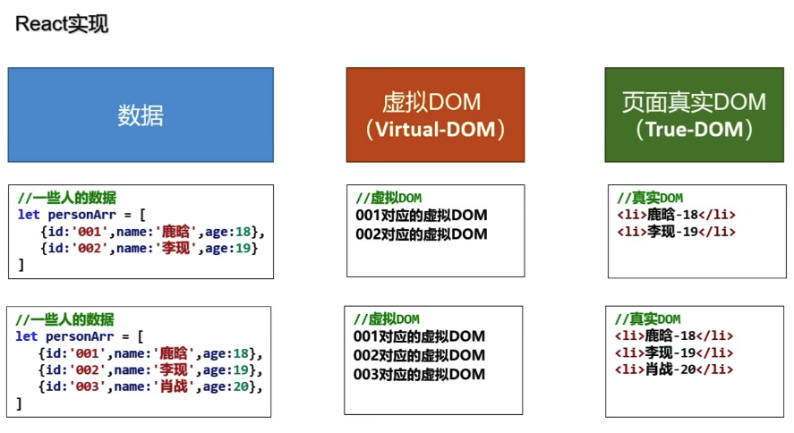

# React

## React 介绍

- 1.采用组件化模式，声明式编码，提高开发效率以及组件复用率
- 2.RN 可以使用react语法进行移动端开发
- 3.使用虚拟dom+diff算法，减少真实DOM的交互

小记：

- react 发展16.8之前无状态组件和有状态组件=>16.8之后hooks/自定hooks => 官方的redux/React-Redux => react-router => 组件复用 minx废弃 => 高阶组件HOC => render-props

- vue2 option api => vuex/vue-router => minx复用

- vue3 composition api => pina/vue-router => 自定hooks复用

### 原生js实现


频繁的操作dom


### react实现



虚拟dom在内存中，对内存进行操作，虚拟dom进行对比更新渲染的时候，原来的虚拟dom没没有发生变化直接使用，只对新虚拟dom进行渲染。

原生js 有100真实dom，变化后101dom，就需要渲染101次

react  有100真实dom，变化后101dom，对比虚拟dom原来前100次dom一样，最后一次新虚拟dom，就只需要渲染1次

1. react.js：React核心库。

2. react-dom.js：提供操作DOM的react扩展库。

3. babel.min.js：解析JSX语法代码转为JS代码的库。

### react 第一个案例

```jsx
<div id="app"></div>
<!-- 先引入react核心库 react-dom操作dom库 babel,jsx转换js库  -->
<script type="text/javascript" src="../lib/16.8.4/react.development.js"></script>
<script type="text/javascript" src="../lib/16.8.4/react-dom.development.js"></script>
<script type="text/javascript" src="../lib/16.8.4/babel.min.js"></script>

<!-- text/babel 写的是jsx，让babel进行编译转译为js -->
<script type="text/babel">
  // 1.创建虚拟dom
  const VDOM = <h1>hello,React</h1>/* 此处不需要写引号，不是字符串 */
  // 2.渲染虚拟dom到页面 ReactDOM函数 (VDom, 选自器)
  ReactDOM.render(VDOM, document.getElementById('app'))
</script>
```

> 16.8 与 18.0 render变化

```jsx
//16版本的写法
ReactDOM.render(<h1>666666</h1>,document.querySelector("#root"))

//以下是18版本写法
const root = ReactDOM.createRoot(document.querySelector("#root"))
root.render(<h1>123456</h1>)
```

### 两种创建虚拟dom创建方式

> jsx为了解决简单的dom结构

- jsx创建虚拟dom

```jsx
<div id="app"></div>
<!-- 先引入react核心库 react-dom操作dom库 babel,jsx转换js库  -->
<script type="text/javascript" src="../lib/16.8.4/react.development.js"></script>
<script type="text/javascript" src="../lib/16.8.4/react-dom.development.js"></script>
<script type="text/javascript" src="../lib/16.8.4/babel.min.js"></script>

<!-- text/babel 写的是jsx，让babel进行编译转译为js -->
<script type="text/babel">
  // 1.创建虚拟dom
  const VDOM = ( /* 此处不需要写引号，不是字符串 */
    <h1 id='text'>
      <span>hello,React</span>
    </h1>
  )
  // 2.渲染虚拟dom到页面 ReactDOM函数 (VDom, 选自器)
  ReactDOM.render(VDOM, document.getElementById('app'))
</script>
```

- js创建虚拟dom

`<h1 class='t-ty' > <span>hello,react</span> </h1>`

```js
<div id="app"></div>
<!-- 先引入react核心库 react-dom操作dom库 babel,jsx转换js库  -->
<script type="text/javascript" src="../lib/16.8.4/react.development.js"></script>
<script type="text/javascript" src="../lib/16.8.4/react-dom.development.js"></script>
<!-- <script type="text/javascript" src="../lib/16.8.4/babel.min.js"></script> -->

<script type="text/javascript">
  // 1.创建虚拟dom createElement(标签名, 标签属性, 标签内容)
  const VDOM = React.createElement('h1', { id: 'text', className: 't-ty'},
    React.createElement('span', { className: ''}, 'hello,react')
  )
  // 2.渲染虚拟dom到页面 ReactDOM函数 (VDom, 选自器)
  ReactDOM.render(VDOM, document.getElementById('app'))
</script>
```

- 使用 react 创建如下元素

```html
<div class="list">
  <h1>水果</h1>
  <ul>
    <li>苹果</li>
    <li>橘子</li>
  </ul>
</div>
```

```jsx
import React from 'react';
import ReactDOM from 'react-dom';

const element = React.createElement('div', { className: 'list' }, [
  React.createElement('h1', null, '水果'),
  React.createElement('ul', null, [
    React.createElement('li', null, '苹果'),
    React.createElement('li', null, '橘子'),
  ]),
]);
const root = ReactDOM.createRoot(document.getElementById('root'));
root.render(element)
```

**总结：** 使用 `createElement` 创建元素非常麻烦、可读性差、不优雅，开发中推荐使用 JSX 来声明 UI。

### 真实dom 与 虚拟dom

1. 本质上是一个object类型的对象（js对象）

2. 虚拟dom比较“轻”，真实dom”重“，因为虚拟dom是react在内存中创建，不需要那么多属性对象

3. 虚拟dom是react在内存中创建，会被react转化为真实对象，呈现在页面上

```js
<div id="app"></div>
<div id="demo"></div>
<!-- 先引入react核心库 react-dom操作dom库 babel,jsx转换js库  -->
<script type="text/javascript" src="../lib/16.8.4/react.development.js"></script>
<script type="text/javascript" src="../lib/16.8.4/react-dom.development.js"></script>
<script type="text/javascript" src="../lib/16.8.4/babel.min.js"></script>

<!-- text/babel 写的是jsx，让babel进行编译转译为js -->
<script type="text/babel">
  // 1.创建虚拟dom
  const VDOM = ( /* 此处不需要写引号，不是字符串 */
    <h1 id='text'>
      <span>hello,React</span>
    </h1>
  )
  // 2.渲染虚拟dom到页面 ReactDOM函数 (VDom, 选自器)
  ReactDOM.render(VDOM, document.getElementById('app'))

  const TDOM = document.getElementById('demo')
  console.log('虚拟dom', VDOM);
  console.log('真实dom',TDOM);
  // debugger 打断点
</script>
```

### react 脚手架

#### create-react-app创建spa项目

创建项目方式：

- 全局安装脚手架再使用命令创建项目
- 使用 npx 远程调用脚手架创建项目

方式 1：

- 全局安装

```shell
# 全局安装脚手架
npm i create-react-app -g
```

- 创建项目

```shell
# project-name 项目名称
create-react-app project-name
```

方式 2：

- npx 安装，npm5.2+支持

```shell
# project-name 项目名称
npx create-react-app project-name
```

#### 配置代理

- 1.create-react-app脚手架若在2.0版本以下，在项目的package.json文件中配置

```json
"proxy":{
   "/api":{
      "target":"http://127.0.0.1:5000",  # 跨域地址
      "changeOrigin": true,    # 是否允许跨域
      "pathRewrite": {        # 重写路径
           "^/api": "/"
       },
    }
}
```

例如：后端接口地址是http://127.0.0.1:5000/cars，经过上述配置，前端访问就变成http://127.0.0.1:5000/api/cars，请求url中包含 `/api`，pathRewrite重新路径将 /api重写为 /，被重写为http://127.0.0.1:5000/cars

pathRewrite，如果不配置，访问和实际地址就都是http://127.0.0.1:5000/api/cars

- 2.若脚手架版本在2.0以上只能配置string类型

```json
"proxy": "http://127.0.0.1:5000",
```

局限性只能配置一个接口地址，如果不同接口数据在不同地址，就无法满足

工作方式：上述方式配置代理，当请求了3000不存在的资源时，那么该请求会转发给5000 （优先匹配前端资源）

- 3.配置一个或者多个代理，middleware中间件

```bash
yarn add http-proxy-middleware # 安装代理中间件
```

注意：webpack内置了http-proxy-middleware包

项目的src目录下建立**setupProxy.js**文件

```js
# src/setupProxy.js文件
const { createProxyMiddleware } = require('http-proxy-middleware');

module.exports = function (app) {
    app.use(
      createProxyMiddleware('/api', {
        target: 'http://localhost:5000',
        secure: false,    // 指定Cookies能否被用户读取
        changeOrigin: true,
        pathRewrite: {
          "^/api": "/"
        },
      }),
      createProxyMiddleware('/base', {
        target: 'http://localhost:5001',
        secure: false,    // 指定Cookies能否被用户读取
        changeOrigin: true,
        pathRewrite: {
          "^/base": "/api1"
        },
      })
    );
};
```

## React JSX 语法

- 1.全称: JavaScript XML

- 2.react定义的一种类似于XML的JS扩展语法: JS + XML本质是React.createElement(component, props, ...children)方法的语法糖

- 3.作用: 用来简化创建虚拟DOM

使用细节：

- 特殊属性写法 className htmlFor

- 没有内容的节点可以使用 单标签

- 必需有根节点，可以使用 <></> 幽灵标签，其实是 <React.Fragment></React.Fragment> 简写

- 如果 JSX 有换行，最好使用 () 包裹

示例代码：

```jsx
// class ---> className     for ---> htmlFor
<div className="box">
 <label htmlFor="ck"></label>
 <input id="ck" type="checkbox" />
</div>
```

- className 和 style

```html
  <style>
    .box {
      height: 200px;
      width: 200px;
      color: red;
    }
  </style>

  <script type="text/babel">
   const sy = {
      color: 'pink',
      backgroundColor: '#000',
      fontWeight: 'bold',
    }
    const VDOM1 = ( // jsx多行 使用()包裹
      // 必须要有根节点
      <React.Fragment>
        <div className = "box" >
          <label id="myLabel" htmlFor="male">Male</label>
          <span className="icon-edit" />
          <p style= { sy } >hello</p>
          <div style={ {width: 50, height: 50, backgroundColor: 'skyblue'} }> 文本内容 </div>
        </div>
      </React.Fragment>
    )
  <script />
```

- 虚拟必须只有一个根节点

```jsx
// 1. 使用 React.Fragment 代码片段
import React from 'react';
import ReactDom from 'react-dom';
const element = (
  <React.Fragment>
    <div>header</div>
    <div>footer</div>
  </React.Fragment>
);
const root = ReactDOM.createRoot(document.getElementById("root"))

root.render(element);
```

```jsx
// 2. 使用<></>可以避免没必要的标签产生 简写 React.Fragment
import ReactDom from 'react-dom';
const element = (
 <>
   <div>header</div>
   <div>footer</div>
 </>
);
const root = ReactDOM.createRoot(document.getElementById("root"))
root.render(element);
```

- 用小括号

```jsx
// 有换行的时候最好使用()可以让标签对其，避免没必要的错误
const element = (
 <>
   <div>header</div>
   <div>footer</div>
 </>
);
```

- jsx中标签元素

```js
<div id="app"></div>
<script type="text/babel">  
  const VDOM1 = ( // jsx多行 使用()包裹
  // 必须要有根节点
  <React.Fragment>
    <test>test</test> // 首字母小写，该标签会转为html中同名元素标签，没测抛出没找到先关元素，不影响视渲染
    // <Good >123</Good> 报错，首字母大写，react就会渲染，没有就是报错影响视图渲染
  </React.Fragment>
)

ReactDOM.render(VDOM1, document.getElementById('app'))
</script>
```

jsx语法规则总结：

* 1.定义虚拟dom时，不要写引号

* 2.标签中混入`js 表达式`要使用{}，不能写`js代码`比如 if(a==c){} for(i=1;i<10;i++){}

* 3.样式类名指定，不要使用class，使用className

* 4.内联样式，要用style={ {key:value} } 形式

* 5.jsx中必须使用根标签包裹 `<React.Fragment></React.Fragment>` 或者`<></>`

* 6.单个标签必须闭合` <span className="icon-edit" /> `或者 `<span className="icon-edit"></span>`

* 7.标签首字母

* (1)若小写字母开头，则转换为html标签中的同名元素。如 `<span></span>`，如果没有同名对应的html标签，则报错比如`<good></good>`

* (2)若大写字母开头，react就去渲染对应的组件，若没有则全局报错，影响视图渲染`<Good></Good>`

**案例：动态展示下面列表**


```html
<script type="text/babel">
  const list = ['angular','react','vue']
  // 1.react {}嵌入表达式中出传入一个数组，react会自动进行遍历
  // 下面是通过map进行数组处理，返回一个新的数组
  // 2.react {}嵌入表达式传入一个对象，react会报错无法进行遍历
  const obj = { name1: 'angular', name2: 'react',name3: 'vue'}
  const VDOM = (
    <div>
      <h1>前端js框架列表</h1>
      <ul>
        { list.map( item => <li key={item}>{item}</li>) }
      </ul>
      { obj } // 渲染这里会报错 obj 是一个对象
    </div>
  )
  // 2.渲染虚拟dom到页面 ReactDOM函数 (VDom, 选自器)
  ReactDOM.render(VDOM, document.getElementById('app'))
</script>
```

### JSX 嵌入表达式

> 掌握在`JSX`中嵌入`JS`表达式，进行渲染

在`JSX`中使用`{}`嵌入`JS`表达式

- 展示数据
- 进行运算
- 三元运算
- 使用函数
- 使用 JSX
- 使用注释

> js代码与js表达式

在{}嵌入表达式中只能写 js表达式 `{ list.map( item => <li key={item}>{item}</li> ) }`

* 区分：js语句(代码) 与 js表达式
  
  * 1.表达式：一个表达式会产生值，任何一个需要值得地方，逻辑表达式返回一个值
    
    * (1). a a+b a*c 'sa'+ 0
    
    * (2). a + b > c ? '大于':'小于'
    
    * (3). sumFn(10,15)
    
    * (4). array.map() array.filter()
    
    * (5). function test() {} 函数返回函数对象
  
  * 2.语句(代码)：
    
    - (1). if() {}
    
    - (2). for(){} / while(true){} / do{}while(true)
    
    - (3). switch(){ case 1: a+b;case 2: b+e; default: 5+1 }

示例：

```jsx
import React from 'react';
import ReactDom from 'react-dom';

// 数据
const data = {
  name: 'tom',
  age: 18,
};

// 函数
const up = () => {
  return data.name.toUpperCase();
};

// jsx表达式
const list = (
  <ul>
    <li>jack</li>
    <li>tony</li>
  </ul>
);

const element = (
  <div>
    {/* 1. 使用数据  注释推荐快键键(ctrl+/)  */}
    <div>姓名：{data.name}</div>
    <div>年龄：{data.age}</div>
    {/* 2. 使用运算 */}
    <div>明年几岁：{data.age + 1}</div>
    {/* 3. 使用三元 */}
    <div>是否成年：{data.age > 16 ? '是' : '否'}</div>
    {/* 4. 使用函数 */}
    <div>姓名大写：{up()}</div>
    {/* 5. 使用JSX(jsx也是表达式) */}
    <div>朋友：{list}</div>
  </div>
);

const root = ReactDOM.createRoot(document.getElementById("root"))
root.render(element);
```

**总结：** 使用`{}`可以在`JSX`中使用表达式，注意不能使用语句。

### JSX 条件渲染

> 使用分支语句、三元运算、逻辑运算进行条件渲染

1. `if/else` 条件渲染

```jsx
const loading = true;
// 不能再JSX中写语句，但，可以充分利用JS能力
const getContent = () => {
  if (loading) {
    return <div>正在加载...</div>;
  } else {
    return <div>数据加载完毕，这是显示数据</div>;
  }
};
const element = <div>{getContent()}</div>;
```

2. `三元运算符` 完成条件渲染

```jsx
const loading = true;
const element = (
  <div>
    {loading ? <div>正在加载...</div> : <div>数据加载完毕，这是显示数据</div>}
  </div>
);
```

3. `逻辑运算` 完成条件渲染

```jsx
const loading = true;
const element = (
  <div>
    {loading && <div>正在加载...</div>}
    {loading || <div>数据加载完毕，这是显示数据</div>}
    {loading /* jsx中直接使用true，表达式值为true是不直接渲染的 */}
  </div>
);
```

### JSX 列表渲染

> 掌握在`JSX`中使用`Array.map()`来进行列表的渲染

1. 使用 `map` 渲染列表

```jsx
// 1. 数据
const list = ['tom', 'jack', 'tony'];
// 2. 转jsx数组
const list2 = list.map((item) => <li>{item}</li>);
// 3. 使用
const element = <ul>{list2}</ul>;
```

3. 直接在 `JSX` 中使用 `map` 渲染列表

```jsx
// 1. 数据
const list = ['tom', 'jack', 'tony'];
// 2. 使用 map调用其实也是js表达式
const element = (
  <ul>
    {list.map((item) => (
      <li>{item}</li>
    ))}
  </ul>
);
```

4. `key` 属性使用

> Warning: Each child in a list should have a unique "key" prop.jsx

```jsx
// 1. 数据
const list = ['tom', 'jack', 'tony'];
// 2. 使用
const element = (
  <ul>
    {list.map((item) => (
      <li key={item}>{item}</li>
    ))}
  </ul>
);
```

**总结：** 在`JSX`中一般使用 `map` 来遍历进行渲染，遍历的时候需要给子元素加上 `key={唯一标识}`

练习题目：

- 使用以下数据，渲染无序列表，显示姓名和是否成年

### JSX 样式-style 方式

> 掌握使用 style 属性设置样式

知识内容：

- `style` 接受一个采用小驼峰命名属性的 `JavaScript` 对象，而不是 `CSS` 字符串
- `style` 中的 `key` 采用小驼峰命名是为了与 `JS` 访问 `DOM` 节点的属性保持一致
- `React` 会自动添加 ”px” 后缀到内联样式为数字的属性后，其他单位需要手动添加

需求：去掉上一个列表案例 `ul` 的点，加上背景样式，设置字体大小，给第一个 `p` 设置两倍字体大小

```jsx
    const list = [
      { id: 100, name: 'tom', age: 15 },
      { id: 101, name: 'jack', age: 18 },
      { id: 102, name: 'tony', age: 20 },
    ];
    const styleObj = {
      listStyle: 'none',
      backgroundColor: 'pink',
      fontSize: 18 // react 会自动添加px
    }

    const VDOM = (
      <div>
        <ul style={styleObj}>
          { list.map(item => {
              return (
                <li key={item.id}>
                  {/* style写在行内样式 */}
                  <p style={ {fontSize: '2em', color: 'yellow'} }>name: {item.name}</p>
                  <p>age {'>'} 18: {item.age > 18 ? 'yes 18':'no 18'}</p>
                </li>
              )
            }) 
          }
        </ul>
      </div>
    )
    // 2.渲染虚拟dom到页面 ReactDOM函数 (VDom, 选自器)
    ReactDOM.render(VDOM, document.getElementById('app'))
```

**总结：** style` 属性使用 `{}` 绑定样式对象，默认 `px` 单位可以省略使用数字，一般需要动态设置属性样式使用这种方式

### JSX 样式-className 方式

> 掌握使用 `className` 设置类名来使用样式

知识内容：

- `className` 设置类名，和 `class` 属性要求一样只能是字符串
- 如果需要根据数据设置类名，可以使用 `{}` 嵌入 `JS` 表达式实现

演示代码：

- 需求：在元素 `button`上根据 `isActive` 数据的值添加 `active` 类名

index.css

```css
.button {
  width: 100px;
  height: 40px;
  border: 1px solid #eee;
  color: #999;
  border-radius: 4px;
  display: inline-block;
  text-align: center;
  line-height: 40px;
  box-shadow: 2px 2px 10px #ccc;
  cursor: pointer;
  user-select: none;
}

.button.active {
  background: #069;
  color: #fff;
  border-color: #069;
}

.button.block {
  display: block;
  width: 100%;
}
```

index.js

```js
import ReactDom from 'react-dom';
// 在src下新建index.css文件，导入进来即可
import './index.css';
const isActive = false;

const element = (
  <span className={`button ${isActive ? 'active' : ''}`}>按钮</span>
);
const root = ReactDOM.createRoot(document.getElementById("root"))
root.render(element);
```

**总结：** 如果只是个别类名的变化使用 `className` 属性嵌入 `三元表达式` 即可完成

### JSX 样式-动态 className

> 掌握在 `React` 中使用 `JS` 原生的能力处理多个类的动态绑定

知识内容：

- 在使用 `className` 的时候遇见多个类名动态绑定，可以模仿 `vue` 使用对象的方式
- `vue` 中绑定类名的时候使用 `{类名:布尔}` 用布尔值决定是否加上这个类名

演示代码：

- 需求：在元素 `button`上根据 `isActive` 数据的值添加 `active` 类名，`isBlock` 数据的值添加 `block` 类名

```jsx
// 如果是多个类名的变化呢？
// vue 中绑定类名的时候使用 {类名:布尔} 用布尔值决定是否加上这个类名 { btn: true, 't-btn': true }
const isActiveT = false
const isBlocked = false

// 类名对象，即像vue中在class="{btn: true'}"
const classObject = { // key属性
  button: true,
  active: isActiveT,
  block: isBlocked
}
const className = (classObj) => {
  return Object.keys(classObj)
  .filter(key => classObj[key]) // 将属性名为true，过滤出来形成数组
  .join(' ') // 再将数组每个元素进行拼接，返回成字符串
}

const VDOM2 = (
  <div>
    <span className={ className(classObject) }>按钮2</span>
  </div>
)

ReactDOM.render(VDOM2, document.getElementById('app'))
```

**总结：** 使用 `JS` 原生的能力处理多个类名的动态绑定，当然这样的需求已经有 `classnames` 库给我们解决了

### JSX 样式-classnames 库

> 掌握使用 `classnames` 库来完成 `className` 属性值的动态绑定

知识内容：

- 如何安装导入 `classnames` 库
- `classnames` 的 `API` 认识
- 使用 `classnames` 处理 `className` 属性值动态绑定

演示过程：

- 安装导入 `classnames` [文档](https://www.npmjs.com/package/classnames#usage-with-reactjs)

```shell
# 安装 npm i classnames
yarn add classnames
```

- 认识 `classnames` API

```js
// 1. 使用字符串
classNames('foo', 'bar'); // foo bar
// 2. 使用对象
classNames({ foo: true, bar: true }); // foo bar
// 3. 使用数组
classNames(['foo', 'bar']); // foo bar
// 4. 混合使用
classNames('foo', { bar: true }); // foo bar
```

- 需求：在元素 `button`上根据 `isActive` 数据的值添加 `active` 类名，`isBlock` 数据的值添加 `block` 类名

```jsx
import ReactDom from 'react-dom';
// 1. 导入classnames
import classNames from 'classnames';
import './index.css';

// 2. 数据
const isActive = true;
const isBlock = true;

// 3. 产生类名
const className = classNames('button', {
  active: isActive,
  block: isBlock,
});

const element = <span className={className}>按钮</span>;
ReactDOM.render(element, document.getElementById("root"))
```

**总结：** 推荐以后开发项目中使用第三方的库来解决`className`的值绑定问题

## React 组件

- 组件允许你将 UI 拆分为独立可复用的代码片段，并对每个片段进行独立构思。

React 创建组件：

1. 使用函数 `function`
2. 使用类 `class`

### 1.函数组件

1）什么是函数组件？

- 使用 JS 函数（普通，箭头）创建的组件

2）定义函数组件

- 语法约定
  - 函数名称`首字母必需大写`，React 据此来区分组件和 HTML 元素
  - 函数`必须有返回值`，表示该组件的 UI 结构，如果不渲染任何内容可返回`null`

3）使用组件

函数的名称就是组件名称，使用组件就是把组件名称当标签使用即可。

```jsx
import ReactDom from 'react-dom/client';

// 普通函数
function Header() {
  return <div>头部组件</div>;
}

// 箭头函数
const Footer = () => {
  return <div>底组件</div>;
};

// 加载组件，不渲染内容
const Loading = () => {
  const loading = false;
  return loading ? <div>正在加载...</div> : null;
};

// 根组件
const App = () => {
  return (
    <>
      <Header />
      <Loading />
      <Footer />
    </>
  );
};
const root = ReactDom.createRoot(document.getElementById('root'))
root.render(<App />);
```

```js
  <script type="text/babel">
    // 1.创建函数组件
    // 函数名称首字母必需大写，React 据此来区分组件和 HTML 元素
    // 函数必须有返回值，表示该组件的 UI 结构，如果不渲染任何内容可返回null
    function Header() {
      const [str, setStr] = React.useState('这是一段文字')
      console.log(this); // 此处this是undefined，进过babel编译后开启严格模式，禁止this指向window

      const onChangeStr = () => {
        setStr('1515151')
      }

      return (
        <div onClick={onChangeStr} >函数定义组件 {str} </div>
      )
    }

    // 箭头函数
    const Footer = () => {
      console.log(this); 
      return <div>底部组件</div>;
    }
    // 加载组件，不渲染内容 返回值为null，不渲染组件
    const Loading = () => {
      const loading = false;
      return loading ? <div>正在加载...</div> : null
    }
    const VDOM = (
      <React.Fragment>
        {/* 渲染Header组件到视图 */}
        <Header />
        <Loading />
        <Footer />
      </React.Fragment>
    )
    // 2.组件渲染到页面
    ReactDOM.render(VDOM, document.getElementById('app'))
    // ReactDOM.render(<Header />, document.getElementById('app')) 发生了什么
    //  1.react解析组件标签，找到Header组件
    //  2.发现组件时函数定义，调用该函数，将虚拟dom转换为真实dom，渲染在页面上
  </script>
```

### 2.类组件-基本使用步骤

> 掌握 React 的类组件写法

1. 什么是类组件？
   
   - 使用`class`语法创建的组件就是类组件

2. 定义类组件
   
   - 约定：类名首字母必需大写
   - 约定：必须继承`React.Component`父类
   - 约定：必需有`render`函数，返回 UI 结构，无渲染可返回 null

```js
  <script type="text/babel">
    class MyComponent extends React.Component {
      constructor(popos) {
        super()
        // TODO: 调用的react.component中state属性
        this.state = {
          text: 'Hello'
        }
      }

      onChange () {
        return () => this.setState({ text: 'ok'})
      }
      // render函数放在 MyComponent 的原型对象上，供创建实例使用
      // render中的this是谁？MyComponent的实例对象 或者 组件实例对象
      render () {
        console.log('render的this', this);
        // return <div onClick={ this.onChange.bind(this) } >{ this.state.text }</div>;
        // return <div onClick={ () => this.onChange() } >{ this.state.text }</div>;
        return <div onClick={ this.onChange() } >{ this.state.text }</div>;
      }
    }
    const VDOM = (
      <React.Fragment>
        {/* 渲染组件到页面 */}
        <MyComponent />
      </React.Fragment>
    )
    // 2.组件渲染到页面
    ReactDOM.render(VDOM, document.getElementById('app'))
    // ReactDOM.render(<Header />, document.getElementById('app')) 发生了什么
    //  1.react解析组件标签，找到Header组件
    //  2.发现组件是 类定义的，随后new出当前实例对象，并通过该实例调用原型上的render方法
    //  3.将虚拟dom转换为真实dom，渲染在页面上
  </script>
```

### 3.类组件-组件抽离

> 理解组件抽离目的，掌握抽离组件方式。

- 抽离组件
  - 定义一个`js`或者`jsx`文件定义组件默认导出
  - 使用组件导入即可，当作标签使用。

具体操作：

1. 新建 `src/components/Header.jsx` 类组件，新建 `src/components/Footer.jsx` 函数组件

```jsx
// src/components/Header.jsx
import { Component } from 'react';
class Header extends Component {
  render() {
    return <div>头部组件</div>;
  }
}
export default Header;
```

```jsx
// src/components/Footer.jsx
const Footer = () => {
  return <div>头部组件</div>;
};
export default Footer;
```

2. 新建 `src/App.jsx` 组件, 导入`Header` `Footer`组件使用。

```jsx
import { Component } from 'react';
import Header from './components/Header.jsx';
import Footer from './components/Footer.jsx';
class App extends Component {
  render() {
    return (
      <>
        <Header />
        内容
        <Footer />
      </>
    );
  }
}
```

3. `index.js` 使用 `App` 根组件

```jsx
import ReactDom from 'react-dom';
import App from './App.jsx';
ReactDom.render(<App />, document.getElementById('root'));
```

### 4.无状态组件和有状态组件

> 理解无状态组件和有状态组件概念

具体内容：

1. 无状态组件
   
   - 组件本身不定义状态，没有组件生命周期，只负责 UI 渲染。
   
   - `React16.8`之前的函数组件都是无状态组件，`Hooks` 出现后函数组件也可以有状态。
     
     ```jsx
     function Welcome(props) {
       return <h1>Hello, {props.name}</h1>;
     }
     ```

2. 有状态组件
   
   - 组件本身有独立数据，拥有组件生命周期，存在交互行为。
   
   - `class` 组件可以定义组件自己的状态，拥有组件生命周期，它是有状态组件。
     
     ```jsx
     class Welcome extends React.Component {
       state = {
             name: ‘tori’,
       }
       componentDidMount() {
             fetch(…);
             …
         }
       render() {
         return (
             <>
                 <h1>Hello, {this.state.name}</h1>
                 <button onClick={() => this.setState({name: ‘007’})}>改名</button>
             </>
           );
       }
     }
     ```

3. 它们的区别
   
   - 无状态组件由于没有维护状态只做渲染，性能较好。有状态组件提供数据和生命周期，能力更强。

4. 如何去选择
   
   - `React16.8`之前，组件不需要维护数据只渲染就使用`函数组件`，有数据和交互使用`类组件`。你需要去判断，有心智负担。
   - `React16.8`之后，`Hooks`出现给函数提供状态，建议使用函数组件即可。


**总结：**

- 组件本身没有状态就是无状态组件，组件本身提供状态就是有状态组件。
- 16.8 之前，无状态组件使用函数组件，有状态组件使用类组件。16.8 之后，统一可使用函数组件。
- React 没有说完全取代类组件，老项目中还是类组件居多，我们有必要学习下它的具体用法。

### 5. 类组件state定义状态

> 掌握类组件中状态的定义与使用

大致步骤：

- 定义`state`属性定义组件状态，属于组件自己的数据，它的值是个对象。
- 使用`state`的时候通过`this`去访问即可，例如：`this.state.xxx`。
- 数据发生变化，驱动视图更新。

```jsx
import { Component } from 'react';

class App extends Component {
  // 状态
  state = {
    title: '数码产品',
    list: ['电脑', '手机', '相机'],
  };
  render() {
    return (
      <>
        <h3>{this.state.title}</h3>
        <ul>
          {this.state.list.map((item) => {
            return <li key={item}>{item}</li>;
          })}
        </ul>
      </>
    );
  }
}
export default App;
```

数据驱动视图演示：


**总结**：定义`state`属性，值是对象存储数据，`this.state.xxx`使用数据

### 6.类组件-绑定事件

> 掌握类组件中绑定事件的方式，和获取事件对象的方式。

大致步骤：

- 在类中声明事件处理函数，在标签上使用`on+事件名称={处理函数}`的方式绑定事件，事件名称需要遵循`大驼峰`规则。
- 处理函数默认的参数就是事件对象，可以使用事件对象处理默认行为和事件冒泡。

```jsx
import { Component } from 'react';

class App extends Component {
  // 状态
  state = {
    count: 0,
  };
  // 事件处理函数
  handleClick(e) {
    // 默认行为
    e.preventDefault();
    // 事件冒泡
    e.stopPropagation();
    console.log(e.target)
    console.log('handleClick');
  }
  handleMouseEnter() {
    console.log('handleMouseEnter');
  }
  render() {
    return (
      <>
        <div onMouseEnter={this.handleMouseEnter}>
          计数器：{this.state.count}
        </div>
        <div>
          <a href="#" onClick={this.handleClick}>
            按钮
          </a>
        </div>
      </>
    );
  }
}
export default App;
```

**总结：**

- 绑定事件的方式和原生的方式一致，使用 `on+事件名称={处理函数}` 方式绑定
- 事件名称使用`大驼峰`规则，例如：`onClick` `onMouseEnter`、`onChange`, 处理函数默认传参为事件对象。

### 7.类组件中this 指向问题

> 发现事件处理函数中 this 获取不到问题和原因

大致步骤：

- 在事件处理函数中打印 `this.state.count` 发现报错，this 是个`undefined`。
- 演示函数调用对 this 指向的影响，得出函数谁调 this 就执行谁。
- 找出原因：处理函数不是通过组件去调用的，导致出现 this 不是组件问题。

具体代码：

1. 发现`this`是`undefined`

```jsx
import { Component } from 'react';

class App extends Component {
  // 状态
  state = {
    count: 0,
  };
  // 事件处理函数
  handleClick(e) {
    console.log(e);
    // Uncaught TypeError: Cannot read properties of undefined (reading 'state')
    console.log(this.state.count);
  }
  render() {
    return (
      <>
        <div>计数器：{this.state.count}</div>
        <div>
          <button onClick={this.handleClick}>按钮</button>
        </div>
      </>
    );
  }
}
export default App;
```

2. 演示处理函数调用对 this 的影响

```js
    class Person {
      constructor(name,age){
        this.name = name;
        this.age = age;
      }
      // class中定义的函数，局部默认是use strict模式
      study() {
        // study 方法是来类的原型对象上，供实例对象使用
        // 通过Person实例调用study时，study的this就是Person的实例对象
        console.log(this);
      }
    }
    const p1 = new Person()
    p1.study(); // 通过实例调用study

    const fnStudy = p1.study;
    fnStudy()  // 直接调用，为啥this是undefined，而不是window呢，原因是在class中定义的函数，局部默认是use strict模式，所有this是undefined

    function test() {
      'use strict';
      console.log(this); // undefined
    }
    test()
```

3. 问题原因
   - 类组件声明的处理函数，赋值给 `on+事件名称` 属性，调用的时候不是通过组件调用的。

### 8.类组件-处理 this 问题

> 掌握通过 绑定箭头函数 bind 声明箭头函数 五种方式解决 this 问题  

解决方式

```jsx
import { Component } from 'react';

class App extends Component {
  constructor() {
    super()
    this.state = {
      count: 0,
    }
    // 先调用App 原型上的handleClick，通过bind返回新的函数，在当前new App()实例对象上添加一个handleClick方法
    this.handleClick = this.handleClick.bind(this)
  }

  // 事件处理函数
  handleClick(e) {
    console.log(e);
    console.log(this.state.count);
  }
  render() {
    return (
      <>
        <div>计数器：{this.state.count}</div>
        <div>
          <button onClick={this.handleClick}>按钮</button>
        </div>
      </>
    );
  }
}
export default App;
```

#### 1.高阶函数(柯里化)

高阶函数：通过 this 来直接**调用** handleClick 并返回箭头函数。  
柯里化：通过函数调用继续返回函数的形式，实现多次接收参数最后统一处理的函数编码形式。  

```jsx
export default class user extends Component {
  state = {
    cound:0
  }
  //this的指向是什么就是看谁调用的
  addEvent() {
    return () => {
      console.log(this);
    }
  }
  render() {
    return (
      <button onClick={this.addEvent()}></button>
    )
  }
}
```

#### 2.包裹一层箭头函数。

箭头函数中的 this 指向“外部”，即 render 函数，而 render 函数中的 this 正是组件实例。

```jsx
export default class user extends Component {
  state = {
    cound:0
  }
  addEvent() {
      console.log(this);
  }
  render() {
    return (
      <button onClick={() => this.addEvent()}></button>
    )
  }
}
```

#### 3.使用bind

```jsx
export default class user extends Component {
  state = {
    cound:0
  }
  addEvent() {
      console.log(this);
  }
  render() {
    return (
      <button onClick={this.addEvent.bind(this)}></button>
    )
  }
}
```

#### 4.通过赋值语句往实例上面添加一个箭头函数。

```jsx
export default class user extends Component {
  state = {
    cound:0
  }
  addEvent = () => {
      console.log(this);
  }
  render() {
    return (
      <button onClick={this.addEvent.bind(this)}></button>
    )
  }
}
```

#### 5.在构造函数中再创建一个实例方法，和原型方法公用一个函数体。

```jsx
class App extends React.Component {
  constructor() {
      super()
      this.state = {
          count: 0,
      }
      this.addClick = this.addClick.bind(this)
  }
  addClick() {
      console.log(this)
  }
  render() {
      return (
          <div>
              <button onClick={this.addClick}>+1</button>
          </div>
      )
  }
}
```

### 9.类组件-setState 使用

> 掌握使用 setState 函数修改组件状态

大致步骤：

- React 类组件提供一个函数`setState({需修改数据})`，可以更新数据和视图。
- 直接修改 state 中的数据是不会更新视图，演示简单数据，数组，对象的正确修改方式。

具体代码：

1. 通过`setState`的来修改数据更新视图

```jsx
class MyComponent extends React.Component {
  // 构造器调用几次？ 1次
  constructor(props) {
    super(props)
    // TODO: 调用的react.component中state状态属性
    this.state = {
      isHot: true,
      wind: '微风'
    }
  }
  /**
   * 为啥指定的this会是undefined？类中的方法默认开启局部严格模式，所以onChange中的this是 undefine
   * */

  // 普通函数在严格模式下是没有上下文的，所有调用是使用bind apply call传递this
  // 箭头函数，this取决于上下文，本身没有this、使用call，apply等无法改变this指向
  onChange (e) {
    console.log(e);
    // onChange方法，放在MyComponent的原型对象上，供实例对象使用
    // 由于onChange方法，是作为onClick的回调函数，不是通过实例调用，而是直接调用
    // 类中的方法默认开启局部严格模式，所以onChange中的this是 undefined。
    console.log(this);
    // react更改状态state，不能直接赋值更改 this.state.isHot = true;
    // 通过this.setState({ isHot: true })
    this.setState({ isHot: !this.state.isHot }, () => console.log('修改了isHot'));
  }

  // render调用几次？1+n次，1次是组件初始化时调用render() n次每次state中的数据发送变化时调用render()
  render () {
    console.log('render的this', this);
    /*
    处理this指向问题：
    1.将class 中的onChange改为箭头函数；onChange = (e) => {} 箭头函数this指向取决于上下文
    2.将class 中的onChange改为 function onChange (e){ return () => console.log(this) }

    3.通过 bind() 函数会创建一个新的绑定函数，改变绑定中this指向，返回一个新的函数
    return <div onClick={ this.onChange.bind(this) } >{ this.state.text }</div>;

    4.通过 call 或者 apply
    call() 方式改变函数中的this执行，并立即调用该函数
    return <div onClick={ () => this.onChange.call(this) } >{ this.state.text }</div>;

    5.onClick返回一个箭头函数：onClick={ () => this.onChange() }，这里的this就是同组件实例调用
      return <div onClick={ () => this.onChange() } >{ this.state.text }</div>;
    */
    return (
      <div onClick={ this.onChange.bind(this) } >
        今天天气很{ this.state.isHot ? '炎热':'凉爽' }，{ this.state.wind }
      </div>
    )
  }
}
const VDOM = (
  <React.Fragment>
    {/* 渲染组件到页面 */}
    <MyComponent />
  </React.Fragment>
)
// 2.组件渲染到页面
ReactDOM.render(VDOM, document.getElementById('app'))
```

2.修改数组和修改对象的正确姿势

```jsx
import { Component } from 'react';

class App extends Component {
  state = {
    count: 0,
    user: {
      name: 'jack',
      age: 18,
    },
    list: ['电脑', '手机'],
  };
  handleClick = () => {
    // 修改数据
    this.setState({
      // key是要修改的数据名称，value是对应的新值
      count: this.state.count + 1,
    });
  };
  updateList = () => {
    // 修改列表
    this.setState({
      list: [...this.state.list, '相机'],
    });
  };
  updateUser = () => {
    // 修改对象
    this.setState({
      user: {
        ...this.state.user,
        name: 'tony',
      },
    });
  };
  render() {
    return (
      <>
        <div>计数器：{this.state.count}</div>
        <div>
          <button onClick={this.handleClick}>按钮</button>
        </div>
        <hr />
        <div>商品：{this.state.list.join(',')}</div>
        <button onClick={this.updateList}>改数组</button>
        <hr />
        <div>
          姓名：{this.state.user.name}，年龄：{this.state.user.age}
        </div>
        <button onClick={this.updateUser}>改对象</button>
      </>
    );
  }
}
export default App;
```

### 10.setState扩展-异步

> 发现setState是“异步”的，多次setState会合并。

1. 理解setState是“异步”的，setState会合并更新
   - 调用 setState 时，将要更新的状态对象，放到一个更新队列中暂存起来（没有立即更新）
   - 如果多次调用 setState 更新状态，**状态会进行合并，后面覆盖前面**
   - 等到所有的操作都执行完毕，React 会拿到最终的状态，然后触发组件更新

```jsx
class MyComponent extends React.Component {
  state = {
    count: 0,
  }

  onClickHandler() {
    const {count} = this.state
    this.setState({count: count+1})
    this.setState({count: count+1})
    this.setState({count: count+1})
    // 多次调用 setState 更新状态，状态会进行合并，后面覆盖前面
    // 仅影响 this.state 从下一次render开始返回的内容，比如修改state状态，但未进行render渲染，所有还是当前状态
    console.log(this.state.count); // 0
  }

  render () {
    return (
      <div>
        Count: {this.state.count}<br/>
        <button onClick={() => this.onClickHandler()}>体现“异步”合并+3? 结果+1</button>
      </div>
    )
  }
}
```

通过回调函数在同一事件期间 多次更新状态`setState((prevState) =>{}, callback)`

```jsx
      addHandler() {
        const {count} = this.state
        this.setState(prevState => { 
          return {count: prevState.count+1}
        }, () => {
          // 等等render重新渲染完毕，获取最新的state值
          console.log('更新后：', this.state.count)  // 打印：2
        })
        this.setState(prevState => { 
          return {count: prevState.count+1}
        })
        // 多次调用 setState 更新状态，通过回调函数在同一事件期间 多次更新状态
        console.log('未更新：', this.state.count)  // 打印：0
      }
```

- 使用 `setState((prevState) => {})` 语法，可以解决多次调用状态依赖问题
- 使用 `setState(updater[, callback])` 语法，在状态更新（页面完成重新渲染）后立即执行某个操作

好处是什么？

- “异步” 更新，或者做延时更新，为了等所有操作结束后去更新
- 合并更新，是将多次setState合并，然后进行更新

setState扩展-异步

具体内容：

- setState本身并不是一个异步方法，其之所以会表现出一种“异步”的形式，是因为react框架本身的一个性能优化机制
- React会将多个setState的调用合并为一个来执行，也就是说，当执行setState的时候，state中的数据并不会马上更新

**总结：**

- 在react类组件中，多次的setState并不会立刻执行，而是合并成一个来执行。

### 11.类组件-受控组件

> 理解受控组件概念，掌握动态绑定表单元素。

具体内容：

1. 什么事受控组件
   
   - 表单元素的值被 React 中`state`控制，这个表单元素就是受控组件。

2. 如何绑定表单元素，如：`input:text` `input:checkbox`

```jsx
import { Component } from 'react';

class App extends Component {
  state = {
    mobile: '13811112222',
    isAgree: true,
  };

  changeMobile = (e) => {
    this.setState({ mobile: e.target.value });
  };

  changeAgree = (e) => {
    this.setState({ isAgree: e.target.checked });
  };

  render() {
    return (
      <>
        <div>
          <input
            value={this.state.mobile}
            onChange={this.changeMobile}
            type="text"
            placeholder="请输入手机号"
          />
        </div>
        <div>
          <input
            checked={this.state.isAgree}
            onChange={this.changeAgree}
            type="checkbox"
          />
          同意用户协议和隐私条款
        </div>
      </>
    );
  }
}
export default App;
```

**总结：**

- 使用`state`的数据赋值给表单原生，通过`onChange`监听值改变修改 state 数据，完成表单元素的绑定。
- 这种表单元素称为受控组件。

### 12.类组件-非受控组件

> 理解非受控组件概念，掌握通过 ref 获取元素。

具体内容：

1. 什么是非受控组件？
   
   - 没有通过 state 控制的表单元素，它自己控制自身的值，就是非受控组件

2. 通过 ref 获取表单元素获取非受控组件的值

```jsx
class MyComponent extends React.Component {
  /*
  获取非受控组件的值 - 类似于vue中 <input ref='mobile' /> const mobile = ref(null)
    1. 通过createRef 创建一个ref对象
    2. 给元素绑定ref属性值为创建的ref对象
    3. 通过ref对象的current获取元素，再获取它的值
  */
  mobileRef = React.createRef();
  mainRef = React.createRef();

  changeMobile() {
    console.log(this);
    // 获取mobileRef input组件值
    console.log(this.mobileRef.current.value);
  }

  onClick() {
    // 获取的main dom元素
    console.log(this.mainRef.current);
    // 获取 main 中标签值
    console.log(this.mainRef.current.innerHTML);
  }
  // 什么是非受控组件？没有通过 state 控制的表单元素，它自己控制自身的值，就是非受控组件
  // 一般都是受控组件state 用的多
  render () {
    return (
      <div >
        {/* 没有被state控制的表单原生认为是非受控组件 */}
        <input 
          ref={this.mobileRef}
          onChange={this.changeMobile.bind(this)}
          type="number" placeholder="请输入手机号" />

        <main ref={this.mainRef} >123456</main>
        <button onClick={() => this.onClick()}>获取main</button>
      </div>
    )
  }
}
ReactDOM.render(<MyComponent />, document.getElementById('app'))
```

### 13.react中样式模块化

比如A组件中的index.css

```css
// index.css
.title{ background-color:pink }
```

```jsx
// A组件
import React, { Component } from 'react'
import './index.css'
export class A extends Component {
    render() {
        return <h1 className='title'>A组件</h2>
    }
}
```

B组件中的index.css 同样页添加了title类样式

```css
// index.css
.title{ background-color:skyblue }
```

```jsx
// B组件
import React, { Component } from 'react'
import './index.css'
export class B extends Component {
    render() {
        return <h1 className='title'>B组件</h2>
    }
}
```

App组件 按照组件加载顺序，后面覆盖前面类样式，B组件中title类样式覆盖了  A组件title类样式

```jsx
import A from './components/a-com' // 生效的是background-color:skyblue
import B from './components/b-com' // 生效的是background-color:skyblue

function App() {
  return (
    <div>
      <A />
      <B />
    </div>
  );
}
export default App;
```

在vue中通过scoped进行样式隔离

react中通过样式的模块化，比如将B组件index.css 变更为 index.module.css

```css
// index.module.css
.title{ background-color:skyblue }
```

样式文件index.module.css 引入B组件，通过B.title 

```jsx
// B组件
import React, { Component } from 'react'
import B from './index.module.css' // 通过模块化引入样式

export class B extends Component {
    render() {
        return <h1 className={B.title} >B组件</h2>
    }
}
```

### 14.组件类

#### PureComponent

**PureComponent**：会对`props`和`state`进行浅比较，跳过不必要的更新，提高组件性能。

`PureComponent`和`Component`基本完全一致，`PureComponent`浅比较，也就是较少`render`渲染的次数，所以`PureComponent`一般用于性能优化

```jsx
// PureComponent 会对props和state进行浅比较，跳过不必要的更新，提高组件性能。
class App extends React.PureComponent {
  state = {
    data: {
      number: 0
    }
  }
  render() {
    const { data } = this.state
    return (
      <div>
        <h2>number: { data.number }</h2>
        <button onClick={() => {
          data.number++;
          // PureComponent组件 对state props变化，浅比较，并没有比较data中属性的变化
          this.setState({ data })
        }}>number+1</button>
      </div>
    )
  }
}
```

击按钮的时候，数字并没有刷新，这是因为`PureComponent`会比较两次的`data`对象，它会认为这种写法并没有改变原先的`data`，所以不会改变


只需要对data对象重新赋值

```jsx
this.setState({ data: {...data} })
```

##### 与shouldComponentUpdate的关系如何

在生命周期中有一个`shouldComponentUpdate()`函数，那么它能改变`PureComponent`吗？

其实是可以的，`shouldComponentUpdate()`如果被定义，就会对新旧 `props`、`state` 进行 `shallowEqual` 比较，新旧一旦不一致，便会触发 `update`。

也可以这么理解：`PureComponent`通过自带的`props`和`state`的浅比较实现了`shouldComponentUpdate()`，这点`Component`并不具备

`PureComponent`可能会因深层的数据不一致而产生错误的否定判断，从而导致`shouldComponentUpdate`结果返回false，界面得不到更新，要谨慎使用

#### React.memo

`React.memo`和`PureComponent`作用类似，可以用作性能优化，`React.memo` 是高阶组件，函数组件和类组件都可以使用， `React.memo`只能对`props`的情况确定是否渲染，而`PureComponent`是针对`props`和`state`。

```jsx
React.memo(ComponentMemo, boolean)
```

- 第一个参数：组件本身，也就是要优化的组件
- 第二个参数：(pre, next) => boolean, `pre`：之前的数据， `next`：现在的数据，返回一个`布尔值`，若为 `true`则不更新，为`false`更新

**React.memo: 第二个参数 返回 `true` 组件不渲染 ， 返回 `false` 组件重新渲染** **shouldComponentUpdate: 返回 `true` 组件渲染 ， 返回 `false` 组件不渲染**

下面🌰：

```jsx
function Child() {
  return <div>
    {console.log('子组件渲染')}
    子组件Child
  </div>
}
// React.memo只针对props变化是否进行渲染
class App extends React.Component {
  state = {
    flag: true
  }
  render() {
    const { flag } = this.state
    return (
      <div>
        <Child />
        <button onClick={() => {
          this.setState({ flag: !flag })
        }}>flag: {JSON.stringify(flag)}</button>
      </div>
    )
  }
}
```

按钮的效果是切换 `flag` 的状态，可以看出`flag`和`Child`之间没有任何关系，那么在切换状态的时候，`Child`会刷新吗？


切换状态的时候，`Child`实际上也会刷新，我们肯定不希望组件做无关的刷新，那么我们加上`memo`来看看的效果：

```jsx
const HOCChild = memo(Child, (prevProps, nextProps) => {
    return true
})
```


**第二个参数的作用**

下面🌰：

```jsx
function Child() {
  return <div>
    {console.log('子组件渲染')}
    子组件Child
  </div>
}

const ChildRender = React.memo(Child, (prevProps, nextProps) => {
  // 返回 true 组件不渲染 ， 返回 false 组件重新渲染
  if(prevProps.number === nextProps.number) return true // props传入number不变，则组件不重新渲染
  else if (prevProps.number !== nextProps.number && nextProps.number > 5) return true // number不同，且值大于5时组件不重新渲染
  else return false // 否则渲染组件
})
class App extends React.Component {
  state = {
    number: 0
  }
  render() {
    const { flag, number } = this.state
    return (
      <div>
        <h2>number: {number}</h2>
        {/*首先要传入props number属性*/}
        <ChildRender number={number} />
        <button onClick={() => {
          this.setState({ number: number+1 })
        }}>点击number：{number}</button>
      </div>
    )
  }
}
```


当数字小于5，才会出发`Child`的更新，通过返回的布尔值来控制

##### memo的注意事项

`React.memo`与`PureComponent`的区别：

- 服务对象不同：`PureComponent` 服务与类组件，`React.memo`既可以服务于类组件，也可以服务与函数式组件，`useMemo`服务于函数式组件（后续讲到）
- 针对的对象不同：`PureComponent`针对的是`props`和`state`，`React.memo`只能针对`props`来决定是否渲染

这里还有个小的注意点：`memo`的第二个参数的返回值与`shouldComponentUpdate`的返回值是相反的，经常会弄混，还要多多注意

- `memo`:返回 `true` 组件不渲染 ， 返回 `false` 组件重新渲染。
- `shouldComponentUpdate`: 返回 `true` 组件渲染 ， 返回 `false` 组件不渲染。

#### React.forwardRef

`forwardRef`：引用传递，是一种通过组件向子组件自动传递引用`ref`的技术

`react`不允许`ref`通过`props`传递，因为组件上已经有 `ref` 这个属性，在组件调和过程中，已经被特殊处理，`forwardRef`出现就是解决这个问题，把`ref`转发到自定义的`forwardRef`定义的属性上，让`ref`可以通过`props`传递。

🌰：比如父组件想获取孙组件，某一个`dom`元素。这种隔代`ref`获取引用，就需要`forwardRef`来助力。

```jsx
function GrandChild(props) {
  return <div>
    孙子组件GrandChild
    <span ref={props.grandRef}>获取dom元素</span>
  </div>
}
function Child(props) {
  return <div>
    子组件Child
    <GrandChild grandRef={props.ref} />
  </div>
}

class Parent extends React.Component {
  isGrandSonDom = React.createRef()
  render() {
    return (
      <div>
        <h2>父组件</h2>
        {/* React不允许ref通过props传递，会提示异常 */}
        <Child ref={this.isGrandSonDom} />
        <button onClick={() => console.log(this.isGrandSonDom)}>获取Son中DOM元素</button>
      </div>
    )
  }
}
```


利用`forwardRef`来转发下`ref`

```jsx
function GrandChild(props) {
  return <div>
    孙子组件GrandChild
    <span ref={props.grandRef}>获取dom元素</span>
  </div>
}
function Child(props) {
  return <div>
    子组件Child
    <GrandChild grandRef={props.grandRef} />
  </div>
}
// forwardRef引用传递，将ref对象传递给子组件
const ForwardFather = React.forwardRef((props, ref) => {
  console.log(props, ref);
  return <Child grandRef={ref} {...props} />
})

class Father extends React.Component {
  isGrandSonDom = React.createRef()
  render() {
    return (
      <div>
        <h2>父组件</h2>
        {/* 将ref对象传递给子组件 */}
        <ForwardFather ref={this.isGrandSonDom} />
        <button onClick={() => console.log(this.isGrandSonDom)}>获取Son中DOM元素</button>
      </div>
    )
  }
}
```


两种获取自定义组件中dom元素

- 1.通过forwardRef进行转发，获取子组件中dom元素

```jsx
// 1.通过forwardRef进行转发，获取子组件中dom元素
function BComp(props) {
  return (
    <div ref={props.BCompRef}>
      <p>子B</p>
      <ul>
        <li><span>BComp</span></li>
      </ul>
    </div>)
}
const ForwardB = React.forwardRef((props, ref) =>{
  return <BComp BCompRef={ref} />
})
class AComp extends React.Component {
  BCompRef = React.createRef()
  render() {
    return (
      <div>
        父A
        {/*<BComp ref={this.BCompRef}/>*/}
        <ForwardB ref={this.BCompRef}/>
        <button onClick={() => console.log(this.BCompRef)}>获取BComp元素</button>
      </div>
    )
  }
}
```

- 2.直接通过props，传递ref对象

```jsx
// 2.直接通过props，传递ref对象
function DComp(props) {
  return (
    <div ref={props.CCompRef}>
      <p>子E</p>
      <ul>
        <li><span>CComp</span></li>
      </ul>
    </div>)
}
class CComp extends React.Component {
  CCompRef = React.createRef()
  render() {
    return (
      <div>
        父C
        <DComp CCompRef={this.CCompRef}/>*
        <button onClick={() => console.log(this.CCompRef)}>获取CComp元素</button>
      </div>
    )
  }
}
```

##### 高阶组件转发Ref

```jsx
// 高阶组件函数
function HOC(Component) {
  class Warp extends React.Component {
    render() {
      const {forwardRef} = this.props
      // 获取传递Component中的dom元素
      return <Component ref={forwardRef} {...this.props} />
    }
  }
  // 调用高阶函数组件，返回一个forwardRef
  return React.forwardRef((props, ref) => <Warp forwardRef={ref} {...props} />)
}

class Index extends React.Component {
  componentDidMount(){
    console.log('Index componentDidMount')
  }
  render(){
    console.log(this.props);
    return <div>Index组件: {this.props.number}</div>
  }
}
const HOCIndx = HOC(Index)
class App extends React.Component {
  state = { number: 0 }
  HOCIndxRef = React.createRef()

  render() {
    return (
      <div>
        <HOCIndx ref={this.HOCIndxRef} number={this.state.number}/>
        <button onClick={() => {
          this.setState({ number: this.state.number+1})
          console.log(this.HOCIndxRef)
        }}>获取HOC组件实例</button>
      </div>
    )
  }
}
```


#### Fragment

`react`不允许一个组件返回多个节点元素，比如说如下情况

```jsx
 return <p>Angular</p>
        <p>React</p>
        <p>Vue</p>
```

为此套一个容器元素解决，如`<div></div>`

```jsx
 return <div>
         <p>Angular</p>
        <p>React</p>
        <p>Vue</p>
     </div>
```

这样做，无疑会多增加一个节点，所以在`16.0`后，官方推出了`Fragment`碎片概念，能够让一个组件返回多个元素，**React.Fragment 等价于`<></>`**

```jsx
 return <React.Fragment>
         <p>Angular</p>
        <p>React</p>
        <p>Vue</p>
     </React.Fragment>
 // 简写
  return <>
         <p>Angular</p>
        <p>React</p>
        <p>Vue</p>
     </>
```

和`Fragment`区别是，`Fragment`可以支持`key`属性。`<></>`不支持`key`属性。

**注意：** 通过`map`遍历后的元素，`react`底层会处理，默认在外部嵌套一个`<Fragment>`。

```jsx
{
   [1,2,3].map(item=><span key={item.id} >{ item.name }</span>)
}
// react底层处理之后，等价于：
<Fragment>
   <span></span>
   <span></span>
   <span></span>
</Fragment>
```

#### lazy

**lazy**：允许你定义一个动态加载组件，这样有助于缩减 bundle 的体积，并延迟加载在初次渲染时未用到的组件，也就是懒加载组件（高阶组件）

`lazy`接收一个函数，这个函数需要动态调用`import()`,如：

```jsx
onst LazyChild = lazy(() => import('./child'));
```

`React.lazy`和`Suspense`配合一起用，能够有动态加载组件的效果。`React.lazy` 接受一个函数，这个函数需要动态调用 `import()`。它必须返回一个 `Promise` ，该 `Promise` 需要 `resolve` 一个 `default export` 的 `React` 组件。

举个例子🌰：

```jsx
const Child = () => {
  React.useEffect(() => {
    console.log('Child渲染了')
  }, [])
  return <div>
        
      </div>
}
// 用setTimeout来模拟import异步引入效果
const LazyChild = React.lazy(() => new Promise((resolve, reject) =>{
  setTimeout(() => {
    resolve({
      default: () => <Child />
    })
  }, 1000)
}))

class App extends React.Component {
  state = {
    show: false
  }
  render() {
    const { show } = this.state
    return (
      <div>
        <button onClick={() => this.setState({show:!show})}>
          渲染图标
        </button>
        {
          show && <React.Suspense fallback={} >
            <LazyChild />
          </React.Suspense>
        }
      </div>
    )
  }
}
```


#### Suspense

何为`Suspense`, `Suspense` 让组件“等待”某个异步操作，直到该异步操作结束即可渲染。

用于数据获取的 `Suspense` 是一个新特性，你可以使用 `<Suspense>` 以声明的方式来“等待”任何内容，包括数据。本文重点介绍它在数据获取的用例，它也可以用于等待图像、脚本或其他异步的操作。

上面讲到高阶组件`lazy`时候，已经用 `lazy` + `Suspense`模式，构建了异步渲染组件。

```jsx
const ProfilePage = React.lazy(() => import('./ProfilePage')); // 懒加载
<Suspense fallback={<Spinner />}>
  <ProfilePage />
</Suspense>
```

## React组件通讯

### 1. 组件通讯介绍

组件的特点

- 组件是`独立且封闭`的单元，默认情况下，只能使用组件自己的数据
- 在组件化过程中，通常会将一个完整的功能拆分成多个组件，以更好的完成整个应用的功能

组件通讯意义

- 而在这个过程中，多个组件之间不可避免的要`共享`某些数据
- 为了实现这些功能，就需要打破组件的独立封闭性，让其与外界沟通
- 这个过程就是**组件通讯**

**总结：**

- 组件状态是独立的，组件化之后涉及状态同步，需要进行组件通讯

### 2. 组件通讯-props 基本使用

传递数据和接收数据的过程

- 使用组件的时候通过属性绑定数据，在组件内部通过 props 获取即可。
1. 函数组件使用 props

```jsx
// 使用组件
<Hello name="jack" age="20" />
```

```jsx
// 定义组件 props包含{name:'jack',age:'20'}
function Hello(props) {
  return <div>接收到数据:{props.name}</div>;
}
```

2. 类组件使用 props

```jsx
// 使用组件
<Hello name="jack" age="20" />
```

```jsx
// 定义组件 props包含{name:'jack',age:'20'}
class Hello extends Component {
  render() {
    return <div>接收到的数据:{this.props.age}</div>;
  }
}
```

3. props是只读属性，是无法修改Cannot assign to read only property 

```js
// 类组件
class MyComponent extends React.Component {
  constructor(props) {
    super(props);
    // 构造器中获取 props属性
    console.log(props);
    // 如果想要通过实例获取props，如this.props，必须通过super(props)
    console.log('实例访问', this.props);
  }
  btnClick(){
    console.log(this.props);
    const { age } = this.props;
    // this.props.age = 15 // react中禁止直接修改props传入值，只读属性Cannot assign to read only property 'age' of object '#<Object>'
  }

  render () {
    // 通过组件实例上props属性
    const { name, gender, age } = this.props;
    return (
      <div>
        <ul>
          <li>name：{name}</li>
          <li>gender：{gender}</li>
          <li>age：{age+1}</li>
        </ul>
        <button onClick={ () => this.btnClick() }>按钮</button>
      </div>
    )
  }
}

// 限制props 传递的数据约束
// 组件添加.propTypes 属性，对象中添加限制规则，react就是帮助添加限制
// 在15.*版本是可以propTypes使用，在16.*之后就弃用了，原因是直接在React实例上挂载属性限制
// 15.* 用name: React.propTypes.string 进行约束
// 16.* 用引入 prop-types 库进行约束 PropTypes.string
MyComponent.propTypes = {
  name: PropTypes.string.isRequired, // 限制name必传 字符串
  gender: PropTypes.string,
  age: PropTypes.number,
  talk: PropTypes.func,
  bobby: PropTypes.shape({
    color: PropTypes.string, // 限制对象字段的类型
    fontSize: PropTypes.number
  })
}
// 设置props默认值
MyComponent.defaultProps = {
  gender: 'man', // 性别默认值
  age: 18
}
// 函数
const talk = () => {
  console.log('说话');
}

// 在组件上，添加标签属性 key:value 传入值
ReactDOM.render(<MyComponent name='tom1' age={18} gender='man' talk={talk} />, document.getElementById('app'))
ReactDOM.render(<MyComponent name='tom2' age={19} gender='man' />, document.getElementById('app2'))

const p = { name: 'tomsss', age:15, gender: 'woman', bobby: { color: 'red', fontSize: 18 } }
ReactDOM.render(<MyComponent { ...p } />, document.getElementById('app3'))
```

**总结：**

- props 是实现组件通讯的关键，它通过使用组件绑定属性，组件内部使用 props 来传值。

#### 1. 件通讯-props 注意事项

> props 是单项数据流只读，但是可以传递任意数据。

1. 什么是`单向数据流`？
   - 单向数据流，是从上到下的，`自顶而下`的，数据流。
   - 好比：河流，瀑布，只能从上往下流动，上游污染下游受影响，但是下游不能影响上游。
   - 父组件传递数据给子组件，父组件更新数据子组件自动接收更新后数据，当是子组件是不能修改数据的。
2. props 可以传递什么数据？`任意`
   - 字符串、数字、布尔、数组、对象、函数、JSX （插槽）

#### 2. prop-types 类型校验

> 校验接收的props的数据类型，增加组件的稳健性

1. props都是外来的，在使用的时候如果数据类型不对，很容易造成组件内部逻辑出错

```jsx
// 创建的组件
const List = props => {
  const arr = props.colors
  const list = arr.map((item, index) => <li key={index}>{item.name}</li>)
    return (
        <ul>{list}</ul>
    )
}

// 使用组件 传递一个数值
<List colors={19} />
```

报错：`TypeError: arr.map is not a function`

2. 通过 prop-types 可以在创建组件的时候进行类型检查，更合理的使用组件避免错误
   - 安装 `yarn add prop-types`
   - 导入 `import PropTypes from 'prop-types'`
   - 使用 `组件名.propTypes = { 'props属性':'props校验规则' }` 进行类型约定，`PropTypes` 包含各种规则

```jsx
import PropTypes from 'prop-types'

const List = (props) => {
  const arr = props.colors
  const lis = arr.map((item, index) => <li key={index}>{item.name}</li>)
  return <ul>{lis}</ul>
}

List.propTypes = {
  // props属性：校验规则
  colors: PropTypes.array
}
```

#### 3. props-类型校验常见类型

- 常见的校验规则
1. 常见类型：array、bool、func、number、object、string
2. React元素类型：element
3. 必填项：isRequired
4. 特定结构的对象：shape({})
- 演示校验规则的使用

```jsx
const Demo = (props) => {
  return <div>Demo组件</div>
}
Demo.propTypes = {
  // 常见类型
  optionalFunc: PropTypes.func,
  // 常见类型+必填
  requiredFunc: PropTypes.func.isRequired,
  // 特定结构的对象 必须
  optionalObjectWithShape: PropTypes.shape({
    color: PropTypes.string,
    fontSize: PropTypes.number
  })
}
```

#### 4. props-默认值

> 给组件的props提供默认值

1. `defaultProps` 的作用
   
   - 给组件的props设置默认值，在未传入props的时候生效

```jsx
// 函数组件 分页组件
const Pagination = (props) => {
  return <div> pageSize的默认值：{props.pageSize}</div>
}
// 设置默认值
Pagination.defaultProps = {
    pageSize: 10
}
// 使用组件
<Pagination />
```

```jsx
// 新版react推荐使用参数默认值来实现
// 分页组件
const Pagination = ({pageSize = 10}) => {
  return <div> pageSize的默认值：{pageSize}</div>
}
// 使用组件
<Pagination />
```

- `组件名称.defaultProps` 可以设置props属性默认值，未传的时候使用
- 新版 react 更推荐 `参数默认值` 来实现

#### 5. props-类组件 静态属性 定义效验和默认值

- 类组件中 `propTypes` `defaultProps` 的使用

```jsx
class Demo extends Component {
  // 校验
  static propTypes = {
    colors: PropTypes.array,
    gender: PropTypes.oneOf(['男', '女']).isRequired
  }
  // 默认值
  static defaultProps = {
    gender: '男'
  }
  render() {
    return <div>Demo组件</div>
  }
}
```

**总结：** 在类组件中通过 `static propTypes = {}` 定义props校验规则 `static defaultProps = {}` 定义props默认值

### 3. 组件refs

> 通过 ref 获取元素，相当于document.queryById('id')

#### 1.字符串形式ref 获取dom元素 （过时api 已弃用)

> <div ref='dv1'></div>  获取 this.refs.dv1.innerHTML

```jsx
class MyComponent extends React.Component {
  // 通过this.refs['标签属性值'].value 获取元素
  onBlur(){
    console.log(this.refs.blur) // 获取ref绑定的元素对象
    console.log(this.refs.blur.value);
  }
  render () {
    return  <input ref='blur' onBlur={() => this.onBlur() } type="text" placeholder='失去焦点提示数据' />
  }
}
```

#### 2.回调形式ref

> ref回调的方式，回调参数就是当前dom，this.textRef在当前实例组件上挂载一个属性进行赋值

```jsx
react会帮你调用ref中的回调函数
<input type="text" ref={(currentNode) => this.textRef = currentNode} placeholder='点击按钮提示数据' />

btnClick = () => console.log(this.textRef.value);
```

```jsx
// 类组件中 props
class MyComponent extends React.Component {
  // ref回调的方式，绑定dom元素
  btnClick(){
    console.log(this.textRef)
    console.log(this.textRef.value);
  }
  onBlur(){
    console.log(this.blur.value);
  }

  render () {
    return (
      <div>
        {/* ref回调的方式，回调参数就是当前dom，this.textRef在当前实例组件上挂载一个属性进行赋值 */}
        <input type="text" ref={(currentNode) => this.textRef = currentNode} placeholder='点击按钮提示数据' />
        <button onClick={ () => this.btnClick() }>按钮</button>
        <input ref={(c) => this.blur = c} onBlur={ () => this.onBlur() } type="text" placeholder='失去焦点提示数据' />
      </div>
    )
  }
}

ReactDOM.render(<MyComponent />, document.getElementById('app'))
```

ref回调的方式，存在调用次数问题？


ref回调被定义为内联函数，它将在更新期间被调用两次，首先是null，然后是DOM元素。

state状态更新时触发render函数

`ref={(currentNode) => this.textRef = currentNode`

第一次调用 ref回调函数传入 null参数

第二次调用 ref回调函数传入 当前绑定dom元素

```jsx
class MyComponent extends React.Component {
  state = { count: 0 }
  // ref回调的方式，绑定dom元素
  btnClick(){
    console.log(this.textRef.value);
    this.setState({count: ++this.state.count});
  }

  render () {
    return (
      <div>
        {/* ref回调的方式，存在调用次数问题？
          ref回调被定义为内联函数，它将在更新期间被调用两次，首先是null，然后是DOM元素。
        */}
        <input type="text" ref={(currentNode) => {
          this.textRef = currentNode
          console.log('@', currentNode);
        }} placeholder='点击按钮提示数据' />
        <button onClick={ () => this.btnClick() }>更新状态：{this.state.count}</button>
      </div>
    )
  }
}

ReactDOM.render(<MyComponent />, document.getElementById('app'))
```

解决上述问题：写为函数的方式，在大多数情况下，这应该不重要。

```jsx
class MyComponent extends React.Component {
  state = {
    count: 0
  }
  // ref回调的方式，绑定dom元素
  btnClick(){
    console.log(this.textRef.value);
    this.setState({count: ++this.state.count});
  }
  saveInput =(c) =>{
    this.textRef = c
    console.log('@', c);
  }
  render () {
    return (
      <div>
        {/* ref回调定义为类上的绑定方法 */}
        <input type="text" ref={this.saveInput} placeholder='点击按钮提示数据' />
        <button onClick={ () => this.btnClick() }>更新状态：{this.state.count}</button>
      </div>
    )
  }
```

#### 3.createRef() 获取对象

> createRef创建ref容器.  this.textRef.current 获取dom

```jsx
class MyComponent extends React.Component {
  // React.createRef返回一个容器，该容器存储 被ref所标识的dom节点
  textRef = React.createRef()
  btnClick(){
    console.log(this.textRef)
    console.log(this.textRef.current.value);
  }
  render () {
    return (
      <div>
        <input type="text" ref={this.textRef} placeholder='点击按钮提示数据' />
        <button onClick={ () => this.btnClick() }>按钮</button>
      </div>
    )
  }
}
```

### 4. 事件处理

1) 通过onXxx属性指定事件处理函数(注意大小写)
   
   - React使用的是自定义(合成)事件, 而不是使用的原生DOM事件
   
   - React中的事件是通过事件委托方式处理的(委托给组件最外层的元素)
2. 通过event.target得到发生事件的DOM元素对象

```jsx
class MyComponent extends React.Component {
  textRef = React.createRef()
  btnClick(e){
    console.log(e);
    console.log(this.textRef)
    console.log(this.textRef.current.value);
  }
  onBlur(e) {
    console.log(e);
    console.log(e.target);
    console.log(e.target.value);
  }
  onChange = (e) =>{
    console.log(e.target.value);
  }

  render () {
    return (
      <div>
        <input type="text" onChange={this.onChange} ref={this.textRef} placeholder='点击按钮提示数据' />
        <button onClick={ (e) => this.btnClick(e) }>按钮</button>
        <input onBlur={ this.onBlur.bind(this) } type="text" placeholder='失去焦点提示数据' />
      </div>
    )
  }
}
```

### 5. 组件通讯-父传子方式

> 通过 props 将父组件的数据传递给子组

- 父组件提供要传递的 state 数据
- 给子组件标签添加属性，值为 state 中的数据
- 子组件中通过 props 接收父组件中传递的数据
1. 给子组件标签添加属性，值为 state 中的数据

```jsx
class Parent extends React.Component {
  state = { count: 0, }
  onClick = () => {
    this.setState({count: ++this.state.count})
  }
  render () {
    return (
      <div>
        <h1>父组件：{this.state.count}</h1>
        <button onClick={ this.onClick } >btn</button>
        {/* 向子组件传递数据 */}
        <Child count={this.state.count} />
        <Son count={this.state.count} />
      </div>
    )
  }
}
```

2. 子组件中通过 props 接收父组件中传递的数据

```jsx
function Child(props) {
  return <h2>子组件：{props.count}</h2>
}
class Son extends React.Component {
  constructor(props) { super(props) }
  render() {
    return <h2>{this.props.count}</h2>
  }
}
```

**总结**：父组件声明`state`,在子组件标签通过`属性绑定`，在子组件中通过`props`使用。

### 6. 组件通讯-子传父方式

> 通过 props 将子组件的数据传递给父组件

- 父组件提供回调函数，通过 props 传递给子组件
- 子组件调用 props 中的回调函数，函数可传参
- 父组件函数的参数就是子组件传递的数据

父组件：

```jsx
class Parent extends React.Component {
  state = { count: 0, }
  onClick = () => {
    this.setState({ count: ++this.state.count })
  }
  // 回调函数
  setCount = (num) => {
    this.setState({ count: this.state.count + num })
  }
  render () {
    return (
      <div>
        <h1>父组件：{this.state.count}</h1>
        <button onClick={ this.onClick } >btn</button>
        {/* 子向父传递数据，通过props传递父组件的回调函数，子组件中调用props函数 */}
        <Child count={this.state.count} setCount={this.setCount} />
      </div>
    )
  }
}
```

子组件：

```jsx
function Child(props) {
  // 将子组件中的数据，通过调用组件回调函数设置 父组件的count
  const handlerClick = () => props.setCount(5000)
  return (
    <div>
      <h2>子组件：{props.count}</h2>
      <button onClick={ handlerClick }>子btn</button>
    </div>
  )
}
```

### 7. 组件通讯-兄弟组件通讯

> 通过状态提升思想完成兄弟组件数据通讯

状态提升思想是什么？

- 将共享状态提升到最近的公共父组件中，由公共父组件管理这个状态和修改状态的方法
- 需要通讯的组件通过 props 接收状态和函数即可


```jsx
import React, { Component } from 'react';
import ReactDOM from 'react-dom';

// 导入两个子组件
import Jack from './Jack';
import Rose from './Rose';

// App 是父组件
class App extends Component {
  // 1. 状态提升到父组件
  state = {
    msg: '',
  };

  changeMsg = (msg) => {
    this.setState({ msg });
  };

  render() {
    return (
      <div>
        <h1>我是App组件</h1>
        {/* 兄弟组件 1 */}
        <Jack changeMsg={this.changeMsg}></Jack>
        {/* 兄弟组件 2 */}
        <Rose msg={this.state.msg}></Rose>
      </div>
    );
  }
}

// 渲染组件
ReactDOM.render(<App />, document.getElementById('root'));
```

Jack

```jsx
import React, { Component } from 'react';
export default class Jack extends Component {
  say = () => {
    // 修改数据
    this.props.changeMsg('you jump i look');
  };
  render() {
    return (
      <div>
        <h3>我是Jack组件</h3>
        <button onClick={this.say}>说</button>
      </div>
    );
  }
}
```

Rose

```jsx
import React, { Component } from 'react';
export default class Rose extends Component {
  render() {
    return (
      <div>
        <h3>我是Rose组件-{this.props.msg}</h3>
      </div>
    );
  }
}
```

兄弟组件数据通信，通过将数据属性定义在两个兄弟组件的父组件上，父级组件做桥梁

### 8. 组件通讯-context 跨级组件通讯

> 掌握使用 context 实现跨级组件通讯

1. 什么是跨级组件通讯？
   
   - 组件间相隔多层，理解成叔侄，甚至更远的亲戚。

2. context 怎么去理解
   
   - 理解：一个范围，只要在这个范围内，就可以跨级组件通讯。（不需要 props 层层传递）


context使用了Provider和Customer模式，在顶层的Provider中传入value，在子孙级的Consumer中获取该值，并且能够传递函数，用来修改context

> 层级关系：App -> Parent -> Child

- createContext：用于创建context，需要一个defaultValue的参数，并返回一个包含Provider，以及Consumer的对象
- Provider：顶层用于提供context的组件，包含一个value的props，value是实际的context数据
- Consumer：底层用于获取context的组件，需要一个函数作为其子元素，该函数包含一个value的参数，该函数的参数就是上层所传递context value

```jsx
// 创建一个Context组件, 或者解构 {Provider, Consumer}
const {Provider, Consumer} = React.createContext({
  // 初始值- 即默认值传的值
  theme: 'pink',
  toggle: () => {}
})
```

顶层组件`<Provider value={注入数据}></Provider>`

```jsx
class App extends React.Component {
  state = {
    count: 0,
    theme: 'pink',
    toggle: this.toggleState,
  }
  toggle = () => {
    this.setState(state => {
      return {
        count: ++state.count,
        theme: state.theme === 'pink' ? 'skyblue': 'pink',
      }
    })
  }

  render () {
    return (
      <div>
        <h1>App根组件{this.state.count}</h1>
        {/* 注入的state数据 */}
        <Provider value={{
          count: this.state.count,
          theme: this.state.theme,
          toggle: this.toggle
        }}>
          <Parent />
        </Provider>
      </div>
    )
  }
}
```

```jsx
// parent组件
function Parent() {
  return (
    <div>
      <h2>父组件</h2>
      <Child />
    </div>
  );
}
```

Consumer底层组件通过 { (value) => JSX }

```jsx
function Child() {
  return (
    <Consumer>
      { /* 在Consumer组件中使用App 传递state数据 */
        (context) => {
          return (
            <div>
              <h3>child组件：{context.count}</h3>
              <button onClick={context.toggle}
                style={{backgroundColor: context.theme}} >
                toggle
              </button>
            </div>)
        }
      }
    </Consumer>
  )
}
```

**总结：**

- 使用`creatContext()`创建一个上下文对象，包含：`Provider` `Consumer` 组件。
- 使用 `Provider` 包裹组件，`value` 属性注入`状态，函数`，被包裹组件下的任何组件可以使用。
- 使用 `Consumer` 消费 `Provider` 提供的数据和函数，语法`{value=>使用数据和函数}`

### 9.EventBus事件总线传参 非父子组件通讯

emit/on 触发和监听

定义一个事件中心

```js
import { EventEmitter } from "events";
const eventBus = new EventEmitter();

export default eventBus;
```

```jsx
// 兄弟组件One
import React from "react";
import eventBus from '@/eventBus'

export class ChildOne extends Component {
    const toEmit = (type) => {
        eventBus.emit('type', type)
    };

    return (
        <div className="child" >
            <h3>兄弟ChildOne组件</h3>
            <button onClick={() => toEmit('all')}>传递数据</button>
        </div>
    )
}
```

```jsx
// 兄弟组件Two
import React from "react";
import eventBus from '@/eventBus'

export class ChildTwo extends Component {
    state = { type: '' }
    componentDidMount() {
        eventBus.on('type', type => this.setState({type}))
    }
    componentWillUnmount() {
        // 销毁监听事件
        eventBus.off('type', () => {})
    }

    render() {
        return (
            <div className="child" >
                <h3>兄弟ChildTwo组件 type: {this.state.type}</h3>
            </div>
        )
    } 
}
```

### 10.Pubsub发布订阅模式

观察者模式是软件设计模式里很常见的一种，它提供了一个订阅模型，假如一个对象订阅了某个事件，当那个事件发生的时候，这个对象将收到通知。

```js
// 观察者模式
function PubSub() {
  const subscriptions = {}
  // 订阅
  this.subscribe = (eventType, callback) => {
    const id = Symbol('id') // 创建唯一类型Symbol
    // 如果订阅的事件不存在，这添加一个eventType事件对象
    if(!subscriptions[eventType]) subscriptions[eventType] = {}
    subscriptions[eventType][id] = callback; // 在为eventType事件对象的id 添加一个callback
    console.log(Object.getOwnPropertySymbols(subscriptions[eventType]));
    return {
      // 移除eventType事件对象
      unsubscribe: function (eventType) {
        delete subscriptions[eventType][id] // 移除对应事件对象id属性
        // obj = { vala: Symbol('geek1'), valb:Symbol.for('geek2') }
        // getOwnPropertySymbols(obj).length为 2
        if (Object.getOwnPropertySymbols(subscriptions[eventType]).length === 0) {
          delete subscriptions[eventType];
        }
      }
    }
  }

  // 发布
  this.publish = (eventType, arg) => {
    // 订阅事件不存在直接返回
    if (!subscriptions[eventType]) return;

    // 将subscriptions中Symbol转为数组，循环遍历并调用点阅函数并传递参数
    Object.getOwnPropertySymbols(subscriptions[eventType])
      .forEach(key => subscriptions[eventType][key](arg));
  };
}
```

使用定义PubSub函数

```jsx
const pub = new PubSub()
class Rose extends React.Component {
  state = { msg: '' }
  componentDidMount() {
    // 订阅消息
    this.sub = pub.subscribe('sendRose', (msg) => {
      console.log(msg, 1);
      this.setState({ msg })
    })
  }
  componentWillUnmount() {
    // 取消订阅
    this.sub.unsubscribe('sendRose')
  }

  sendEvent = () => {
    pub.publish('sendJack', '向jack发送消息：i am Rose')
  }
  render() {
    return (
      <div>
        <h3>Rose组件：{this.state.msg}</h3>
        <button onClick={this.sendEvent}>向jack发送消息</button>
      </div>
    )
  }
}

class Jack extends React.Component {
  state = { msg: '' }
  componentDidMount() {
    // 订阅消息Rose
    this.sub = pub.subscribe('sendJack', (msg) => {
      console.log(msg, 2);
      this.setState({ msg })
    })
  }
  componentWillUnmount() {
    // 取消订阅
    this.sub.unsubscribe('sendJack')
  }

  sendEvent = () => {
    pub.publish('sendRose', '向rose发送消息：i am Jack')
  }
  render() {
    return (
      <div>
        <h3>Jack组件：{this.state.msg}</h3>
        <button onClick={this.sendEvent} >向rose发送消息</button>
      </div>
    )
  }
}
class App extends React.Component {
  state = {
    flag: true
  }
  render () {
    return (
      <div>
        <h1>App组件</h1>
        {/* 兄弟组件 1 */}
        <Jack />
        {/* 兄弟组件 2 */}
        {this.state.flag && <Rose />}
        <button onClick={() => this.setState({flag: !this.state.flag})}>卸载rose组件</button>
      </div>
    )
  }
}
ReactDOM.render(<App />, document.getElementById('app'))
```


也可以通过第三方库`pubsub-js`安装

```bash
npm i pubsub-js
```

引入`pubsub-js`库

```js
import PubSub from 'pubsub-js'
```

通过 `subscribe` 来订阅消息，它接收两个参数，第一个参数是消息的名称，第二个是消息成功的回调，回调中也接受两个参数，一个是消息名称，一个是返回的数据

```js
this.token = PubSub.subscribe('sendMgs',(msg, data)=>{
  console.log(msg, data);
})
```

发布 `publish` 来发布消息：

```js
PubSub.publish('search',{name:'tom', age:18})
```

通过 `unsubscribe` 来取消指定的订阅：

```js
PubSub.unsubscribe(this.token)
```

利用PubSub-js 不同组件直接通讯🌰：

```js
class Rose extends React.Component {
  state = { msg: '' }
  componentDidMount() {
    // 订阅消息
    this.token = PubSub.subscribe('sendRose', (msg, data) => {
      console.log(msg, data);
      this.setState({ msg: data })
    })
  }
  componentWillUnmount() {
    // 取消订阅
    PubSub.unsubscribe(this.token)
  }

  sendEvent = () => {
    PubSub.publish('sendJack', '向jack发送消息：i am Rose')
  }
  render() {
    return (
      <div>
        <h3>Rose组件：{this.state.msg}</h3>
        <button onClick={this.sendEvent}>向jack发送消息</button>
      </div>
    )
  }
}

class Jack extends React.Component {
  state = { msg: '' }
  componentDidMount() {
    // 订阅消息Rose
    this.token = PubSub.subscribe('sendJack', (msg, data) => {
      console.log(msg, data);
      this.setState({ msg: data })
    })
  }
  componentWillUnmount() {
    // 取消订阅
    PubSub.unsubscribe(this.token)
  }

  sendEvent = () => {
    PubSub.publish('sendRose', '向rose发送消息：i am Jack')
  }
  render() {
    return (
      <div>
        <h3>Jack组件：{this.state.msg}</h3>
        <button onClick={this.sendEvent} >向rose发送消息</button>
      </div>
    )
  }
}
class App extends React.Component {
  state = { flag: true }
  render () {
    return (
      <div>
        <h1>App组件</h1>
        <Jack />
        {this.state.flag && <Rose />}
        <button onClick={() => this.setState({flag: !this.state.flag})}>卸载rose组件</button>
      </div>
    )
  }
}
```

### 11.react中组件间4种通信方式-redux、props、context、订阅发布

- 1.父子组件之间， 通过props通信

- 2.祖先元素与后代元素的数据通信-通过`Context`实现跨层级

- 3.消息订阅-发布模式 pubsub-js库 或者 引入 event模块进行通信

- 4.使用redux或Mobx全局状态管理工具

### 12.react如何实现vue中插槽类似功能

插槽可以决定某一块区域存放什么内容。在vue中通slot来完成。

react对于需要插槽有非常灵活的实现方式，有两种：

- 组件的children子元素

- props属性传递React元素

1.组件的this.props.children子元素


```jsx
// navbar 导航头，左中右分别放不同的组件内容
class NavBar extends React.Component {
  render() {
    console.log(this.props);
    console.log(this.props.children);
    const {children} = this.props
    return (
      <div className="nav-bar">
        <div className="left">{children[0]}</div>
        <div className="center">{children[1]}</div>
        <div className="right">{children[2]}</div>
      </div>
    )
  }
}
```

```jsx
class App extends React.Component {
  render() {
    return (
      <div style={{width: '100%'}} >
        {/* NavBar中元素，通过this.props.children获取 */}
        <NavBar msg='abc' >
          <span>left</span>
          <span>标题</span>
          <span>right</span>
        </NavBar>
      </div>
    )
  }
}
```

**弊端：**

- 插槽传入的标签元素可能是一个元素 或者 多个元素，this.props.children获取到可能是一个元素对象 也可能是 一个Array

- 取元素方式，通过数组的下标

2.props属性传递React元素

```jsx
// navbar 导航头，左中右分别放不同的组件内容
class NavBar extends React.Component {
  render() {
    console.log(this.props);
    const {leftSlot, centerSlot, rightSlot} = this.props
    return (
      <div className="nav-bar">
        <div className="left">{leftSlot}</div>
        <div className="center">{centerSlot}</div>
        <div className="right">{rightSlot}</div>
      </div>
    )
  }
}
```

```jsx
class App extends React.Component {
  render() {
    return (
      <div style={{width: '100%'}} >
        {/* props传递 DOM元素 */}
        <NavBar
          leftSlot={<span>left</span>}
          centerSlot={<span>center</span>}
          rightSlot={<span>right</span>}
        >
        </NavBar>
      </div>
    )
  }
}
```

3.实现作用域插槽

插入父元素组件中的内容，由子元素组件决定

```jsx
// 父组件 中插入子组件中位置比如是一个button，但按钮内容由子组件得到
class App extends React.Component {
  state ={
    title: ['left', 'center','right'],
  }

  render() {
    return (
      <div style={{width: '100%'}} >
        {/* props传递 DOM元素 */}
        <NavBar
          title={this.state.title}
          /* 插入按钮的内容由子组件数据处理，所有传入一个回调函数 */
          itemType={item => <button>{item}</button>}
        >
        </NavBar>
      </div>
    )
  }
}
```

```jsx
class NavBar extends React.Component {
  render() {
    console.log(this.props);
    const {title, itemType} = this.props
    return (
      <div className="nav-bar">
        {
          title.map((item,index) => {
            return (
              /* 调用父组件的回调 */
              <div key={index}>{ itemType(item) }</div>
            )
          })
        }
      </div>
    )
  }
}
```

### 13.高阶函数与函数柯里化

**高阶函数**：如果一个函数符合下面2个规范中的任意一个，那么就是高阶函数

- 1.若a函数，接收的参数是一个函数，那么a函数就是高阶函数

- 2.若a函数，调用返回值依然是一个函数，那么a函数就是高阶函数
  
   常见高阶函数有：Promise setTimeout arr.map()等等

**函数柯里化**：通过函数调用继续返回函数的方式，实现多次接收参数最后统一处理的函数编码形式

```jsx
class Login extends React.Component {
  state = {
    username: '',
    password: ''
  }
  // 函数柯里化
  saveFormData(type) {
    return (e) => { // 回调才是onchange函数
      console.log({[type]: e.target.value});
      this.setState({ [type]: e.target.value})
    }
  }
  submit = (e) => {
    e.preventDefault();
    e.persist() // 合成事件对象实例, 在v16 介绍 https://www.jianshu.com/p/2639c71809e0
    const {username, password} = this.state
  }
  render () {
    const { username, password } = this.state
    return (
      <div>
        <form action="./Demo.html" onSubmit={this.submit} >
          用户：<input value={username} onChange ={this.saveFormData('username')} type="text" name="username" /> <br/>
          密码：<input value={password} onChange ={this.saveFormData('password')} type="password" name="password" />
          <button>登录</button>
        </form>
      </div>
    )
  }
}
```

## React生命周期

React类组件的生命周期整体概览，组件从创建到消耗的过程

### 16.0 之前生命周期函数 （旧）


#### Intialization(初始化）

在初始化阶段,我们会用到 `constructor()` 这个构造函数，如：

```jsx
constructor(props) { super(props); }
```

- super的作用 用来调用基类的构造方法( constructor() ), 也将父组件的props注入给子组件，供子组件读取 **(组件中props只读不可变，state可变)**
- 初始化操作，定义this.state的初始内容
- 只会执行一次

#### Mounting(挂载）

组件挂载：`constructor() => componentWillMount() => render() => componentDidMount()`

constructor(){}: 初始化数据

componentWillMount：**在组件挂载到DOM前调用**

- 这里面的调用的this.setState不会引起组件的重新渲染，也可以把写在这边的内容提到constructor()，所以在项目中很少。
- 只会调用一次

render: **渲染**

- **只要props和state发生改变（无两者的重传递和重赋值，论值是否有变化，都可以引起组件重新render），都会重新渲染render。**
- return：是必须的，是一个React元素（UI，描述组件），不负责组件实际渲染工作，由React自身根据此元素去渲染出DOM。
- render是**纯函数**（Pure function：返回的结果只依赖与参数，执行过程中没有副作用），不能执行this.setState。

componentDidMount：**组件挂载到DOM后调用**

- 调用一次

#### Update(更新)

1.更新setState()：`shouldComponentUpdate() => componentWillUpdate() => render() => componentDidUpdate()`

2.强制更新forceUpdate()：`componentWillUpdate() => render() => componentDidUpdate()`

- 跳过shouldComponentUpdate()

3.props父组件传递子组件，传入props状态发送变化，父组件执行render，props引起的子组件更新过程中：`componentWillReceiveProps() => shouldComponentUpdate() => componentWillUpdate() => render() => componentDidUpdate()`

- componentWillReceiveProps(nextProps)：**调用于props引起的组件更新过程中**
  
  - nextProps：父组件传给当前组件新的props
  
  - 可以用nextProps和this.props来查明重传props是否发生改变（原因：不能保证父组件重传的props有变化）
  
  - 只要props发生变化就会，引起调用

- shouldComponentUpdate(nextProps, nextState)：**性能优化组件**
  
  - nextProps：当前组件的this.props
  
  - nextState：当前组件的this.state
  
  - 通过比较nextProps和nextState,来判断当前组件是否有必要继续执行更新过程。
  
  - 返回false：表示停止更新，用于减少组件的不必要渲染，优化性能
  
  - 返回true：继续执行更新
  
  - 像componentWillReceiveProps（）中执行了this.setState，更新了state，但在render前(如shouldComponentUpdate，componentWillUpdate)，this.state依然指向更新前的state，不然nextState及当前组件的this.state的对比就一直是true了

- componentWillUpdate(nextProps, nextState)：**组件更新前调用**
  
  - 在render方法前执行
  
  - 由于组件更新就会调用，所以一般很少使用
  
  - render：重新渲染

- componentDidUpdate(prevProps, prevState)：组件更新后被调用
  
  - prevProps：组件更新前的props
  
  - prevState：组件更新前的state

- 可以操作组件更新的DOM

#### Unmounting(卸载)

componentWillUnmount：组件被卸载前调用

- 可以在这里执行一些清理工作，比如清楚组件中使用的定时器，清楚componentDidMount中手动创建的DOM元素等，以避免引起内存泄漏

基本使用

```jsx
class Count extends React.Component {
  // 1.构造器
  constructor(props) {
    console.log('count---constructor');
    super(props);
    // 初始化状态
    this.state = {
      count: 0
    }
  }

  // 2.组件将要挂载时，执行钩子
  UNSAFE_componentWillMount() {
    console.log('count挂载前 componentWillMount');
  }

  // 3.render 调用时机：初始化渲染，状态更新之后
  render () {
    console.log('count---render');
    return (
      <div>
        <h2>count: {this.state.count}</h2>
        <button onClick={this.onClick} >点我+1</button>
        <button onClick={this.death} >卸载组件</button>
        <button onClick={this.force} >不更改state数据，forceUpdate</button>
      </div>
    )
  }

  // 4.组件挂载完毕，立即执行componentDidMount函数
  componentDidMount() {
    console.log('count挂载后 componentDidMount');
  }

  // 5.组件卸载时，立即执行 componentWillUnmount函数
  componentWillUnmount() {
    console.log('count卸载后 componentWillUnmount');
  }

  // 应该是否进行组件的状态更新 控制组件更新阀门
  // 返回 false，则不会调用 UNSAFE_componentWillUpdate()，render() 和 componentDidUpdate()
  shouldComponentUpdate() {
    console.log('count shouldComponentUpdate');
    return true;
  }

  // 组件中的状态更新前，执行钩子
  UNSAFE_componentWillUpdate() {
    console.log(this.state.count);
    console.log('count状态更新前 componentWillUpdate');
  }

  // 组件中的状态更新后，执行钩子
  componentDidUpdate() {
    console.log(this.state.count);
    console.log('count状态更新后 componentDidUpdate');
  }

  death() {
    // 卸载组件 unmountComponentAtNode(container):从DOM中删除已挂载的 React 组件并清理其事件处理程序和状态。返回boolean
    // 但是删除节点 unmountComponentAtNode()，在React18中被root.unmount()所取代。
    ReactDOM.unmountComponentAtNode(document.getElementById("app"))
  }
  // 更新state
  onClick = () => {
    const { count } = this.state
    this.setState({count: count+1})
  }
  // 强制更新
  force = () =>{
    this.forceUpdate()
  }
}
```

```jsx
class Parent extends React.Component {
  state = { msg: 'ok'}
  changeMsg = () => this.state.msg ==='ok' ? this.setState({ msg: 'Change'}): this.setState({ msg: 'ok'}) 
  render() {
    console.log('Parent---render');
    return (
      <div>
        <h2>Parent</h2>
        <Child msg={this.state.msg} />
        <button onClick={this.changeMsg} >msg</button>
      </div>
    )
  }
}
class Child extends React.Component {
  // 组件将要接收新的props之前 执行钩子函数
  // 根据新的 props 值更新 state, 从版本 16.3 开始，更新 state 以响应 props 更改的建议方法是使用新的 static getDerivedStateFromProps 生命周期。
  componentWillReceiveProps() { // 名称沿用至React 17, 18改为UNSAFE_componentWillReceiveProps
    console.log('Child---componentWillReceiveProps', this.props);
  }
  shouldComponentUpdate () {
    console.log('Child---shouldComponentUpdate');
    return true;
  }
  componentWillUpdate() {
    console.log('Child---componentWillUpdate');
  }
  render() {
    console.log('Child---render');
    return (
      <div>
        Child
        <p>{this.props.msg}</p>
      </div>
    )
  }
  componentDidUpdate() {
    console.log('Child---componentDidUpdate');
  }
}
```

总结：

1. 初始化阶段: 由ReactDOM.render()触发--- 初次渲染
   1.constructor()
   2.componentWillMount()
   3.render()
   
   4.componentDidMount()  --- 常用，一般在钩子中做一些初始化，开启定时器、发请求、订阅消息

2. 更新阶段: 由组件内部this.setSate()或父组件重新render触发
   
   1.shouldComponentUpdate()
   
   2.componentWillUpdate()
   3.render()
   4.componentDidUpdate()

3. 卸载组件: 由ReactDOM.unmountComponentAtNode()触发
   
   1.componentWillUnmount() --- 在这个钩子中做一些收尾事，关闭定时器，取消订阅

### 16.4 之后生命周期函数 （新）

**17.0**：删除 `componentWillMount` 、 `componentWillReceiveProps` 和 `componentWillUpdate`，只有这些钩子函数前面加“UNSAFE_”生命周期名称才能工作

添加`getDerivedStateFromProps`、`getSnapshotBeforeUpdate`生命钩子

[React组件生命周期](http://projects.wojtekmaj.pl/react-lifecycle-methods-diagram/)


#### static getDerivedStateFromProps

getDerivedStateFromProps(props, state)：**组件创建和更新时调用的方法**

- props：组件更新的props
- state：组件更新的state
- 在React v16.3中，在创建和更新时，只能是由父组件引发props变化才会调用这个函数，在React v16.4改为无论是Mounting还是Updating，也无论是什么引起的Updating，全部都会调用。
- 类似于componentWillReceiveProps，不同的是getDerivedStateFromProps是一个静态函数，也就是这个函数不能通过this访问到class的属性，当然也不推荐使用
- 如果props传入的内容不需要影响到你的state，那么就需要返回一个null，这个返回值是必须的，所以尽量将其写到函数的末尾。
- 在组件创建时和更新时的render方法之前调用，它应该返回一个对象来更新状态，或者返回null来不更新任何内容。

#### getSnapshotBeforeUpdate

getSnapshotBeforeUpdate(prevProps,prevState):**Updating时的函数，在render之后调用**

- prevProps：组件更新前的props
- prevState：组件更新前的state
- 可以读取，但无法使用DOM的时候，在组件可以在可能更改之前从DOM捕获一些信息（例如滚动位置）
- 返回的任何指都将作为参数传递给componentDidUpdate()

getSnapshotBeforeUpdate运用场景

```jsx
class App extends React.Component {
  constructor(props) {
    super(props);
    this.state = {
      list: []
    }
    this.listRef = React.createRef()
  }
  // 这里的+= 当数据发送变化触发getSnapshot，对当前内容做快照高度30，componentDidMount数据更完毕dom也更新完毕加1条，高度为60，两个差值就是向上滚动高度
  getSnapshotBeforeUpdate(prevProps, prevState) {
    console.log('getSnapshotBeforeUpdate', prevProps, prevState);
    if (prevState.list.length < this.state.list.length) { // 原数组变化，记录list滚动位置
      const list = this.listRef.current;
      return list.scrollHeight - list.scrollTop; // 快照记录 滚动位置 比如内容高度60-卷曲高度30=30
    }
    return null
  }
  componentDidUpdate(prevProps, prevState, snapshot) {
    console.log('componentDidUpdate', prevProps, prevState, snapshot);
    if (snapshot !== null) { // snapshot 有值，说明我们刚刚添加了新的 items
      const list = this.listRef.current;
      list.scrollTop = list.scrollHeight - snapshot // 获取更新后的内容高度比如90 - 快照记录滚动位置30，只需滚动60
    }
  }
  // 组件挂载完毕
  componentDidMount() {
    let count = 1
    const clearId = setInterval(() => {
      const { list } = this.state
      let newList = `new${list.length+1}`
      this.setState({ list: [newList, ...list] })
      ++count
      if (count === 50) clearInterval(clearId)
    }, 1000)
  }
  render() {
    const {list} = this.state
    return (
      <div ref={this.listRef} className={'list'}>
        {list.map(((listItem,i) => <div className='list-item' key={i}>{listItem}</div>))}
      </div>
    )
  }
}
```

#### mount挂载阶段

当组件实例被创建并插入 DOM 中时，其生命周期调用顺序如下：

- [**`constructor()`**](https://zh-hans.legacy.reactjs.org/docs/react-component.html#constructor) =>
- [`static getDerivedStateFromProps()`](https://zh-hans.legacy.reactjs.org/docs/react-component.html#static-getderivedstatefromprops)=>
- [**`render()`**](https://zh-hans.legacy.reactjs.org/docs/react-component.html#render)=>
- [**`componentDidMount()`**](https://zh-hans.legacy.reactjs.org/docs/react-component.html#componentdidmount)

#### update更新阶段

当组件的 props 或 state 发生变化时会触发更新。组件更新的生命周期调用顺序如下：

`getDerivedStateFromProps() => shouldComponentUpdate() => render => getSnapshotBeforeUpdate() => componentDidUpdate()`

- [`static getDerivedStateFromProps(props, state)`](https://zh-hans.legacy.reactjs.org/docs/react-component.html#static-getderivedstatefromprops)：会在调用 render 方法之前调用，并且在初始挂载及后续更新时都会被调用。返回一个对象来更新 state，如果返回 null 则不更新任何内容。
- [`shouldComponentUpdate(nextProps, nextState)`](https://zh-hans.legacy.reactjs.org/docs/react-component.html#shouldcomponentupdate)：将 `this.props` 与 `nextProps` 以及 `this.state` 与`nextState` 进行比较，并返回 `false` 以告知 React 可以跳过更新。请注意，返回 `false` 并不会阻止子组件在 state 更改时重新渲染。
- [**`render()`**](https://zh-hans.legacy.reactjs.org/docs/react-component.html#render)
- [`getSnapshotBeforeUpdate()`](https://zh-hans.legacy.reactjs.org/docs/react-component.html#getsnapshotbeforeupdate)：**在render之后调用**，在最近一次渲染输出（提交到 DOM 节点）之前调用。它使得组件能在发生更改之前从 DOM 中捕获一些信息（例如，滚动位置）
- [**`componentDidUpdate()`**](https://zh-hans.legacy.reactjs.org/docs/react-component.html#componentdidupdate)

#### unmount卸载

当组件从 DOM 中移除时会调用如下方法：

- [**`componentWillUnmount()`**](https://zh-hans.legacy.reactjs.org/docs/react-component.html#componentwillunmount)

#### Error Handling错误处理

当渲染过程，生命周期，或子组件的构造函数中抛出错误时，会调用如下方法：

- [`static getDerivedStateFromError()`](https://zh-hans.legacy.reactjs.org/docs/react-component.html#static-getderivedstatefromerror)
- [`componentDidCatch()`](https://zh-hans.legacy.reactjs.org/docs/react-component.html#componentdidcatch)

**总结：**

- 初始化阶段: 由ReactDOM.render()触发--- 初次渲染
  1.constructor()
  
  2.getDerivedStateFromProps()
  
  3.render()
  
  4.componentDidMount() --- 常用，一般在钩子中做一些初始化，开启定时器、发请求、订阅消息

- 更新阶段: 由组件内部this.setSate()或父组件重新render触发
  
  1.getDerivedStateFromProps()
  
  2.shouldComponentUpdate()
  
  3.render()
  
  4.getSnapshotBeforeUpdate()
  
  5.componentDidUpdate()

- 卸载组件: 由ReactDOM.unmountComponentAtNode()触发
  
  1.componentWillUnmount() --- 在这个钩子中做一些收尾事，关闭定时器，取消订阅

## React diff算法


## React hooks

### hooks-介绍

**具体内容：**

1. hooks 解释
   
   - `Hooks`：钩子、钓钩、钩住 ，`Hooks` 是 **React v16.8** 中的新增功能

2. hooks 作用
   
   - 为**函数组件**提供状态、生命周期等原本 class 组件中提供的 React 功能
   - 可以理解为通过 Hooks 为函数组件钩入 class 组件的特性
   - 注意：**Hooks 只能在函数组件中使用**，自此，函数组件成为 React 的新宠儿

3. React v16.8 版本前后，组件开发模式的对比：
   
   - React v16.8 以前： class 组件(提供状态) + 函数组件(展示内容)
   - React v16.8 及其以后：
     1. class 组件(提供状态) + 函数组件(展示内容)
     2. Hooks(提供状态) + 函数组件(展示内容)
     3. 混用以上两种方式：部分功能用 class 组件，部分功能用 Hooks+函数组件

**总结**：

- 虽然有了 Hooks，但 React 官方并没有计划从 React 库中移除 class

- 有了 Hooks 以后，不能再把**函数组件**称为~~无状态组件~~了，因为 Hooks 为函数组件提供了状态

### hooks-解决的问题

**具体内容：**

1. 组件的状态逻辑复用问题
   
   - 在 Hooks 之前，组件的状态逻辑复用经历了：mixins（混入）、HOCs（高阶组件）、render-props 等模式
   - （早已废弃）mixins 的问题：1 数据来源不清晰 2 命名冲突
   - HOCs、render-props 的问题：重构组件结构，导致组件形成 JSX 嵌套地狱问题

2. class 组件自身的问题
   
   - 选择：函数组件和 class 组件之间的区别以及使用哪种组件更合适
   - 需要理解 class 中的 this 是如何工作的
   - 相互关联且需要对照修改的代码被拆分到不同生命周期函数中
   - 相比于函数组件来说，不利于代码压缩和优化，也不利于 TS 的类型推导

**总结**：

- 正是由于 React 原来存在的这些问题，才有了 Hooks 来解决这些问题

### v16.8中的新增hooks

#### useState

`useState`可以弥补函数组件没有`state`的缺陷。`useState`可以接受一个初识值，也可以是一个函数`action`，`action`返回值作为新的`state`。返回一个数组，第一个值为`state`读取值，第二个值为改变`state`的`dispatchAction`函数。

**useState**：定义变量，可以理解为他是类组件中的`this.state`使用：

```js
const [state, setState] = useState(initialState);
```

- `state`：目的是提供给 `UI`，作为渲染视图的数据源
- `setState`：改变 state 的函数，可以理解为`this.setState`
- `initialState`：初始默认值

```jsx
// useState：定义变量，可以理解为他是类组件中的this.state
function App() {
  const [msg, setMsg] = React.useState('hooks');

  const click = (e) => {
    console.log(e.target);
    // 多个设置状态，不会像class组件中的this.setState,总是替换，而不是合并
    setMsg(msg+'hello')
    setMsg(msg+' test2222')
  }
  const click2 = (e) => {
    console.log(e.target);
    // 多次异步操作，使用异步回调函数
    setMsg((value) => {
      return value + 'hello'
    })
    setMsg(v => v + ' tset222')
  }
  return (
    <div>
      <h2>{ msg }</h2>
      <button onClick={click}>切换</button>
      <button onClick={click2}>多个setMsg</button>
    </div>
  )
}
```

**注意：**`useState`有点类似于`PureComponent`,会进行一个比较浅的比较，如果是对象的时候直接传入并不会更新，这点一定要切记，如

```jsx
const App = () => {
  const [ state, setState ] = useState({number: 0})

  return <div>
    <div>number：{state.number}</div>
    <button
      onClick={() => {
        state.number++
        setState(state)
      }}
    >点击</button>
  </div>
}
```

#### useEffect

`useEffect`：副作用，理解为是类组件的生命周期，也是我们最常用的钩子

> 什么是副作用呢？ **副作用（Side Effect)**：是指函数式编程，将那些跟数据计算无关的操作，都称为 "副效应"，如请求数据、修改全局变量，打印、数据获取、设置订阅以及手动更改 `React` 组件中的 `DOM` 都属于副作用操作都算是副作用

`useEffect`可以弥补函数组件没有生命周期的缺点。可以在`useEffect`第一个参数回调函数中，做一些请求数据，事件监听等操作，第二个参数作为`dep`依赖项，当依赖项发生变化，重新执行第一个函数。

##### 1.useEffect不传递第二个参数`dep`依赖项

默认，不传递第二个参数`dep`依赖项，无论什么情况，都会执行

```jsx
const HooksModel = () => {
  const [count, setCount] = React.useState(0);
  React.useEffect(() => {
    document.title = `点击了${ count }次！`
    console.log(`点击了${ count }次！`);
  })
  return (
    <div>
      <h2>{ count }</h2>
      <button onClick={() => setCount(count+1)}>点击次数:{count}</button>
    </div>
  )
}
```


如果是默认情况，它会自动执行之前class组件的componentDidMount，componentDidUpdate这两个生命周期的方法。组件挂载是执行componentDidMount，state更新时执行componentDidUpdat

##### 2.useEffect 传入第二个参数为[]

```jsx
const HooksModel = () => {
  const [count, setCount] = React.useState(0);
  React.useEffect(() => {
    document.title = `点击了${ count }次！`
    console.log(`点击了${ count }次！`);
  }, [])
  return (
    <div>
      <h2>{ count }</h2>
      <button onClick={() => setCount(count+1)}>点击次数:{count}</button>
    </div>
  )
}
```


相当于class组件中的componentDidMount，只在初始化的时候执行一次，不会重复执行。

##### 3.useEffect传入第二个参数为[count]，传入一个可变的state

监听传递的dep依赖项目，当依赖项发生变化，触发第一个参数回调，可以理解为vue中watch

```jsx
const HooksModel = () => {
  const [count, setCount] = React.useState(0);
  const [num, setNum] = React.useState(0);

  React.useEffect(() => {
    document.title = `num值${ num }！`
    console.log(`num值${ num }！`);
  })
  return (
    <div>
      <h2>{ count }</h2>
      <h2>{ num }</h2>
      <utton onClick={() => setCount(count+1)}>点击次数:{count}</button>
      <button onClick={() => setNum(num+1)}>修改num:{num}</button>
    </div>
  )
}
```


**这种情况下，相当于class组件的componentDidMount，componentDidUpdate，我们的更新依赖于这可变的count（对比class组件的componentDidUpdate生命周期）**

##### 4.useEffect中返回一个函数

useEffect中返回一个函数，相当于class组件里边的componentWillUnmount

```jsx
const Child = (props) => {
  const {num, setNum} = props
  // 4.useEffect第一个参数回调中，返回一个函数
  React.useEffect(() => {
    console.log(`Child挂载`);
    return () => {
      setNum(556) // 卸载时设置父组件num为556
      console.log(`Child卸载`, num);
    }
  }, [])
  return <div>Child组件 {num}</div>
}

const HooksModel = () => {
  const [count, setCount] = React.useState(0);
  const [num, setNum] = React.useState(0);
  const [flag, setFlag] = React.useState(false);

  return (
    <div>
      <h2>{ count }</h2>
      <h2>{ num }</h2>
      <button onClick={() => setCount(count+1)}>点击次数:{count}</button>
      <button onClick={() => setNum(num+1)}>修改num:{num}</button> <hr/>

      <button onClick={() => setFlag(v => !v)}>{flag ? '卸载child' : '挂载child'}</button>
      {flag && <Child num={num} setNum={setNum} id='child' />}
    </div>
  )
}
```


之前在class组件中componentWillUnmount生命周期

`useEffect()`允许返回一个函数，在组件卸载时，执行该函数，清理副效应。如果不需要清理副效应，`useEffect()`就不用返回任何值。

```jsx
useEffect(() => {
  const subscription = props.source.subscribe();
  return () => {
    subscription.unsubscribe();
  };
}, [props.source]);
```

上面例子中，`useEffect()`在组件加载时订阅了一个事件，并且返回一个清理函数，在组件卸载时取消订阅。

##### 5.useEffect() 的用途

只要是副效应，都可以使用`useEffect()`引入。它的常见用途有下面几种。

- 获取数据（data fetching）
- 事件监听或订阅（setting up a subscription）
- 改变 DOM（changing the DOM）
- 输出日志（logging）

下面是从远程服务器获取数据的例子。

```js
import React, { useState, useEffect } from 'react';
import axios from 'axios';

function App() {
  const [data, setData] = useState({ hits: [] });

  useEffect(() => {
    const fetchData = async () => {
      const result = await axios(
        'https://hn.algolia.com/api/v1/search?query=redux',
      );
      setData(result.data);
    };
    fetchData();
  }, []);

  return (
    <ul>
      {data.hits.map(item => (
        <li key={item.objectID}>
          <a href={item.url}>{item.title}</a>
        </li>
      ))}
    </ul>
  );
}

export default App;
```

上面例子中，`useState()`用来生成一个状态变量（`data`），保存获取的数据；`useEffect()`的副效应函数内部有一个 async 函数，用来从服务器异步获取数据。拿到数据以后，再用`setData()`触发组件的重新渲染。

##### 6.useEffect() 的注意点

使用`useEffect()`时，有一点需要注意。如果有多个副效应，应该调用多个`useEffect()`，而不应该合并写在一起。

```jsx
function App() {
  const [varA, setVarA] = useState(0);
  const [varB, setVarB] = useState(0);
  useEffect(() => {
    const timeoutA = setTimeout(() => setVarA(varA + 1), 1000);
    const timeoutB = setTimeout(() => setVarB(varB + 2), 2000);

    return () => {
      clearTimeout(timeoutA);
      clearTimeout(timeoutB);
    };
  }, [varA, varB]);

  return <span>{varA}, {varB}</span>;
}
```

上面的例子是错误的写法，副效应函数里面有两个定时器，它们之间并没有关系，其实是两个不相关的副效应，不应该写在一起。正确的写法是将它们分开写成两个`useEffect()`。

```jsx
function App() {
  const [varA, setVarA] = useState(0);
  const [varB, setVarB] = useState(0);

  useEffect(() => {
    const timeout = setTimeout(() => setVarA(varA + 1), 1000);
    return () => clearTimeout(timeout);
  }, [varA]);

  useEffect(() => {
    const timeout = setTimeout(() => setVarB(varB + 2), 2000);

    return () => clearTimeout(timeout);
  }, [varB]);

  return <span>{varA}, {varB}</span>;
}
```

#### useLayoutEffect

**useLayoutEffect**： 与`useEffect`基本一致，不同的地方时，`useLayoutEffect`是`同步`

**`useEffect`执行顺序:** 组件更新挂载完成 -> 浏览器 `dom` 绘制完成 -> 执行 `useEffect` 回调。

**`useLayoutEffect` 执行顺序:** 组件更新挂载完成 -> 执行 `useLayoutEffect` 回调-> 浏览器`dom`绘制完成。

由于`useLayoutEffect`是同步的，所以它会阻塞页面渲染，所以需根据场景谨慎使用。

```jsx
function EffectTwo(){
  const [value, setValue] = React.useState(0)
  React.useEffect(() => {
    if (value === 0) {
      setValue(Math.random() * 100);
    }
  }, [value]);
  console.log('render', value);
  return (<div>
      <p>useEffect value: {value}</p>
      <button onClick={() => setValue(0)}>click</button>
    </div>)
}
```

在实际观察页面的时候，这个div是有闪动的，这在交互上和性能上是绝对需要避免的。这个例子中组件的变化顺序是：

1. click setState （value）
2. 虚拟 DOM 设置到真实 DOM 上
3. 渲染
4. 执行useEffect回调
5. setState（value）
6. 虚拟 DOM 设置到真实 DOM 上
7. 渲染

一共执行了两次渲染

```jsx
function EffectOne(){
  const [value, setValue] = React.useState(0)
  // 会损耗性能
  React.useLayoutEffect(() => {
    if (value === 0) {
      setValue(Math.random() * 100);
    }
  }, [value]);
  console.log('render', value);
  return (<div>
      <p>useLayoutEffect value: {value}</p>
      <button onClick={() => setValue(0)}>click</button>
    </div>)
}
```

1. click setState （value）
2. 虚拟 DOM 设置到真实 DOM 上
3. 执行useLayEffect回调
4. setState （value）
5. 虚拟 DOM 设置到真实 DOM 上
6. 渲染

`useLayoutEffect`页面并没有出现闪动，而是正常渲染


**差异**

- `useEffect` 是异步执行的，而`useLayoutEffect`是同步执行的。
- `useEffect` 的执行时机是浏览器完成渲染之后，而 `useLayoutEffect` 的执行时机是浏览器把内容真正渲染到界面之前，和 `componentDidMount` 等价。

使用场景：比如我们需要在dom绘制之前，移动dom到制定位置，先确定dom元素x轴和y轴坐标，在进行渲染

#### useContext

**useContext**：上下文，类似于`Context`：其本意就是设置全局共享数据，使所有组件可跨层级实现共享

`useContext`的参数一般是由`createContext`的创建，通过 `CountContext.Provider` 包裹的组件，才能通过 `useContext` 获取对应的值

```jsx
// 通过createContext 创建的上下文对象，通过useContext()所有组件可跨层级实现共享
const CompContext = React.createContext(null)
function App() {
  const [style, setStyle] = React.useState('pink');
  const [count, setCount] = React.useState(0);
  const toggle = () => {
    setCount(v => ++v)
    setStyle(v => v === 'pink'? 'skyblue' : 'pink')
  }
  return (
    <div>
      <h1>App 根组件: {count}</h1>
      {/* 注入相关对象或方法 */}
      <CompContext.Provider value={{
        count,
        style,
        toggle
      }}>
        <Parent />
      </CompContext.Provider>
    </div>
  )
}

const Parent = () => {
  return (<div>
      <h2>Parent父组件</h2>
      {/* 组件数据共享 */}
      <ChildO />
      <ChildT />
    </div>)
}

const ChildO = () => {
  // 通过useContext() 获取
  const {count, style, toggle} = React.useContext(CompContext)
  return (<div>
      <h3>Child1组件：{count}</h3>
      <button onClick={toggle}
        style={{backgroundColor:style}}>toggle</button>
    </div>)
}
const ChildT = () => {
  // 通过useContext() 获取
  const {count, style, toggle} = React.useContext(CompContext)
  return (<div>
      <h3>Child2组件：{count}</h3>
      <button onClick={toggle}
        style={{backgroundColor:style}}>toggle</button>
    </div>)
}
```


#### useReducer()：action 钩子

React 本身不提供状态管理功能，通常需要使用外部库。这方面最常用的库是 Redux。

Redux 的核心概念是，组件发出 action 与状态管理器通信。状态管理器收到 action 以后，使用 Reducer 函数算出新的状态。Reducer 函数的形式是`(state, action) => newState`返回一个新的state值

**useReducer**：它类似于`redux`功能的api

```jsx
const [state, dispatch] = useReducer(reducer, initialArg, init?)
```

- `state`：更新后的`state`值
- `dispatch`：可以理解为和`useState`的`setState`一样的效果
- `reducer`：可以理解为`redux`的`reducer`回调函数
- `initialArg`：初始值
- `init`：应返回初始状态的初始值设定项函数。如果未指定，则初始状态设置为 `initialArg` 。否则，初始状态将设置为调用 `init(initialArg)` 的结果

```jsx
function App() {
  // useReducer 与 useState 非常相似
  // const [state, dispatch] = useReducer(reducer, initialArg, init?)
  // 参数一：Reducer回调函数，回调参数的 state 和 action，state第一次为初始值0，action接收dispatch中参数，回调中return值为最新number值即state
  // 参数二：为 state 的初始值
  // 参数三：返回初始状态的初始值预设项函数。如果未指定，则初始状态设置为initialArg 。否则，初始状态为调用 init(initialArg) 的结果
  const [number, dispatchNumber] = React.useReducer((state, action) => {
    console.log(state, action);
    const { type, payload } = action
    switch (type) {
      case 'add':
        state = state + payload; break;
      case 'sub':
        state = state - payload; break
      case 'reset':
        state = payload; break
    }
    return state // 返回新state值，供number使用
  }, 0, (number) => number + 100)
  return (
    <div>
      <h2>当前number：{ number }</h2>
      <button onClick={() => dispatchNumber({type: 'add', payload: 1})}>加+1</button>
      <button onClick={() => dispatchNumber({type: 'sub', payload: 1})}>减-1</button>
      <button onClick={() => dispatchNumber({type: 'reset', payload: 0})}>重置</button>
    </div>
  )
}
```


#### useMemo

    `useMemo`接受两个参数，第一个参数是`callback`函数，返回值用于产生**保存值**。 第二个参数是一个数组，作为`dep`依赖项，数组里面的依赖项发生变化，重新执行第一个函数，产生**新的值**。

    当一个父组件中调用了一个子组件的时候，父组件的 state 发生变化，会导致父组件更新，而子组件虽然没有发生改变，但也会进行更新。

简单的理解下，当一个页面内容非常复杂，模块非常多的时候，函数式组件会**从头更新到尾**，只要一处改变，所有的模块都会进行刷新，这种情况显然是没有必要的。

看下面一个小栗子🌰：

```jsx
function useList(list) {
  return list.map((item,index) => {
    {console.log('list渲染')}
    return <li key={index}>{item}</li>
  })
}
function Child({num}){
  console.log('Child函数组件');
  return <div>num: {num}</div>
}

function App() {
  const [flag, setFlag] = React.useState(false)
  const [num, setNum] = React.useState(0)
  const list = useList(['Angular', 'React', 'Vue'])
  return (
    <div>
      <ul>{list}</ul>
      <Child num={num}/>
      status: {JSON.stringify(flag)}
      <button onClick={() => setFlag(!flag)}>{JSON.stringify(flag)}</button>
    </div>
  )
}
```


当点击按钮切换flag值，App函数式组件会**从头更新到尾**，会触发useList()，会做出不必要的渲染增加了性能开销，所以做自定义 `hooks`的时候一定要注意，需要**减少性能开销**,我们为组件加入 `useMemo`试试：

```jsx
function useList(list) {
  return React.useMemo(() => {
    return list.map((item,index) => {
      {console.log('list渲染')}
      return <li key={index}>{item}</li>
    })
  }, [])
}

function Child({num}){
  // 当props.num发送变化时重新渲染
  return React.useMemo(() =>{
    console.log('Child函数组件');
    return <div>num: {num}</div>
  }, [num])
}

function App() {
  const [flag, setFlag] = React.useState(false)
  const [num, setNum] = React.useState(0)
  const list = useList(['Angular', 'React', 'Vue'])
  return (
    <div>
      <ul>{list}</ul>
      <Child num={num}/>
      status: {JSON.stringify(flag)}
      <button onClick={() => setFlag(!flag)}>{JSON.stringify(flag)}</button>
    </div>
  )
}
```


此时修改App中状态值，不会在做相关的渲染

还有一个🌰具体看todo-useMemo-demo.html 文件

#### useCallback

`useMemo` 和 `useCallback` 接收的参数都是一样，都是在其依赖项发生变化后才执行，都是返回缓存的值，区别在于 `useMemo` 返回的是函数运行的结果， `useCallback` 返回的是函数。 返回的`callback`可以作为`props`回调函数传递给子组件。

```jsx
function App() {
  const [flag, setFlag] = React.useState(false)
  const [num, setNum] = React.useState(0)
  const add = () => {
    setNum(num + 1)
  }
  // useCallback返回一个函数
  const addCallback = React.useCallback(() => {
    setNum(num + 1)
  }, [num])
  return (
    <div>
      <h3>num: {num}</h3>
      <Button onClick={add}>普通function</Button>
      <Button onClick={addCallback}>useCallback处理</Button>
      <button onClick={() => setFlag(!flag)}>切换flag：{JSON.stringify(flag)}</button>
    </div>
  )
}
const Button = React.memo((props) => {
  console.log(props.children)
  return <button onClick={props.onClick}>{props.children}</button>
})
```


两个按钮组件，props传入onClick点击函数，一个传入普通函数，另一传入useCallback返回的函数。当父组件中的flag状态发生变化，函数式组件会**从头更新到尾**，通过useCallback传递函数就不会触发，原因是对num值进行监听，当num值发生变化时才会执行回调。

还有一个🌰具体看todo-useCallback-demo.html 文件

#### useRef

**useRef**： 可以获取当前元素的所有属性，并且返回一个可变的ref对象，并且这个对象**只有current属性**，可设置`initialValue`

```jsx
const refContainer = useRef(initialValue);
```

- 返回一个可变的 ref 对象，该对象只有个 current 属性，初始值为传入的参数( initialValue )。
- 返回的 ref 对象在组件的整个生命周期内保持不变
- 当更新 current 值时并不会重新渲染re-render ，这是与 useState 不同的地方
- 更新 useRef 是 side effect (副作用)，所以一般写在 useEffect 或 event handler 里
- useRef 类似于类组件的 this

##### 1.useRef传递引用值，读取和写入，实现缓存数据

秒表🌰：

```jsx
function Stopwatch() {
  const [flag, setFlag] = React.useState(false)
  const [startTime, setStartTime] = React.useState(null)
  const intervalRef = React.useRef(null) // 用户缓存记录定时id
  const endRef = React.useRef(null) // 记录stop时毫秒数，用于下一次start

  const change = () => {
    setFlag(!flag)
    !flag ? handleStart(): handleStop()
  }
  // 开始倒计时
  const handleStart = () => {
    startTime===null? setStartTime(0): setStartTime(endRef.current)
    clearInterval(intervalRef.current)
    intervalRef.current = setInterval(() => {
      setStartTime(v => v+=10)
    },10)
  }
  const handleStop = () => {
    clearInterval(intervalRef.current)
    endRef.current = startTime
  }
  const handleReset = () => {
    clearInterval(intervalRef.current)
    setStartTime(null)
  }
  let secondsPassed = 0
  if(startTime !== null) {
    secondsPassed = startTime / 1000
  }
  return (<div>
      <h2>Time passed: {secondsPassed.toFixed(2)}</h2> <br />
      <button disabled={startTime === null && !flag}
        onClick={() => handleReset()}>reset</button>
      <button onClick={change}>
        {!flag ? 'Start':'Stop'}
      </button>
    </div>)
}
```


创建`useRef`时候，会创建一个原始对象，只要函数组件不被销毁，原始对象就会一直存在

##### 2.useRef操作 DOM

```jsx
function InputForm() {
  const inputRef = React.useRef(null)
  React.useEffect(() => {
    // 组件挂载是聚焦input
    inputRef.current.focus()
  }, [])
  return (<label>
      focus: <input ref={inputRef} type="text"/>
    </label>)
}
```

父组件操作组件内部的 DOM，自定义`MyInput` 组件，但父级能够聚焦输入（父级无权访问）。可以使用 `useRef` 的组合来保存输入，并使用 `forwardRef` 将其公开给父组件。

```jsx
import { forwardRef, useRef } from 'react';

const MyInput = forwardRef((props, ref) => {
  return <input {...props} ref={ref} />;
});

export default function Form() {
  const inputRef = useRef(null);

  function handleClick() {
    inputRef.current.focus();
  }

  return (
    <>
      <MyInput ref={inputRef} />
      <button onClick={handleClick}>
        Focus the input
      </button>
    </>
  );
}
```

##### 3.useRef与createRef的区别

```jsx
function RefDiff(){
  const [num, setNum] = React.useState(1)
  const refForUseRef = React.useRef(null)
  const refForCreateRef = React.createRef()
  console.log(`useRef ${refForUseRef.current}`);
  console.log(`createRef ${refForCreateRef.current}`);

  if(!refForUseRef.current) refForUseRef.current = num
  if(!refForCreateRef.current) refForCreateRef.current = num

  return (
    <div>
      <h3>Current render num: {num}</h3>
      <p>refForUseRef: {refForUseRef.current}</p>
      <p>refForCreateRef: {refForCreateRef.current}</p>
      <button onClick={() => setNum(prev => ++prev)}>+1</button>
    </div>
  )
}
```

看到refForUseRef.current一直为1(因为refForUseRef.current已经存在该引用)，而refForCreateRef.current却是(因为createRef 每次渲染都会返回一个新的引用，所以if判断时为true，会被重新赋值，页面就会显示出新的值)


组件在下一次渲染中，createRef 每次渲染都会返回一个新的引用，而 useRef 每次都会返回相同的引用

#### useImperativeHandle

**useImperativeHandle**：可以让你在使用 `ref` 时自定义暴露给父组件的实例值。

我们需要在`最外层的组件上`控制其他组件的方法，希望最外层的点击事件，同时执行`子组件的事件`，这时就需要 useImperativeHandle 的帮助

```jsx
useImperativeHandle(ref, createHandle, [deps])
```

- `ref`：`useRef`所创建的ref
- `createHandle`：处理的函数，返回值作为暴露给父组件的 ref 对象。
- `deps`：依赖项，依赖项更改形成新的 ref 对象。

```jsx
// 将ref进行转发
const Child = React.forwardRef(function Child(props, ref) {
  const [count, setCount] = React.useState(0)
  const inputRef = React.useRef(null)
  // 对外暴露方法，父组件通过ref.current.add()调用
  React.useImperativeHandle(ref, () => {
    return {
      add,
      focus
    }
  }, [])

  const add = () => {
    setCount((v) => v + 1)
  }
  const focus = () => {
    inputRef.current.focus()
    inputRef.current.value = 'focus'
  }

  return (
    <div>
      <p>点击次数：{count}</p>
      <input type="text" ref={inputRef} />
      <button onClick={add}>Child+1</button>
    </div>)
})

function App() {
  const childRef = React.useRef(null)
  return (
    <div>
      <Child ref={childRef}/>
      <button onClick={() => childRef.current.add()}>根组件App +1</button>
      <button onClick={() => childRef.current.focus()}>根组件App 聚焦</button>
    </div>
  )
}
```


#### useDebugValue

`useDebugValue` 可用于在 `React` 开发者工具中显示自定义 `hook` 的标签。这个`hooks`目的就是检查自定义`hooks`

```jsx
function useFriendStatus(friendID) {
  const [isOnline, setIsOnline] = useState(null);
  // ...
  // 在开发者工具中的这个 Hook 旁边显示标签
  // e.g. "FriendStatus: Online"
  useDebugValue(isOnline ? 'Online' : 'Offline');

  return isOnline;
}
```

>  不推荐你向每个自定义 Hook 添加 debug 值。当它作为共享库的一部分时才最有价值。
> 
> 在某些情况下，格式化值的显示可能是一项开销很大的操作。除非需要检查 Hook，否则没有必要这么做。因此，useDebugValue 接受一个格式化函数作为可选的第二个参数。
> 
> 该函数只有在 Hook 被检查时才会被调用。它接受 debug 值作为参数，并且会返回一个格式化的显示值。

### v18.2中的新增hooks

#### useSyncExternalStore

**useSyncExternalStore**:是一个推荐用于`读取`和`订阅外部数据源`的 `hook`，其方式与选择性的 `hydration` 和时间切片等并发渲染功能兼容

```jsx
const state = useSyncExternalStore(subscribe, getSnapshot[, getServerSnapshot])
```

- `subscribe`: 订阅函数，用于注册一个回调函数，当存储值发生更改时被调用。此外， `useSyncExternalStore` 会通过带有记忆性的 `getSnapshot` 来判别数据是否发生变化，如果发生变化，那么会`强制更新`数据。
- `getSnapshot`: 返回当前存储值的函数。必须返回缓存的值。如果 `getSnapshot` 连续多次调用，则必须返回相同的确切值，除非中间有存储值更新。
- `getServerSnapshot`：返回服务端(`hydration`模式下)渲染期间使用的存储值的函数

```jsx
// 函数
const initCount = { count: 1 }
const sumReducer = (state = initCount, action) => {
  console.log(state.count);
  switch (action.type) {
    case 'add':
      return {
        ...state,
        count: state.count + action.payload.num,
      } 
    case 'sub':
      return {
        ...state,
        count: state.count - action.payload.num,
      }
    default:
      console.log('未执行操作')
      return state
  }
}
const totalReducer = (state = { num: 0 }, action) => {
  console.log(2);
  switch (action.type) {
    case 'total':
      return {
        ...state,
        count: state.count + action.payload.num,
      }
    default:
      console.log('未执行操作')
      return state
  }
}
// combine 合并多个 reducer
const rootReducers = Redux.combineReducers({
  counter: sumReducer,
  total: totalReducer,
})
// 创建store
const store = Redux.createStore(
  rootReducers,
  window.__REDUX_DEVTOOLS_EXTENSION__ && window.__REDUX_DEVTOOLS_EXTENSION__()
)

function App() {
  // 订阅
  const state = React.useSyncExternalStore(store.subscribe, 
    () => store.getState().counter.count)
  return (<div>
    <div>{state}</div>
    <div>
      <button onClick={() => store.dispatch({ type:'add', payload: {num: 1} })} >加1</button>
      <button onClick={() => store.dispatch({ type:'sub', payload: {num: 1} })} >减1</button>
    </div>
  </div>)
}
```


当点击按钮后，会触发 `store.subscribe`（订阅函数），执行`getSnapshot`后得到新的`count`，如果`count`发生变化，则会触发更新

#### useTransition

**useTransition**：返回一个状态值表示过渡任务的等待状态，以及一个启动该过渡任务的函数。

如：输入框、tab切换、按钮等，这些任务需要视图上`立刻`做出响应，这些任务可以称之为立即更新的任务

但有的时候，更新任务并不是那么紧急，或者来说要去请求数据等，导致新的状态不能立更新，需要用一个`loading...`的等待状态，这类任务就是过度任务

```jsx
const [isPending, startTransition] = useTransition();
```

- `isPending`：过渡状态的标志，为`true`时是等待状态
- `startTransition`：可以将里面的任务变成过渡任务

```jsx
function App() {
  // isPending为true时是等待状态; startTransition过渡任务函数
  const [isPending, startTransition] = React.useTransition()
  const [list, setList] = React.useState([])
  const [keyword, setKeyword] = React.useState('')
  return (<div>
    useTransition：
    <input type="text" value={keyword}
      onChange={e => {
        setKeyword(e.target.value)
        startTransition(() =>{
          // 过渡任务
          const res = []
          for (let i = 0; i < 50; i++) {
            res.push(e.target.value)
          }
          setList(res)
        })
      }} />
    <ul>
      {isPending ? (<h1>🌀 Loading...</h1>) : 
        (list.map((item, index) => <li key={index}>{item}</li>))}
    </ul>
  </div>)
}
```


input输入内容是，会进行增加，假设我们在`startTransition`中请求一个接口，在接口请求的时候，`isPending`会为`true`，就会有一个`loading`的状态，请求完之后，`isPending`变为`false`渲染列表

#### useDeferredValue

**useDeferredValue**：接受一个值，并返回该值的新副本，该副本将推迟到更紧急地更新之后。

如果当前渲染是一个紧急更新的结果，比如用户输入，`React` 将返回之前的值，然后在紧急渲染完成后渲染新的值

```jsx
const deferredValue = useDeferredValue(value);
```

- `value`：可变的值，如`useState`创建的值
- `deferredValue`: 延时状态

```jsx
function App() {
  const [value, setValue] = React.useState('')
  // 更新值是滞后的值
  const deferredValue = React.useDeferredValue(value)
  console.log('value', value);
  console.log('deferredValue', deferredValue);

  const getList = key => {
    const arr = [];
    for (let i = 0; i < 10000; i++) {
      if (String(i).includes(key)) {
        arr.push(<li key={i}>{i}</li>);
      }
    }
    return arr;
  }

  return (<div>
    useTransition：
    <input type="text" value={value}
      onChange={e => {
        setValue(e.target.value)
      }} />
    <ul>
      {deferredValue ?  getList(deferredValue): (<h1>🌀 Loading...</h1>)}
    </ul>
  </div>)
}
```


当value值发生变化，通过useDeferredValue返回的deferredValue值是滞后的

`useTransition`和`useDeferredValue`不同：

- 相同点：`useDeferredValue`和`useTransition`一样，都是过渡更新任务
- 不同点：`useTransition`给的是一个状态，而`useDeferredValue`给的是一个值

#### useInsertionEffect

**useInsertionEffect**：与 `useEffect`一样，但它在所有 DOM 突变 之前同步触发。

`useInsertionEffect`对比于`useEffect`和`useLayoutEffect`在执行顺序上有什么区别🌰：

```jsx
useEffect(()=>{
  console.log('useEffect')
},[])

useLayoutEffect(()=>{
  console.log('useLayoutEffect')
},[])

useInsertionEffect(()=>{
  console.log('useInsertionEffect')
},[])
```


执行顺序上 `useInsertionEffect` > `useLayoutEffect` > `useEffect`

注意：`useInsertionEffect` 应仅限于 **css-in-js** 库作者使用。优先考虑使用 `useEffect` 或 `useLayoutEffect` 来替代。

```jsx
function App() {
  React.useEffect(()=>{
    console.log('useEffect')
  },[])

  React.useLayoutEffect(()=>{
    console.log('useLayoutEffect')
  },[])

  React.useInsertionEffect(()=>{
    console.log('useInsertionEffect')
    const style = document.createElement('style')
    style.innerHTML = `
      .css-in-js{
        color: blue;
      }`
    document.head.appendChild(style)
  },[])

  return (<div className='css-in-js'>useInsertionEffect</div>)
}
```

#### useId

**useId** ： 是一个用于生成横跨服务端和客户端的稳定的`唯一 ID` 的同时避免`hydration` 不匹配的 `hook`。

```jsx
const App = () => {
  const id = React.useId()
  return (
    <div>
        <div id={id} >
          useId
        </div>
    </div>
  );
}
```


### 自定义hooks

`自定义hooks`是在`react-hooks`基础上的一个扩展，可以根据业务、需求去制定相应的`hooks`,将常用的逻辑进行封装，从而具备复用性。

- [react-use](https://streamich.github.io/react-use/)

- [react-hook-form](https://react-hook-form.com/)

- [ahooks - React Hooks Library - ahooks 3.0](https://ahooks.js.org/zh-CN/)

自定义hooks的名称是以**use**开头：

```js
const [ xxx, ...] = useXXX(参数一，参数二...)
```

简单的小例子来了解下`自定义hooks`:

```jsx
// 实现一个记录鼠标移动坐标的功能, 封装一个hooks函数
function useMouse() {
  const [mouse, setMouse] = React.useState({x:0, y:0})
  React.useEffect(() => {
    // 组件挂载完毕后
    const handelMouseMove = (e) => {
      setMouse({x: e.clientX, y: e.clientY})
    }
    document.addEventListener('mousemove', handelMouseMove)
    return () => {
      document.removeEventListener('mousemove', handelMouseMove)
    }
  }, [])
  return React.useMemo(() => mouse, [mouse])
}
function App() {
  const [flag, setFlag] = React.useState(true)
  const mouse = useMouse()
  return (
    <div>
      <div>鼠标坐标位置：{JSON.stringify(mouse)}</div>
      <button onClick={() => {setFlag(v => !v)}}>切换</button>
      <div>切换状态：{JSON.stringify(flag)}</div>
    </div>
  );
}
```


## React过渡动画

React 可以被用来实现强大的动画效果。参见 [React Transition Group](https://reactcommunity.org/react-transition-group/) 、 [React Spring](https://github.com/react-spring/react-spring) 以及[Framer Motion](https://www.framer.com/motion/)等示例。

想要让某一个组件的显示和消失添加某种过渡动画，增加用户体验。我们可以通过原生css来实现过渡动画，但react社区提供了`react-transition-group`来完成过渡动画

react曾为开发中提供过动画插插件reac-addons-css-transition-group，后社区维护，形成现在的`react-transition-group`。

react-transition-group实现组件的`入场` 和`离场`动画，需要额为安装：

```bash
npm install react-transition-group --save
```

react-transition-group主要包含四个组件：

- Transition
  该组件是一个和平台无关的组件 (不一定要结合CSS)口在前端开发中，我们一般是结合CSS来完成样式，所以比较常用的是CSSTransition;

- CSSTransition
  
  在前端开发中，**通常使用CSSTransition来完成过渡动画效果**

- SwitchTransition
  两个组件显示和隐藏切换时，使用该组件

- TransitionGroup
  将多个动组件包裹在其中，一般用于列表中元素的动画

### Transition

一段时间内从一个组件状态到另一个组件状态的转换。它最常用于对组件的装载和卸载进行动画处理，但也可用于描述就地转换状态。

- **appear**  默认值： `false`

        默认情况下，子组件在首次装载时不执行`enter` transition，无论 `in` 的值如何。如果需要此行为，请将 `appear` 和 `in` 都设置为 `true` 。

        注意：没有像 `appearing` / `appeared` 这样的特殊出现状态，只增加了一个额外的进入过渡。但是，在 `<CSSTransition>` 组件中，首次输入转换确实会产生额外的 `.appear-*` 类，这样你可以选择以不同的方式设置其样式。

- **enter**  默认值： `true`
  
  entering与entered

        启用或禁用输入过渡。

- **exit**  默认值： `true`
  
  exiting与exited
  
  启用或禁用退出过渡。

下面例子：

```jsx
import { Transition } from 'react-transition-group'

const duration = 300 // 延迟300ms执行
// 默认style
const defaultStyle = {
  transition: `opacity ${duration}ms ease-in-out`, // 对opacity做过渡效果
  opacity: 0,
}
// 2种 enter与exit状态，4个过渡状态
const transitionStyles = {
  entering: { opacity: 1 },
  entered:  { opacity: 1 },
  exiting:  { opacity: 0 },
  exited:  { opacity: 0 },
};
export default function TransitionCom({ in: inProp }) {
  const nodeRef = useRef(null);
  return (
    <Transition nodeRef={nodeRef} in={inProp} timeout={duration}>
      {/* state过渡状态
        in：为 true 时，组件开始“进入”阶段，transition状态切换到 'entering' 在转换期间，然后在完成后切换到 'entered' 阶段
            为 false 时，组件开始“退出”阶段，状态从 'exiting' 移动到 'exited'
       */}
      {state => (
        <div ref={nodeRef} style={{
          ...defaultStyle,
          ...transitionStyles[state]
        }}>
          I'm a fade Transition!
        </div>
      )}
    </Transition>
  );
}
```

- state：过渡状态，四个过渡状

- nodeRef：对需要转换的 DOM 元素的 React 引用

- in：为 true 时，组件开始“进入”阶段，transition状态切换到 `entering` 在转换期间，然后在完成后切换到 `entered` 阶段；
  
  为 false 时，组件开始“退出”阶段，状态从 `exiting` 移动到 `exited`

- timeout：组件将切换到 `entering` 状态并在那里停留 500 毫秒（ timeout 的值），然后最终切换到 `entered`

通过in控制进场 和 离场状态

```jsx
function App() {
  const [flag, setFlag] = useState(false)
  return (
    <div className="App">
      <button onClick={() => setFlag(!flag)}>显示隐藏</button> <br />
      <TransitionCom in={flag} />
    </div>
  );
}
```


**mountOnEnter**  default: false
    默认情况下，子组件与父 Transition 组件一起立即装载。如果要在第一个 in={true} 上“延迟挂载”组件，可以设置 mountOnEnter 。在第一次进入转换后，组件将保持挂载状态，即使在“退出”时也是如此，除非您还指定 unmountOnExit 。
**unmountOnExit**  default: false
    默认情况下，子组件在达到 'exited' 状态后保持挂载状态。如果您希望在组件完成退出后卸载组件，请设置 unmountOnExit 。

**addEndListener**

添加自定义过渡结束触发器。使用Transition DOM 节点和 `done` 回调调用

```jsx
<Transition nodeRef={nodeRef} in={inProp} timeout={duration}
  addEndListener={(done) => {
    // 使用CSS transitionend事件来标记过渡的结束
    nodeRef.current.addEventListener('transitionend', (e) =>{
      done(e)
      console.log('标记过渡的结束');
    }, false);
  }}
>
 {state => (
    <div ref={nodeRef} style={{
      ...defaultStyle,
      ...transitionStyles[state]
    }}>
      I'm a fade Transition!
    </div>
  )}
</Transition>
```

注意：当传递 `nodeRef`为prop 时，不会传递 `node` ，因此 `done` 作为第一个参数传递。

```js
addEndListener={(node, done) => {
  // 使用CSS transitionend事件来标记过渡的结束
  node.addEventListener('transitionend', done, false);
}}
```

**onEnter**

    在应用“正在进入”状态之前触发的回调。提供了一个额外的参数 `isAppearing` ，用于指示初始装载时是否正在发生进入阶段

- type: Function(node: HtmlElement, isAppearing: bool) -> void

- default: function noop() {}

**onEntering**
    应用“正在进入”状态后触发的回调。提供了一个额外的参数 isAppearing ，用于指示初始装载时是否正在发生进入阶段

- type: Function(node: HtmlElement, isAppearing: bool)

- default: function noop() {}

**onEntered**
    应用“已进入”状态后触发的回调。提供了一个额外的参数 isAppearing ，用于指示初始装载时是否正在发生进入阶段

- type: Function(node: HtmlElement, isAppearing: bool) -> void

- default: function noop() {}

    **注意**：上述三个回调事件，当传递 nodeRef prop 时，不会传递 node ，因此 isAppearing 作为第一个参数传递。

**onExit**
应用“正在退出”状态之前触发的回调。

- type: Function(node: HtmlElement) -> void

- default: function noop() {}

**onExiting**
应用“正在退出”状态后触发的回调。

- type: Function(node: HtmlElement) -> void

- default: function noop() {}

**onExited**
应用“已退出”状态后触发的回调。

- type: Function(node: HtmlElement) -> void

- default: function noop() {}

    **注意**：当 nodeRef 道具被传递时， node 不会被传递

### CSSTransition

受出色的ng-animate库启发的过渡组件，如果您使用的是CSS过渡或动画，则应使用它。它建立在 `Transition` 组件之上，继承了它的所有属性。

CSSTransition执行过程中，有三个状态: `appear`、`enter`、`exit`;它们有三种状态，需要定义对应的CSS样式:

- 第一类，开始状态: 对于的类是`-appear`、`-enter`、`exit`;

- 第二类: 执行动画: 对应的类是`-appear-active`、-enter-active、-exit-active;

- 第三类: 执行结束: 对应的类是`-appear-done`、-enter-done、-exit-done;

        `CSSTransition` 在转换的 `appear` 、 `enter` 和 `exit` 状态期间应用第一类名。应用第一个类，然后应用第二个 `*-active` 类以激活 CSS 过渡。转换后，将应用匹配第三类的 `*-done` 类名来保持转换状态。

看下面🌰：

```jsx
import { useRef } from 'react'
import { CSSTransition } from 'react-transition-group'
import './CSSTransitionC.css'

export default function CSSTransitionCom({ children, in: inProp }) {
  const nodeRef = useRef(null)
  return (
    <div>
      <CSSTransition nodeRef={nodeRef} in={inProp}
        timeout={1500} classNames="my-tran" unmountOnExit={true}
        >
        <div ref={nodeRef} style={{backgroundColor: 'pink', display: 'inline-block'}}>
          {/* I'll receive my-node-* classes <br/> */}
          {children}
        </div>
      </CSSTransition>
    </div>
  )
}
```

`classNames`：动画class名称

type: `string | { appear?: string, appearActive?: string, appearDone?: string, enter?: string, enterActive?: string, enterDone?: string, exit?: string, exitActive?: string, exitDone?: string, }`

在组件出现、进入、退出或完成过渡时应用于组件的动画类名称。可以提供单个名称，该名称将为每个阶段添加后缀，例如 `classNames="fade"` 适用：

- `fade-appear`, `fade-appear-active`, `fade-appear-done`
- `fade-enter`, `fade-enter-active`, `fade-enter-done`
- `fade-exit`, `fade-exit-active`, `fade-exit-done`

每个单独的类名也可以独立指定，如下所示：

```js
classNames={{
 appear: 'my-appear',
 appearActive: 'my-active-appear',
 appearDone: 'my-done-appear',
 enter: 'my-enter',
 enterActive: 'my-active-enter',
 enterDone: 'my-done-enter',
 exit: 'my-exit',
 exitActive: 'my-active-exit',
 exitDone: 'my-done-exit',
}}
```

classNames是一个类名 `classNames="my"`

```css
// CSSTransitionC.css

/* 进入状态，透明度由0到1 */
.my-tran-enter { /* 进入的初始状态 */
  opacity: 0;
}
.my-tran-enter-active { /* 执行动画 */
  opacity: 1;
  animation: enter 1500ms linear;
  transition: all 1500ms ease-in-out;
}
/* 执行结束 */
/* .my-tran-enter-done{
  opacity: 1;
} */

/* 离开状态，透明度由1到0 */
.my-tran-exit {
  opacity: 1;
}
.my-tran-exit-active {
  opacity: 0;
  animation: exit 1500ms linear;
  transition: all 1500ms ease-in-out;;
}
/* .my-tran-exit-done{
  opacity: 0;
} */

@keyframes enter { /* 进入动画 */
  0% {
      transform: scale(0);
  }
  50% {
      transform: scale(1.5);
  }
  100% {
      transform: scale(1);
  }
}

@keyframes exit { /* 离开动画 */
  0% {
      transform: scale(1);
  }
  50% {
      transform: scale(1.5);
  }
  100% {
      transform: scale(0);
  }
}
```

使用CSSTransitionCom组件

```jsx
function App() {
  const [flag, setFlag] = useState(false)
  return (
    <div className="App">
      <button onClick={() => setFlag(!flag)}>显示隐藏</button> <br />
      <CSSTransitionCom in={flag} >
        
      </CSSTransitionCom>
    </div>
  );
}
```


- 如果添加 unmountOnExit={true)，那么该组件会在执行退出动画结束后被移除掉;

- 当in为true时，触发进入状态，会添加-enter、-enteracitve的class开始执行动画，当动画执行结束后，会移除两个class并目添加-enter-done的class:

- 当in为false时，触发退出状态，会添加-exit、-exit-active的cass开始执行动画，当动画执行结束后，会移除两个class，并目添加-enter-done的class;

**appear**：是否在初次组件进入时添加动画。将 `appear` 和 `in` 都设置为 `true`

    在CSSTransitionC.css中添加 *-appear、\*-appear-active

```jsx
/* 如设置in与appear为true，开场动画 */
.my-tran-appear {
  transform: translateX(-150px);
}
.my-tran-appear-active {
  transform: translateX(0);
  transition: transform 1s ease-in-out;
}

... ...CSSTransitionC.css其他内容
```

CSSTransition 中设置 in与appear 为true

```jsx
import React, { useRef } from 'react'
import { CSSTransition } from 'react-transition-group'
import './CSSTransitionC.css'

export default function CSSTransitionCom({ children, in: inProp }) {
  const nodeRef = useRef(null)
  return (
    <div>
      <CSSTransition nodeRef={nodeRef} in={inProp}
        timeout={1500} classNames="my-tran" unmountOnExit={true} appear={true}
        >
        <div ref={nodeRef} style={{backgroundColor: 'pink', display: 'inline-block'}}>
          {/* I'll receive my-node-* classes <br/> */}
          {children}
        </div>
      </CSSTransition>
    </div>
  )
}
```


### SwitchTransition

受 vue 过渡模式启发的过渡组件。当您想要控制状态转换之间的渲染时，可以使用它。根据所选模式和子键（即 `Transition` 或 `CSSTransition` 组件）， `SwitchTransition` 在它们之间进行一致的过渡

- mode
  
  过渡模式。 `out-in` ：当前元素首先转换出来，完成后，新元素转换进来。 `in-out` ：新元素首先过渡，完成后，当前元素过渡出来。
  
  类型： `'out-in'|'in-out'`
  
  默认值： `'out-in'`

SwitchTransition切换动画组件

- children子组件key属性：切换设置不同key值，执行动画相关动画 `<CSSTransition
   key={state} />`

```jsx
import {useState, useRef} from 'react'
import { SwitchTransition, CSSTransition } from 'react-transition-group';
import './SwitchTransitionC.css'

const modes = ["out-in", "in-out"];
export default function SwitchTransitionCom({ children }) {
  const [mode, setMode] = useState('out-in')
  const [state, setState] = useState(false)
  const GoodbyeRef = useRef(null)
  const HelloRef = useRef(null)
  const nodeRef = state ? GoodbyeRef : HelloRef
  return (
    <div>
      <h3>Mode: {mode}</h3>
      <div>
        {modes.map(item => (
          <label key={item} >
            <input type='radio' checked={item === mode}
              value={item} onChange={e => setMode(e.target.value)}
            /> {item}
          </label>
        ))}
      </div>
      <div className='main'>
        <SwitchTransition mode={mode}>
          <CSSTransition
            key={state ? "Goodbye, world!" : "Hello, world!"}
            nodeRef={nodeRef}
            addEndListener={(done) => nodeRef.current.addEventListener("transitionend", done, false) }
            classNames='fade'>
            <div ref={nodeRef}>
              <button onClick={() => setState(state => !state)}>
                {state? 'Goodbye, world!': "Hello, world!"}
              </button>
            </div>
          </CSSTransition>
        </SwitchTransition>
      </div>
    </div>
  )
}
```


SwitchTransition组件里面要有CSSTransition或者Transition组件，不能直接包裹你想要切换的组件:

SwitchTransition里面的CSSTransition或Transition组件不再像以前那样接受in属性来判断元素是何种状态，取而代之的是key属性;

### TransitionGroup

当有一组数据需要动画时，可以为使用`TransitionGroup`

- component

    `<TransitionGroup>` 默认呈现 `<div>`。可以通过提供 `component` 道具来更改此行为。如果您使用 React v16+ 并希望避免包装 `<div>` 元素，您可以传入 `component={null}`。

- children

    TransitionGroup中包裹，多个 `Transition` 或 `CSSTransition` 子组件

以下示例。当项目被删除或添加到待办事项列表时， `in` 属性由 `<TransitionGroup>` 自动切换。

```jsx
import {useState, createRef} from 'react'
import {TransitionGroup, CSSTransition} from 'react-transition-group'
import {v4 as uuid} from 'uuid'
import './TransitionGroupC.css'

export default function TransitionGroupCom() {
  const [list, setList] = useState([
    {
      id: uuid(),
      text: 'Buy eggs',
      nodeRef: createRef(null),
    },
    {
      id: uuid(),
      text: 'Pay bills',
      nodeRef: createRef(null),
    },
    {
      id: uuid(),
      text: 'Invite friends over',
      nodeRef: createRef(null),
    }
  ])
  const onEnter = (e) =>{
    const text = e.target.value.trim()
    if(e.keyCode !== 13 || text === '') return;
    console.log(e.keyCode );
    e.target.value = ''
    setList(v => [...v,  {
      id: uuid(),
      text,
      nodeRef: createRef(null),
    }])
  }
  return (
    <div>
      <input type="text" onKeyDown={onEnter} />
      {/* 一组列表都需要动画 */}
      <TransitionGroup component='ul'>
        {list.map(({id, text, nodeRef}) => (
          // 为每个li元素添加动画
          <CSSTransition key={id} timeout={750} appear
            nodeRef={nodeRef}
            classNames="item">
            <li ref={nodeRef}>
              {text}
              <span onClick={() => {
                setList(v => v.filter(item => item.id !== id))
              }}>❌</span>
            </li>
          </CSSTransition>)
        )}
      </TransitionGroup>
    </div>
  )
}
```

```css
/* TransitionGroupC.css */
.item-appear {
  opacity: 0;
}
.item-appear-active {
  opacity: 1;
  transition: opacity 750ms ease-in-out;
}
.item-enter {
  opacity: 0;
  transform: translateX(-100%);
}
.item-enter-active {
  opacity: 1;
  transform: translateX(0);
  transition: all 750ms ease-in;
}
.item-exit {
  opacity: 1;
  transform: translateX(0);
}
.item-exit-active {
  opacity: 0;
  transform: translateX(100%);
  transition: all 750ms ease-in;
}
```


## React中CSS

css一直是React的痛点，也是被很多开发者吐槽、诟病的一个点。

    从普通的css，到css modules，再到css in js，有几十种不同的解决方案，上百个不同的库；

    大家一致在寻找最好的或者说最适合自己的CSS方案，但是到目前为止也没有统一的方案;

#### 内联样式

- 内联样式是官方推荐的一种css样式的写法:
  
  - style 接受一个采用小驼峰命名属性的 JavaScript 对象，而不是 CSS 字符串;
  
  - 并且可以引用state中的状态来设置相关的样式，

- 内联样式的优点
  1.内联样式，样式之间不会有冲突
  
  2.可以动念获取当前state中的状态

- 内联样式的缺点:
  1.写法上都需要使用驼峰标识
  2.某些样式没有提示
  3.大量的样式,代码混乱
  4.某些样式无法编写(比如伪类/伪元素)、::before；

```jsx
import {useState} from 'react'

export default function InlineStyle() {
  const [fontSize, setFontSize] = useState(20)
  return (
    <div>
      <button onClick={() => setFontSize(v => v+5)}>改变字体</button>
      <h2 style={{color: 'red', fontSize}}>inline-style</h2>
      <p style={{backgroundColor: 'skyblue'}}>
        this is inline content
      </p>
    </div>
  )
}
```

#### 引入css文件

普通的css我们通常会编写到一个单独的文件，之后再进行引入。这样的编写方式和普通的网页开发中编写方式是一致的:

- 如果我们按照普通的网页标准去编写，那么也不会有太大的问题;

- 但是组件化开发中我们总是希望组件是一个独立的模块，即便是样式也只是在自己内部生效，不会相互影响口 但是普通的css都属于全局的css，样式之间会相互影响;

```jsx
import './none.css'
// 组件中直接引入.css文件是全局样式，如果不同组件使用css文件中存在样式名称相同，那么后引入的样式会覆盖前面的组件样式
import About from './comp/about'
import Home from './comp/home'

export default function NoneStyle() {
  return (
    <div>
      <h2 className='title'>none-style</h2>
      <p className='content'>这是一段文字啊</p>
      {/* About和home组件存在使用相同样式类名，后引入home组件中css样式覆盖About组件样式 */}
      <About/>
      <Home/>
    </div>
  )
}
```

```css
/* none.css */
.title{
  font-size: 32px;
  color:rgb(174, 174, 207);
}
.content {
  background-color: skyblue;
}
```

这种编写方式最大的问题是样式直接会互相层叠

#### CSS modules模块

css modules并不是React特有的解决方案，而是所有使用了类似于webpack配置的环境下都可以使用的。

- 如果在其他项目中使用webpack，那么我们需要自己来进行配置，比如配置webpack.config.js中的modules: true等。

React的脚手架已经内置了css modules的配置:

- .css/.less/.scss 等样式文件都需要修改成 .module.css/.module.less/.module.scss 等

```jsx
// 模块化引入
import noneModule from './none.module.css'
import About from './comp/about'
import Home from './comp/home'

export default function NoneStyle() {
  return (
    <div>
      <h2 className={noneModule.title}>none-style</h2>
      {/* ${noneModule.p-Sy} module模块化不支持 p-sy带 -的类名，但要写成${noneModule['p-sy']} */}
      <p className={`${noneModule.content} ${noneModule['p-sy']}`}>这是一段文字啊</p>
      {/* About和home组件存在使用相同样式类名，为各自css文件修改为xxx.module.css */}
      <About/>
      <Home/>
    </div>
  )
}
```

将文件修改xxx.module.css

```css
.title{
  font-size: 40px;
  color:rgb(174, 174, 207);
}
.content {
  background-color: skyblue;
  color:coral;
}
.p-sy {
  border: 1px darkblue dashed;
}
```

css modules确实解决了局部作用域的问题，也是很多人喜欢在React中使用的一种方案。

**但是这种方案也有自己的缺陷：**

- 引用的类名，不能使用连接符`(.home-title)`，在JavaScript中是不识别的；如果想要使用`noneModule['home-title']`
  
  - 所有的 className都必须使用`{style.className}`的形式来编写
  
  - 不方便动态来修改某些样式，依然需要使用内联样式的方式，如果你觉得上面的缺陷

- 如果觉得上面缺陷还可以接受，那么在开发中完全可以选择使用css modules来编写，并且也是在React中很受欢迎的一种方式

### 引入less或者sass

两种方式配置

1. 通过修改webpack脚手架配置，npm run eject生成webpack配置
   
   **配置less**
   
   ```bash
   npm i less less-loader -S
   ```
   
   暴露webpack配置文件，执行`npm run eject`，根目录会出现一个config文件夹，在里面可以找到webpack.config.js文件
   
   修改webpack.config.js配置文件，使用Ctrl+F，搜索内容为sass
   
   ```js
   // style files regexes
   const sassRegex = /\.css$/;
   const cssModuleRegex = /\.module\.css$/;
   const sassRegex = /\.(scss|sass)$/;
   const sassModuleRegex = /\.module\.(scss|sass)$/;
   + const lessRegex = /\.less$/;
   + const lessModuleRegex = /\.module\.less$/;
   ```
   
   搜索sass，根据sass配置修改为以下代码：
   
   ```js
   {
     test: lessRegex,
     exclude: lessModuleRegex,
     use: getStyleLoaders(
       {
         importLoaders: 3,
         sourceMap: isEnvProduction
           ? shouldUseSourceMap
           : isEnvDevelopment,
         modules: {
           mode: 'icss',
         },
       },
       'less-loader'
     ),
     sideEffects: true,
   },
   {
     test: sassModuleRegex,
     use: getStyleLoaders(
       {
         importLoaders: 3,
         sourceMap: isEnvProduction
           ? shouldUseSourceMap
           : isEnvDevelopment,
         modules: {
           mode: 'local',
           getLocalIdent: getCSSModuleLocalIdent,
         },
       },
       'less-loader'
     ),
   },
   ```
   
   **配置sass**
   
   create-react-app的webpack内置了sass-loader，只需要安装sass语法包
   
   ```bash
   npm i sass
   ```

2. craco：在webpack原有配置上补充新的配置，通过`craco`包
   
   ```bash
   npm i -D @craco/craco
   ```
   
   根目录中创建一个CRACO配置文件并配置 `craco.config.js`
   
   package.json添加配置
   
   ```json
   "scripts": {
       ... ...
       "cr:start": "craco start",
       "cr:build": "craco build",
       "cr:test": "craco test"
   }
   ```
   
   下载less 以及craco-less 加载插件
   
   ```bash
   npm i less craco-less -D
   ```
   
   比如修改打包入口文件：craco.config.js示例
   
   ```js
   const CracoLessPlugin = require("craco-less");
   module.exports = {
     plugins: [
       {
           plugin: CracoLessPlugin,
           options: {
             lessLoaderOptions: {
               lessOptions: { // less配置
                   modifyVars: { "@primary-color": "#1DA57A" },
                   javascriptEnabled: true
               }
             }
           }
       }
     ],
   };
   ```

### css in js

- 官方文档也有提到过Css in JS这种方案
  
  - “CsS-in-JS”是指 种模式，其中 CSS 由 JavaScript 生成而不是在外部文件中定义
  
  - 注意此功能并不是 React 的一部分，而是由第三方库提供
  
  - React 对样式如何定义并没有明确态度

- 在传统的前端开发中，我们通常会将结构(HTML) 、样式(CSS) 、逻辑(JavaScript) 进行分离
  
  - 但是在前面的学习中，我们就提到过，React的思想中认为逻辑本身和UI是无法分离的，所以才会有了JSX的语法。样式也是属于UI的一部分
  - 事实上CSS-in-JS的模式就是一种将样式(CSS) 也写入到javascript中的方式，并且可以方便的使用JavaScript的状态，所以React有被人称之为 `All in JS`

- 批评声音虽然有，但是在我们看来很多优秀的Css-in-Js的库依然非常强大、方便:
  
  - CSS-in-JS通过JavaScript来为CSS赋予一些能力，包括类似于CSS预处理器一样的样式嵌套、函数定义、逻辑复用、动态修改状态等等
  
  - 虽然CSS预处理器也具备某些能力，但是获取动态状态依然是一个不好处理的点
  
  - 所以，目前可以说CSS-in-JS是React编写CSS最为受欢迎的一种解决方案;

- 目前比较流行的css-in-js库：
  
  - [styled-components](https://styled-components.com/)
  
  - [emotion](https://emotion.sh/)
  
  - [styled-jsx](https://www.npmjs.com/package/styled-jsx)

**styled-components使用**

```bash
npm install styled-components
```

基本使用，创建css style.js

```js
import styled from 'styled-components'
// 导出
export const Wrapper = styled.div`
  h2{
    font-size: 30px
  }
  .section{
    border: 1px solid red;
    border-radius: 10px;
    .title{
      font-size: 24px;
      color: #ffccec;
    }
    p {
      background-color: purple;
      &:hover{
        text-shadow: 1px 1px 1px #ccc;
      }
    }
  }
  footer{
    background-color: pink;
  }
`
```

组件中引入样式组件

```jsx
import React from 'react'
import { Wrapper } from './style'

export default function CssInJsComp() {

  return (
    <Wrapper>
      <h2>css-in-js-Comp</h2>
      <div className='section'>
        <h4 className='title'>title123456</h4>
        <p className='content'>这是一段文字123456</p>
      </div>
      <footer>
        关于echo9z
      </footer>
    </Wrapper>
  )
}
```


- styled-components的本质是通过函数的调用，最终创建出一个组件:
  
  - 这个组件会被自动添加上一个不重复的class
  
  - styled-components会给该class添加相关的样式

- 另外，它支持类似于CSS预处理器一样的样式嵌套
  
  - 支持直接子代选择器或后代选择器，并且直接编写样式;
  
  - 可以通过&符号获取当前元素
  
  - 直接伪类选择器、伪元素等

styled-components定义的组件可以传递props属性

```jsx
import React,{useState} from 'react'
import { Wrapper, SectionWrapper } from './style'

export default function CssInJsComp() {
  const [style, setStyle] = useState({
    fontSize: 30,
    color: 'skyblue',
  })
  return (
    <Wrapper>
      <h2>css-in-js-Comp</h2>
      <SectionWrapper size={style.fontSize} color={style.color}>
        <h4 className='title'>title123456</h4>
        <p className='content'>这是一段文字123456</p>
        <button onClick={() => setStyle(v => ({...v, color: 'yellow'}))}>修改SectionWrapper颜色</button>
      </SectionWrapper>
      <footer>
        关于echo9z
      </footer>
    </Wrapper>
  )
}
```

获取props需要通过`${}`传入一个插值函数，props会作为该函数的参数;

```js
export const SectionWrapper = styled.section`
  border: 1px solid red;
  border-radius: 10px;
  .title{
    font-size: ${props => props.size}px;
    color: ${props => props.color};
  }
  p {
    background-color: purple;
    &:hover{
      text-shadow: 1px 1px 1px #ccc;
    }
  }
`
```

添加attrs属性，即设置为默认值

```js
import styled, {css} from 'styled-components'

// 1.基本使用
export const Wrapper = styled.div`
  h2{
    font-size: 30px
  }
  footer{
    background-color: pink;
  }
`
// 2.将section子元素单独抽取一个样式组件
// 3.可以接收外物的props
// 4.attrs设置元素标签属性 <section color='blue'></section>
export const SectionWrapper = styled.section.attrs(props => ({
  color: props.color || 'blue', // 当组件没有传递color，默认值为blue
}))`
  border: 1px solid red;
  border-radius: 10px;
  .title{
    font-size: ${props => props.size}px;
    color: ${props => props.color};
  }
  p {
    background-color: purple;
    &:hover{
      text-shadow: 1px 1px 1px #ccc;
    }
  }
`
```


从 `styled-components` 导入 `{ css }` ，并将一个函数插入到我们的模板文字中

```jsx
import styled, { css } from 'styled-components'

export const Button = styled.button`
  border-radius: 3px;
  border: 2px solid #BF4F74;
  color: '#BF4F74';
  margin: 0 1em;
  padding: 0.25em 1em;
  ${props =>
    props.$primary && css`
      background: #BF4F74;
      color: white;
    `};
`
render(
  <Container>
    <Button>Normal Button</Button>
    <Button $primary>Primary Button</Button>
  </Container>
);
```


**styled高级特性**

- 支持样式的继承
  
  ```js
  export const BaseButton = styled.button`
    padding: 8px 32px;
    border: 1px solid skyblue;
    border-radius: 5px;
  `
  // 继承BaseButton样式
  export const WarnButton = styled(BaseButton)`
    background-color: #fff;
    border: 1px red dashed;
    color: red;
    &:hover{
      color: #ffffff;
      background-color: red;
    }
  `
  ```
  
  使用继承样式组件
  
  ```jsx
  import { Wrapper, SectionWrapper, WarnButton } from './style'
  <WarnButton>warning</WarnButton>
  ```
  
  

- styled设置主题
  
  Context组件，通过上下文 API 将主题注入到组件树中任意位置，供所有树中组件使用注入样式。
  
  ```jsx
  <ThemeProvider theme={{ color: 'orange' }} >
    <App />
  </ThemeProvider>
  ```
  
  在style.js文件中通过`props => props.theme.hoverColor`获取变量值
  
  ```jsx
  export const Box = styled.div`
    width: 50px;
    height: 50px;
    color: ${props => props.theme.color};
    transition: all 0.5s ease-in-out;
    &:hover{
      background-color: ${props => props.theme.hoverColor}
    }
  `
  ```
  
  ```jsx
  <Box>123</Box>
  ```
  
  

- 使用Animation
  
  带有 `@keyframes` 的 CSS 动画不限于单个组件，但您仍然不希望它们是全局的以避免名称冲突。这就是导出 `keyframes` 帮助程序的原因。
  
  ```js
  import styled, {keyframes} from 'styled-components'
  
  const rotate = keyframes`
    from {
      transform: rotate(0deg);
    }
  
    to {
      transform: rotate(360deg);
    }
  `;
  export const Rotate = styled.div`
    display: inline-block;
    animation: ${rotate} 2s linear infinite;
    padding: 32px 16px;
    font-size: 18px;
  `
  render(
    <Rotate>< 💅🏾 ></Rotate>
  );
  ```
  
  

### classnames库

vue中添加class是一件简单的事：

```js
let vm = new Vue({
    el:'#app',
    data:{
      classColor:'textColor',
      classFont:'textFont', 

      isGgcText:true,
      isLi:true,
    },
});

<div :class="{ bgcText: isGgcText, liSty: isLi }"></div>
<div :class="[classColor, classFont]"></div>
<div :class="[{ bgcText: isGgcText }, classColor]"></div>
```

react中使用jsx来添加class，需要借助模板字符串和三元表达式

```jsx
<div className={`title ${isActive? "active": ""}`}></div>
<div className={['title', (isActive ? "active": "")].join(" ")}></div>
```

安装classnames库

```bash
npm i -D classnames
```

借助第三方库：classnames 动态加载

```js
classNames('foo', 'bar'); // =>  'foo bar'
classNames('foo',{ bar: true }); // =>   'foo bar'
classNames({ 'foo-bar' : true }); //=>  'foo-bar'
classNames({ 'foo-bar' : false }); //=>  ''
classNames({ foo: true }, { bar: true }); //=> 'foo bar'
classNames({ foo: true, bar: true }); //=> 'foo bar'
classNames('foo', { bar: true, duck: false }, 'baz', { quux: true }); //=> 'foo bar baz quux'
classNames(null, false, 'bar' , undefined, 0, 1, { baz: null }, ''): // => 'bar 1'
```

```jsx
import React, { useState } from 'react'
import classnames from 'classnames'
import './style.css'

export default function Classnames() {
  const [isActive]=useState(true)
  return (
    <div>
      <h3 className={`${isActive? 'active' : ''}`}>132up up</h3>
      <div className={classnames({box: isActive})} >
        123
      </div>
    </div>
  )
}
```

## React 路由

后端中，路由的概念是：一个路由对应着一个接口，根据路由的不同，返回不同的响应数据。

前端路由的概念是依据 url 的不同，分配不同的界面组件，其本质是用户事件与事件处理函数之间的对应关系

#### 前端路由原理

前端路由分为：历史路由、哈希路由两种。二者都不会产生页面刷新，但是表现形式与本质原理都不一致。

##### hash路由

- url中的hash
  
  - url的hash也就是锚点#，本质上改变location.href属性
    
    `<a href="#/hash" >hash</a>`
  
  - 可以通过直接赋值`location.href=xxx`，页面不会刷新
  * location.hash = '#/test1'; http://www.test.com/#/test1，并且会新增一条历史记录
  
  * onhashchange事件，hash值发生变化时会触发该事件
  
  ```js
  <div>
    <a href="#/about">about</a>
    <a href="#/about">about</a>
    <div class="router-view"></div>
  </div>
  const routerView = document.querySelector('.router-view')
  
  window.addEventListener('hashchange', () =>{
      switch(location.hash){
          case '#/home':
              routerView.innerHTML = 'home'
              breack;
          case '#/about':
              routerView.innerHTML = 'home'
              breack;
          default:
              routerView.innerHTML = 'default'
      }
  })
  ```

##### history路由

* h5中的history
  
  * history.back() 去上一条历史
  * history.forward() 去下一条历史
  * history.go(1 || -1) 相对当前 跳多少条记录 正 前进 负 后退
  * history.length 历史列表中的 URL（页面）数量

* h5新增api，设置跳转新的url，阻止页面跳转，不会引起页面刷新
  
  - pushState(data, title, url) 追加一条历史记录, data用于存储自定义数据，通常设null+ title网页标题，基本上没有被支持，一般设为空+ url 以当前域为基础增加一条历史记录，不可跨域设置
  
  - replaceState(data, title, url) 与pushState()基本相同，不同之处在于replaceState()，只是替换当前url，不会增加/减少历史记录。
  
  - onpopstate事件，当前进或后退时则触发该事件 back()和forward()才能触发

```js
<div>
  <a href="/home">home</a>
  <a href="/about">about</a>
  <div class="router-view"></div>
</div>

const routerView = document.querySelector('.router-view')

const aElements = document.getElementsBytTagName('a')
for(let item of aElements) {
    item.addEventListener('click', (e) => {
        e.preventDefault();
        const href = item.getAttribute('href')
        history.pushState({} , '', href)
        historyChange();
    })
}

function historyChange(){
    switch(location.pathname){
        case '/home':
            routerView.innerHTML = 'home'
            breack;
        case '/about':
            routerView.innerHTML = 'home'
            breack;
        default:
            routerView.innerHTML = 'default'
    }
}
// 页面发送前进或后退时
window.addEventListener('popstate', historyChange)
```

### react-router-dom 基础使用

  React 中实现前端路由的库是：react-router-dom，通过管理 url，实现组件与 url 的对应，通过 url 进行组件之间的切换。 
routerV5版本 

```bash
npm install react-router-dom@5 -S
```

基本使用

```jsx
import { BrowserRouter as Router, Switch, Route, Link } from "react-router-dom";
import About from './components/about';
import Users from './components/users';
import Home from './components/home';

function App() {
  return (
    <Router>
      <h2>router基本使用</h2>
      <div>
        <nav>
          <ul>
            <li><Link to="/">Home</Link></li>
            <li><Link to="/users">users</Link></li>
            <li><Link to="/about">Home</Link></li>
          </ul>
        </nav>
        <Switch>
          <Route exact path="/" >
            <Home />
          </Route>
          <Route path="/about">
            <About />
          </Route>
          <Route path="/users">
            <Users />
          </Route>
        </Switch>
      </div>
    </Router>
  );
}

export default App;
```

### Router中的组件主要分为三类：

1. 路由器，例如 BrowserRouter 和 HashRouter
2. 路由匹配器： 例如Route和Switch
3. 导航链接：例如Link, NavLink, and Redirect

#### 路由器

 React Router 应用程序的核心应该是路由器组件。react-router-dom 提供BrowserRouter和HashRouter路由器。

1. 底层原理不一样：
     BrowserRouter使用的是H5的history API，不兼容IE9及以下版本。
     HashRouter使用的是URL的哈希值。

2. path表现形式不一样
     BrowserRouter的路径中没有#,例如：localhost:3000/demo/test
     HashRouter的路径包含#,例如：localhost:3000/#/demo/test

3. 刷新后对路由state参数的影响
     (1) BrowserRouter没有任何影响，因为state保存在history对象中。
     (2) HashRouter刷新后会导致路由state参数的丢失！

4. 备注：HashRouter可以用于解决一些路径错误相关的问题。
- BrowserRouter 使用常规URL路径，创建一个像example.com/some/path这样真实的 URL

- HashRouter 将当前位置存储在URL的哈希部分，因此URL看起来类似于example.com/#/your/page

将顶级的App元素包装在路由器下：

```js
import React from "react";
import ReactDOM from "react-dom";
import { BrowserRouter } from "react-router-dom";

function App() {
  return <h1>Hello React Router</h1>;
}

ReactDOM.render(
  <BrowserRouter>
    <App />
  </BrowserRouter>,
  document.getElementById("root")
)
```

#### 路由匹配器

有两种路由匹配组件，**Switch** 和 **Route**。当渲染Switch 组件时，查找Route子元素中path与当前URL匹配的元素。将找到的第一个Route呈现渲染并忽略所有的其他路由。（注意：比如`/user`、`/user/:id`、/user/detail、/user/detail/:id，将包含更多特定路径的Route放在最前面）

如果没有匹配的Route，Switch将什么都不会渲染(null)。

```jsx
import { useState } from 'react'
import { BrowserRouter as Router,Switch,Route,Link } from "react-router-dom";
import About from './components/about';
import Users from './components/users';
import Home from './components/home';
import './App.css'
import Test from './components/test';

function App() {
  const [isActive, setIsActive] = useState('home')

  return (
    <Router>
      <h2>router基本使用</h2>
      <div>
        <nav>
          <ul>
            <li><Link to="/" onClick={() => setIsActive('home')}
              className={`${isActive === 'home'? 'active':''}`}>Home</Link></li>

            <li><Link to="/users" onClick={() => setIsActive('users')}
              className={`${isActive === 'users'? 'active':''}`}>users</Link></li>
            <li><Link to="/users/15" >/users/15</Link></li>
            <li><Link to="/users/detail/100" >/users/detail/100</Link></li>
            <li><Link to="/users/detail">/users/detail</Link></li>

            <li><Link to="/about" onClick={() => setIsActive('about')}
              className={`${isActive === 'about'? 'active':''}`}>about</Link></li>
          </ul>
        </nav>
        <Switch>
          <Route exact path="/" component={Home} />
          <Route path="/about" component={About} />
          <Route path="/users/detail/:id" component={Test} />
          <Route path="/users/detail" component={Test} />
          <Route path="/users/:id" component={Test} />
          <Route path="/users" component={Users} />
        </Switch>
      </div>
    </Router>
  );
}

export default App;
```

    注意： Route path匹配的是URL的开头而不是整个URL，`<Route path="/">` 会始终与URL匹配，所以我们通常将这个Route放在`<Switch>`的最后，还有一个解决方案就是使用`<Route exact path="/">`，使用 exact 将使Route匹配整条 URL 而不仅仅是开头。

##### 路由匹配规则

模糊匹配

- 问题：当 Link组件的 to 属性值为 “/login”时，为什么 默认路由 也被匹配成功?
- 默认情况下，React 路由是**模糊匹配**模式
- 模糊匹配规则：只要请求url的pathname 与Route中的path 开头就会匹配成功

```js
<Link to="/login">登录页面</Link>
<Route path="/" component={Home} /> // 匹配成功
<Route path="/:dynamic" component={Home} /> // 匹配成功
// pathname 代表Link组件的to属性（也就是 location.pathname）
// path 代表Route组件的path属性
```

精确匹配

- 给 Route 组件添加 `exact` 属性，让其变为**精确匹配**模式
- 精确匹配：只有当 path 和 pathname 完全匹配时才会展示该路由

```jsx
<Link to="/login">登录页面</Link>
<Route exact path="/" component={Home} />
```

exact当为true时，进行精确匹配

比如请求`http://localhost:80/user/abc`，路由表中匹配`path=/user`，与`location.pathname=/user/abc` 进行精确匹配；

如果exact为false呈现对应组件，如果为true不呈现组件

| exact       | Route path | Link to      |                  |
| ----------- | ---------- | ------------ | ---------------- |
| exact:true  | path=/user | to=/user/abc | 不呈现组件            |
| exact:false | path=/user | to=/user/abc | 呈现对应path=/user组件 |

    单独只写Route匹配组件，查找Route元素中path与当前URL匹配的元素。如果第一个Rout元素满足，后面还存在其他满足Route元素，则满足Route路由都进行渲染。

下面🌰：

```jsx
import { useState } from 'react'
import { BrowserRouter as Router,Switch,Route,Link } from "react-router-dom";
import About from './components/about';
import Home from './components/home';
import './App.css'
import Test from './components/test';

function App() {
  const [isActive, setIsActive] = useState('home')

  return (
    <Router>
      <div>
          <ul>
            <li><Link to="/" onClick={() => setIsActive('home')}
              className={`${isActive === 'home'? 'active':''}`}>Home</Link></li>
            <li><Link to="/about" onClick={() => setIsActive('about')}
              className={`${isActive === 'about'? 'active':''}`}>about</Link></li>
          </ul>
          <Route exact path="/" >
            <Home />
          </Route>
          <Route path="/about">
            <About />
          </Route>
          <Route path="/:id">
            <Test />
          </Route>
      </div>
    </Router>
  );
}

export default App;
```

请求/about时，匹配到/about 个动态路由/:id都满足，渲染两个路由组件


加上Switch组件，找到的第一个Route呈现渲染

```jsx
    ......
  <Switch>
    <Route exact path="/" >
      <Home />
    </Route>
    <Route path="/about">
      <About />
    </Route>
    <Route path="/:id">
      <Test />
    </Route>
  </Switch>
    ......
```

#### Route props

component、render、children所有的渲染方式都会提供相同的三个路由属性。

- match
- location
- history

#### Route 渲染内容的三种方式

> Route 渲染优先级：children>component>render。

##### component

当路径匹配时才会渲染component组件，同时与route props一起渲染

```jsx
import React from "react";
import ReactDOM from "react-dom";
import { BrowserRouter as Router, Route } from "react-router-dom";

function User(props) {
  console.log(props); // 路由组件接收到三个固定的属性
  return <h1>Hello {props.match.params.username}!</h1>;
}

ReactDOM.render(
  <Router>
    <Route path="/about/:username" component={User} />
  </Router>,
);
```


##### render:func

    使用 render 可以方便地进行内联渲染和包装，而无需进行上文解释的不必要的组件重装。

    可以传入一个函数，以在位置匹配时调用，而不是使用 component 创建一个新的 React 元素。render 渲染方式接收所有与 component 方式相同的 route props。

```jsx
import React from 'react'
import { Route } from 'react-router-dom'

export default function FadingRoute({component: Component, ...rest}) {
// export default function FadingRoute(props) {
  // console.log({...rest});
  // ...rest类似于剩余参数，比如props {component computedMatch location path}这些对象属性，
  // 先结构component, 在通过..rest剩余参数将computedMatch location path 合并到...rest对象中
  return (
    <Route
      {...rest}
      render={routeProps => (
        <Component {...routeProps} />
      )}
    />
  )
}
```

使用：

```jsx
import { BrowserRouter as Router,Switch,Route,NavLink } from "react-router-dom";
import About from './pages/about';
import Users from './pages/users';
import Home from './pages/home';
import './App.css'
import FadingRoute from './components/FadingRoute';

function App() {
  return (
    <Router>
      <div>
         <ul>
          <li><NavLink exact to="/" >Home</NavLink></li>
          <li><NavLink exact to="/about/123">about</NavLink></li>
        </ul>

        <Switch>
          <Route exact path="/" component={Home} />
          <FadingRoute path="/about/:id" component={About} />
        </Switch>
      </div>
    </Router>
  );
}
export default App;
```

##### children:func

children 属性与 component 和 render 属性接收相同的 route props，当pathnam与path值不匹配的时候，children 的 match 为 null

允许您根据路由是否匹配来动态调整 UI。例如，如果路由匹配，我们将添加一个 `active` 类

```jsx
import React from 'react'
import { BrowserRouter as Router, Route, Link } from 'react-router-dom'

export default function ListItemLink({to, children, ...rest}) {
  console.log({...rest});
  return (
    <Route
      path={to}
      children={(rootProps) => { // 结构
        console.log(rootProps)
        return (
        <li>
          <Link to={to} {...rest}
            className={rootProps.match ? "active" : ""}
          >{children}</Link>
        </li>)
      }}
    />
  )
}

ReactDOM.render(
  <Router>
    <ul>
      <ListItemLink to="/abc ">a</ListItemLink>
    </ul>
  </Router>,
);
```

#### 导航链接

Link&NavLink组件

`Link` 组件：用于指定导航链接，会渲染成 a 标签

- `to` 属性，将来会渲染成 a 标签的 href 属性

```jsx
<Link to="/test">test</Link>
// 渲染为：
<a href="/test">test</a>
```

除了 Link 组件外，路由库中还提供了 `NavLink` 组件，可以在路由匹配时获得一个高亮类名，从而指定高亮类样式效果

- 使用方式同 Link 组件，只是额外获得一个高亮类名

- `activeClassName` 属性：用于指定高亮的类名，默认 `active`

- `exact` 属性：精确匹配，表示必须精确匹配（to 属性值和浏览器地址栏中的 pathname 相同），类名才生效
  
  - 默认情况下，React 路由中的 NavLink 的 to 属性在匹配的时候，默认是 **模糊匹配**
  - **模糊匹配**，表示：只要 浏览器地址栏中的 patchname（比如：/search/a）是以 NavLink to（/search） 属性的值开头的，此时，就会匹配成功

- `replace`属性： `true` 时，单击该链接将替换历史记录堆栈中的当前条目，而不是添加新条目

```jsx
<NavLink to="/abc">abczz</NavLink>
// 渲为：
<a href="/abc" class="active">abczz</a>

// exact 是否精确匹配
// 模糊匹配:
// 浏览器地址栏中的 pathname 为：/search/a
// 匹配成功的 to 属性为：
// 1 /search         ==> 模糊匹配成功
// 2 /search/a    ==> 完全相同，匹配成功
// 3 /sear            ==> 匹配失败，与一级路径 /search不相等

// 精确匹配：
// 浏览器地址栏中的 pathname 为：/search/a
// 注意：添加 exact 属性后，变为精确匹配，此时，patchname 只能为 /search
// React 中如果属性是 布尔值 可以只写属性名称，不用写后面的 = 
<NavLink activeClassName='is-active' exact to="/search">search</NavLink>

// replace模式
<Link to="/test" replace >test</Link>
```

### 404页面

路由规则全都不匹配时，通过`path="*"`进行任意匹配，没有匹配到

```jsx
import { BrowserRouter as Router, Switch, Route, NavLink } from "react-router-dom";
import About from './pages/about';
import Users from './pages/users';
import Home from './pages/home';
import NoMatch from './pages/no-match';

function App() {
  return (
    <Router>
      <div>
        <ul>
          <li><NavLink exact to="/" >Home</NavLink></li>
          <li><NavLink exact to="/users" >users</NavLink></li>
          <li><NavLink exact to="/about">about</NavLink></li>
        </ul>

        <Switch>
          <Route exact path="/" component={Home} />
          <Route path="/users" component={Users} />
          <Route path="/about" component={About} />
          {/* 以上路由规则全都不匹配时，404页面; 放在最后，兜底*/}
          <Route path="*" component={NoMatch}/>
        </Switch>
      </div>
    </Router>
  );
}

function NoMatch() {
  const location = useLocation()
  return (
    <div>
      <h2>404</h2>
      <h3>no path <code>{location.pathname}</code></h3>
    </div>
  )
}

export default App;
```

### Redirect重定向

    重定向到新 URL将覆盖历史记录堆栈中的当前位置，就像服务器端重定向 （HTTP 3xx） 一样。

- to：重定向到新 URL

```jsx
    <Router>
      <h2>router基本使用</h2>
      <div>
        <ul>
          <li><NavLink exact to="/" >Home</NavLink></li>
          <li><NavLink exact to="/users" >users</NavLink></li>
          <li><NavLink exact to="/about">about</NavLink></li>
        </ul>

        <Switch>
          <Redirect exact from='/' to='/home' />
          <Route path="/home" component={Home} />
          <Route path="/users" component={Users} />
          <Route path="/about" component={About} />

          {/* 以上路由规则全都不匹配时，重定向到/home; 放在最后，兜底*/}
          <Redirect to='/home' />
          {/* 以上路由规则全都不匹配时，404页面; 放在最后，兜底*/}
          {/* <Route path="*" component={NoMatch}/> */}
        </Switch>
      </div>
    </Router>
```

- to为object对象

```jsx
<Redirect
  to={{
    pathname: "/login",
    search: "?q=your+face",
    state: { referrer: currentLocation }
  }}
/>
```

    将通过路径名 `'/login'` 指向的 `Login` 路由组件中的 `this.props.location.state.referrer` 访问此新的 `referrer` 属性值

- from：请求原 UR

```jsx
<Switch>
  <Redirect from="/old-path" to="/new-path" />
  <Route path="/new-path">
    <Comp />
  </Route>
</Switch>
```

注意：from这只能用于在 `<Switch>` 内渲染 `<Redirect>` 时匹配位置。

- push为 `true` 时，重定向会将一个新条目推送到历史记录中，而不是替换当前条目。

- exact完全匹配 `from`; 等同于路线Route组件中的excat

```jsx
<Switch>
  <Redirect exact push from="/" to="/home" />
  <Route path="/home">
    <Home />
  </Route>
  <Route path="/about">
    <About />
  </Route>
</Switch>
```

### 嵌套路由(二级路由)

```jsx
import { useState } from 'react'
import { 
  BrowserRouter as Router,
  Switch,
  Route,
  Link } from "react-router-dom";
import About from './components/about';
import Users from './components/users';
import Home from './components/home';
import './App.css'

function App() {
  const [isActive, setIsActive] = useState('home')

  return (
    <Router>
      <h2>router嵌套路由</h2>
      <div>
        <nav>
          <ul>
            <li><Link to="/" onClick={() => setIsActive('home')}
              className={`${isActive === 'home'? 'active':''}`}>Home</Link></li>
            <li><Link to="/users" onClick={() => setIsActive('users')}
              className={`${isActive === 'users'? 'active':''}`}>users</Link></li>
            <li><Link to="/about" onClick={() => setIsActive('about')}
              className={`${isActive === 'about'? 'active':''}`}>about</Link></li>
          </ul>
        </nav>
        {/* 一级路由出口 */}
        <Switch>
          <Route exact path="/" >
            <Home />
          </Route>
          <Route path="/about">
            <About />
          </Route>
          <Route path="/users">
            <Users />
          </Route>
        </Switch>
      </div>
    </Router>
  );
}

export default App;
```

```jsx
// users.jsx
import {useRouteMatch, Route, Switch, Link, useParams} from 'react-router-dom'

export default function Users() {
  const match = useRouteMatch()
  // path: route中的匹配规则，url请求地址后路径字符串
  // <Route path={`/:id`} 请求的路径 http://localhost:80/users; path='/:id' url='/users'
  console.log(match.path, match.url)
  return (
    <div>
      <h2>Users</h2>
      <ul>
        <li><Link to={`${match.url}/abc`}>users/acb</Link></li>
        <li><Link to={`${match.url}/123`}>users/123</Link></li>
        <li><Link to={`${match.url}/props-v-state`}>props-v-state</Link></li>
      </ul>
      {/* 二级路由出口 */}
      <Switch>
        <Route exact path={match.path} />
        <Route path={`${match.path}/:userId`} component={User}/>
      </Switch>
    </div>
  )
}

function User() {
  // 获取路由中的动态参数
  const {userId} = useParams()
  return (
    <div>
      <h3>{userId}</h3>
    </div>
  )
}
```

### 获取url动态Params参数

路由链接(携带参数)：`<Link to='/demo/test/tom/18'}>Home</Link>`
注册路由(声明接收)：`<Route path="/demo/test/:name/:age" component={Test}/>`
接收参数：this.props.match.params 或 const {name, age} = useParams()

```jsx
import { BrowserRouter as Router, Switch, Route, Link, useParams } from "react-router-dom";
import Home from './components/home';

function App() {
  return (
    <Router>
      <div>
        <ul>
          <li><NavLink to="/" >Home</NavLink></li>
          {/* 向路由传递params 参数 */}
          <li><NavLink to="/about/123/ohmyhash">about</NavLink></li>
        </ul>

        <Switch>
          <Route exact path="/" component={Home} />
          {/* 声明接收params 参数 */}
          <Route path="/about/:id/:title" component={About} />
        </Switch>
      </div>
    </Router>
  );
}

function About(props) {
  // 方式一：通过props路由组件传递的match属性
  console.log(props.match.params.id);
  // 方式二：useParams hooks函数
  const {id, title} = useParams()
  return (
    <div>
      About {props.match.params.id};
      hooks {id} - {title}
    </div>
  )
}

export default App;
```

### 获取url Query参数

路由链接(携带参数)：`<Link to='/demo/test?name=tom&age=18'}>Home</Link>`
注册路由(无需声明，正常注册即可)：`<Route path="/demo/test" component={Test}/>`

- 接收参数：`this.props.location.search`
  备注：获取到的search是urlencoded编码字符串，借助node模块中querystring解析

```jsx
import { BrowserRouter as Router, Switch, Route, Link, useLocation } from "react-router-dom";
import Home from './components/home';

function App() {
  return (
    <Router>
      <div>
        <ul>
          <li><NavLink to="/" >Home</NavLink></li>
          {/* 向路由传递search 参数 */}
          <li><NavLink to="/home?id=123&title=ohmyhash">about</NavLink></li>
        </ul>

        <Switch>
          <Route exact path="/" component={Home} />
          {/* search参数无需声明接收，query get传递查询参数 */}
          <Route path="/home" component={About} />
        </Switch>
      </div>
    </Router>
  );
}

// 封装useQuery hooks
function useQuery() {
  const { search } = useLocation()
  return React.useMemo(() => new URLSearchParams(search), [search])
}

function About(props) {
  // 方式一：通过props路由组件传递的location属性
  console.log(props.location.search);
  const search = props.location.search
  const query = new URLSearchParams(search)

  // 方式二：useLocation hooks函数
  const query2 = useQuery()
  return (
    <div>
      About {query.get('id')};
      hooks {query2.get('id')} - {query2.get('title')}
    </div>
  )
}

export default App;
```


### 向组件传递state参数

路由链接(携带参数)：`<Link to={{pathname:'/demo/test',state:{name:'tom',age:18}}}>详情</Link>`
注册路由(无需声明，正常注册即可)：`<Route path="/demo/test" component={Test}/>`

- 接收参数：this.props.location.state
  注：刷新也可以保留住参数

```jsx
import { BrowserRouter as Router, Switch, Route, Link, useLocation } from "react-router-dom";
import Home from './components/home';

function App() {
  return (
    <Router>
      <div>
        <ul>
          <li><NavLink to="/" >Home</NavLink></li>
          {/* 向路由传递params 参数 */}
          <li><NavLink to={{
              pathname: `/home/detail`,
              // search: `?id=123&title=ohmyhash`, // url后添加?id=1&title=message
              // hash: "#the-hash", // 在 url添加 #the-hash
              state: { 
                id: 123,
                detail: ohmyhash
              } // 路由组件中，通过location.state
          }}>about</NavLink></li>
        </ul>

        <Switch>
          <Route exact path="/" component={Home} />
          {/* state参数无需声明接收 */}
          <Route path="/home" component={About} />
        </Switch>
      </div>
    </Router>
  );
}

function About(props) {
  // 方式一：通过props路由组件传递的location.state属性
  console.log(props.location.state);
  const state1 = props.location.state
  // 方式二：useLocation hooks函数，返回location对象
  const { state } = useLocation()
  return (
    <div>
      About {state1.id};
      hooks {state.id} - {state.detail}
    </div>
  )
}

export default App;
```

### 编程式导航go、push、replace

- 通过`useHistory` hook 来拿到路由提供的 history 对象，用于获取浏览器历史记录的相关信息。常用操作：
  - `push(path, [state])`：跳转到某个页面，参数 path 表示要跳转的路径，传递state参数
  - `replace(patch, [state])`：跳转到某个页面，会替换当前的历史记录
  - `go(n)`： 前进或后退到某个页面，参数 n 表示前进或后退页面数量（比如：-1 表示后退到上一页）
  - goBack()：等于 go(-1)
  - goForward()：等于 go(1)

```jsx
import { BrowserRouter as Router, Switch, Route, Link, useLocation } from "react-router-dom";
import Home from './components/home';

function App() {
  return (
    <Router>
      <div>
        <button onClick={() => history.goBack()}>后退</button>
        <button onClick={() => history.goForward()}>前进</button>
        <ul>
          <li><NavLink to="/" >Home</NavLink></li>
          <li><NavLink to={{ pathname: `/home/detail`,
              state: { id: 123, detail: ohmyhash } // 路由组件中，通过location.state
          }}>about</NavLink>  
            <button onClick={() => {
              history.push(`${url}/detail`, { 
                id: item.id,
                title: item.content
              })
            }}>push</button> |
            <button onClick={() => {
              history.replace(`${url}/detail`, { 
                id: item.id,
                title: item.content
              })
            }}>replace</button>
          </li>
        </ul>

        <Switch>
          <Route exact path="/" component={Home} />
          <Route path="/home" component={About} />
        </Switch>
      </div>
    </Router>
  );
}

function About(props) {
  const { state } = useLocation()
  return (
    <div>
      About {state1.id};
      hooks {state.id} - {state.detail}
    </div>
  )
}

export default App;
```

`push(path)`和 `replace(path)` 跳转路由的区别：

比如：访问了 3 个页面：['/login', '/home', '/search']，当前所在页面为：'/search'

1. 通过 `push('/a')` 方法访问了一个新页面：'/a'，此时，就相当于往数组中 push 了一条数据，
   
   - 浏览器中的记录为：['/login', '/home', '/search', '/a']

2. 此时，如果又通过 `replace('/a')` 方法访问了一个新页面：'/a'，此时，就相当于把当前页面地址，替换为 '/a'
   
   - 浏览器中的记录为：['/login', '/home', '/a']

以replace为例：

- 携带params参数：history.replace(\`/home/\${id}/\${title}\`)

- 携带search参数：history.replace(\`/home?id=\${id}&title=\${title}\`)

- 携带state参数：history.replace('/home', { id: 1, title: 'ohmyhash'})

### Route 路由配置

配置route路由表

```js
// 定义路由组件
import Home from '../pages/home';
import NoMatch from '../pages/no-match';

import News from '../pages/home/news';
import Message from '../pages/home/message';
import Detail from '../pages/home/message/detail';
import HomeView from '../pages/home/home-view';

const routes = [
  {
    path: '/home',
    component: Home,
    routes: [
      {
        path: '/home/news',
        component: News
      },
      {
        path: '/home/message',
        component: Message,
        routes: [
          {
            path: '/home/message/detail',
            component: Detail,
          }
        ]
      },
      {
        path: '/home/:info',
        component: HomeView
      },
    ]
  },
  {
    path: '*',
    component: NoMatch,
  },
]

export default routes
```

```jsx
import { BrowserRouter as Router, Switch, Route, Redirect, NavLink } from "react-router-dom";
import routes from './router';

function RouteWithSubRoutes(route) {
  return (
    <Route path={route.path}
      render={props => (
        <route.component {...props} routes={route.routes} />
      )}
    />
  );
}

function App() {
  return (
    <Router>
      <h2>router基本使用</h2>
      <ul className='left'>
        <li><NavLink exact to="/" >Home</NavLink></li>
      </ul>
      <div className='right'>
        <Switch>
          <Redirect exact from='/' to='/home' />
          {routes.map((route, idx) => 
            <RouteWithSubRoutes key={idx} {...route} />
          )}
        </Switch>
      </div>
    </Router>
  );
}

export default App;

// /home/message
import { useRouteMatch, Link, Switch, Route, Redirect, useHistory } from 'react-router-dom'
import Detail from './detail'

export default function Message({ routes }) {
  const {path, url} = useRouteMatch()
  const history = useHistory()
  const [arr, setArr] = useState([
    {id:1, content: 'message01'},
    {id:2, content: 'message02'},
    {id:3, content: 'message03'},
  ])
  return (
    <div>
      <button onClick={() => history.goBack()}>后退</button>
      <button onClick={() => history.goForward()}>前进</button>
      <ul>
        {
          arr.map((item) => <li key={item.id}>
            <Link to={{
              pathname: `${url}/detail`,
              // search: `?id=${item.id}&title=${item.content}`, // url后添加?id=1&title=message
              // hash: "#the-hash", // 在 url添加 #the-hash
              state: { 
                id: item.id,
                title: item.content
              } // 路由组件中，通过location.state
            }} >{item.content}</Link>
          </li>)
        }
      </ul>
      <Switch>
        {
          routes.map((route, idx) => <RouteWithSubRoutes key={idx} {...route} />)
        }
        <Redirect from={`${path}`} to={{
          pathname: `${url}/detail`,
          state: { id: 1, title: 'message01' }
        }} />
      </Switch>
    </div>
  )
}

// /home/message/detail
import { useLocation } from 'react-router-dom'
export default function Detail() {
  const state = useLocation().state || {}
  return (
    <div>
      <ul>
        <li>Id: {state.id || null}</li>
        <li>Title: {state.title || null}</li>
        <li>Content: 变得更强</li>
      </ul>
    </div>
  )
}
```

### withRouter v6已弃用

在非路由组件（一般组件）中使用router相关操作，通过withRouter进行包裹处理，让一步组件具备路由组件的特有属性或api

`withRouter` 会在包装组件，将 `match` 、 `location` 和 `history` 道具传递给包装的组件props

```jsx
import React from 'react'
import { withRouter, useHistory } from 'react-router-dom'

function Header(props) {
  // const history = useHistory()
  console.log(props, 'Header')
  const {history} = props
  return (
    <div>
      <button onClick={() => history.goBack()}>后退</button>
      <button onClick={() => history.goForward()}>前进</button>
    </div>
  )
}
const wrappedHeader = withRouter(Header)

export default function App() {
  return (
    <Router>
        <wrappedHeader />
        <ul>
          <li><NavLink exact to="/" >Home</NavLink></li>
          <li><NavLink exact to="/users" >users</NavLink></li>
          <li><NavLink exact to="/about">about</NavLink></li>
        </ul>
        <div>
          <Switch>
            <Redirect exact from='/' to='/home' />
            <Route path="/home" component={Home} />
            <Route path="/users" component={Users} />

            {/* 以上路由规则全都不匹配时，404页面; 放在最后，兜底*/}
            <Route path="*" component={NoMatch}/>
          </Switch>
        </div>
    </Router>
  );
}
```


## Redux状态管理

[Redux](https://cn.redux.js.org/introduction/getting-started/#redux-toolkit)：是 JavaScript 应用的状态容器，提供可预测的状态管理

[React-redux](https://react-redux.js.org/introduction/getting-started)：react接入redux库，实现在 React 中使用 Redux 进行状态管理

[Redux Toolkit](https://redux-toolkit.js.org/introduction/getting-started)：官方提供的一个开箱即用的工具集，宗旨在简化 Redux 的使用和代码质量，提供一些常用的工具函数和模板代码

### 理解js纯函数

**函数式编程**中有一个非常重要的概念叫**纯函数**，JavaScript符合**函数式编程的范式**，所以也**有纯函数的概念**

- 比如**react中组件就被要求像是一个纯函数**(为什么是像，因为还有class组件)，**redux中有一个reducer的概念**，也是要求必须是一个纯函数;

- 所以掌握纯函数对于理解很多框架的设计是非常有帮助的:

- 纯函数的维基百科定义:
  
  - 在程序设计中，若一个函数符合以下条件，那么这个函数被称为纯函数:
  
  - 此函数**在相同的输入值时**，需产生相同的输出
  
  - 函数的输出和输入值以外的其他隐藏信息或状态无关，也和由I/0设备产生的外部输出无关。
  
  - 该函数不能有语义上可观察的函数副作用，诸如“触发事件”使输出设备输出，或更改输出值以外物件的内容等

- 简单总结
  
  - 确定的输入，一定会产生确定的输出
  
  - 函数在执行过程中，不能产生副作用

纯函数，每次输入都有一个确定的输出，不会被外界的变量影响

```js
function sum(a,b){
    return a + b
}
sum(12,10)
sum(12,10)
```

不是纯函数，函数输出的值被外部代码函数或变量所影响

```js
let c = 10
function sum(a,b){
    return a + b + c
}
sum(12,10) // 32
c = 8
sum(12,10) // 30
```

我们来看一个对数组操作的两个函数:

- ***slice:*** slice截取数组时不会对原数组进行任何操作,而是生成一个新的数组

- ***splice:*** splice截取数组, 会返回一个新的数组, 也会对原数组进行修改

slice就是一个纯函数，不会修改数组本身，而splice函数不是一个纯函数

```js
var names = ["abc" , "cba" , "nba" ,"dna"]
//slice截取数组时不会对原数组进行任何作,而是生成一个新的数组
var newNames = names.slice(0, 2)
console.log(newNames)

//splice截取数组，会返回一个新的数组,也会对原数组进行修改
var newNames2 = names.splice(0,2)
console.log(newNames2)
console.log(names)
```

### 副作用

**那么这里又有一个概念，叫做副作用**，什么又是副作用呢?

- 副作用 (side effect)其实本身是医学的一个概念，比如我们经常说吃什么药本来是为了治病，可能会产生一些其他的副作用;

- 在计算机科学中，也引用了副作用的概念，表示在**执行一个函数**时，除了返回函数值之外，还对**调用函数产生了附加的影响**，比如修改了全局变量，修改参数或者改变外部的存储

- 纯函数在执行的过程中就是不能产生这样的副作用:
  
  - 副作用往往是产生**bug的“温床”**

简单理解：函数执行过程有修改外部变量的操作；函数可以引用外部代码块变量，不能修改外界变量，如果修改了就被称之副作用

```js
let obj1 = {num:5, msg: 'abc'}
function sum(obj){
    obj.num = 10
}
sum(obj1)
```

为什么纯函数在函数式编程中非常重要呢?

- 可以安心的编写和安心的使用

- 你在写的时候保证了函数的纯度，只是单纯实现自己的业务逻辑即可，不需要关心传入的内容是如何获得的或者依赖其他的外部变量是否已经发生了修改

- 你在用的时候，你确定你的输入内容不会被任意篡改，并且自己确定的输入，一定会有确定的输出

    React中就要求我们无论是**函数还是class声明一个组件**，这个组件都必须**像纯函数一样，保护它们的props不被修改**


### 背景介绍

- 2014 年 Facebook 提出了 Flux 架构的概念（前端状态管理的概念），引发了很多的实现
- 2015 年，Redux 出现，将 Flux 与*函数式编程*结合一起，很短时间内就成为最热门的前端架构
- Flux 是最早的前端的状态管理工具，它提供了状态管理的思想，也提供对应的实现
- 除了 Flux、Redux 之外，还有：Mobx、Zustand等状态管理工具

为什么需要Redux?


- 不使用 Redux (图左边) ：
  - 只能使用父子组件通讯、状态提升等 React 自带机制
  - 处理远房亲戚(非父子)关系的组件通讯时乏力
  - 组件之间的数据流混乱，出现 Bug 时难定位
- 使用 Redux (图右边)：
  - **集中式存储和管理应用的状态**
  - 处理组件通讯问题时，**无视组件之间的层级关系**
  - 简化大型复杂应用中组件之间的通讯问题
  - 数据流清晰，易于定位 Bug

### Redux-核心要素

1. 三个核心概念是什么
   
   - 为了让**代码各部分职责清晰、明确**，Redux 代码被分为三个核心概念：action/reducer/store

2. 三个核心概念的职责分别是什么
   
   > action -> reducer -> store
   
   - **action**（动作）：描述要做的事情
   - **reducer**（函数）：更新状态
   - **store**（仓库）：整合 action 和 reducer